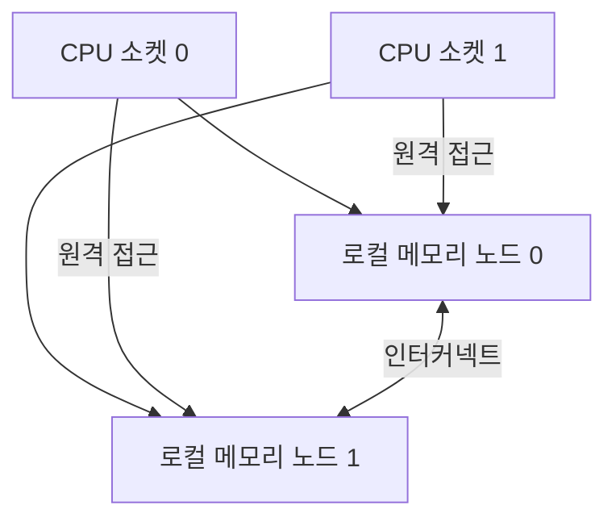

# NUMA 아키텍처

- **NUMA(Non-Uniform Memory Access)**는 CPU마다 가까운 로컬 메모리와 먼 원격 메모리가 존재하는 구조다.
- 스레드가 자신이 실행되는 노드의 메모리를 사용하면 빠르지만, 다른 노드의 메모리에 접근하면 지연 시간과 메모리 대역폭 비용이 증가한다.
- 성능 최적화의 핵심은 **스레드와 데이터의 위치를 함께 배치**하는 것이다. 이를 CPU affinity와 NUMA-aware allocation으로 관리한다.

## 개념 설명

SMP 구조에서는 모든 CPU가 동일한 메모리를 같은 비용으로 접근한다고 가정한다. 반면 NUMA 서버는 여러 소켓과 메모리 노드로 구성되며, 각 소켓은 자신의 로컬 메모리에 더 빠르게 접근한다. 다른 소켓의 메모리는 인터커넥트(QPI, UPI, Infinity Fabric 등)를 거쳐야 하므로 원격 접근이 된다.

운영체제는 NUMA 노드, CPU, 메모리를 관리하고 프로세스의 메모리 정책을 적용한다. 대표적인 정책은 다음과 같다.

- **local**: 현재 스레드가 실행 중인 노드에 우선 할당
- **interleave**: 여러 노드에 페이지를 순환 배치
- **preferred**: 특정 노드를 우선 사용하되 부족하면 다른 노드 사용
- **bind**: 지정한 노드에서만 메모리 할당

리눅스에서는 `numactl --hardware`로 토폴로지를 확인하고, `numactl --cpunodebind=0 --membind=0 ./app`처럼 실행 범위를 제한할 수 있다. `libnuma`의 `numa_alloc_onnode()`는 특정 노드에 메모리를 할당한다.

실무에서 자주 사용하는 **first-touch 정책**도 중요하다. 가상 메모리 페이지는 실제로 처음 접근하는 CPU의 노드에 배치될 수 있으므로, 병렬 초기화 스레드가 데이터를 사용할 위치에서 직접 초기화해야 한다. 반대로 한 스레드가 전체 배열을 먼저 초기화하면 이후 여러 스레드가 원격 메모리를 읽게 될 수 있다.

NUMA 최적화는 캐시 지역성, 메모리 대역폭, 락 경합과 함께 봐야 한다. 데이터 공유가 많은 구조에서는 노드 간 일관성 트래픽이 증가하므로, 샤딩·스레드별 버퍼·노드별 큐를 사용해 공유 상태를 줄이는 것이 효과적이다.

## 코드 예제

다음 예제는 노드 0에 버퍼를 할당하고, 실행 중인 CPU와 메모리 노드를 출력한다. 실제 서비스에서는 스레드 affinity도 함께 설정해야 한다.

```c
#include <numa.h>
#include <stdio.h>
#include <unistd.h>

int main(void) {
    if (numa_available() < 0) return 1;

    size_t n = 1024UL * 1024 * 256;
    char *buf = numa_alloc_onnode(n, 0); // NUMA 노드 0에 할당
    if (!buf) return 1;

    for (size_t i = 0; i < n; i += 4096)
        buf[i] = 1; // 페이지를 실제로 매핑하는 touch

    printf("cpu=%d, node=%d\n",
           sched_getcpu(), numa_node_of_cpu(sched_getcpu()));

    numa_free(buf, n);
    return 0;
}
```

컴파일 예시는 `gcc numa.c -lnuma -o numa`이다. 버퍼를 노드 0에 두고 스레드를 노드 1의 CPU에서 실행하면 원격 접근이 발생한다. 반대로 스레드와 버퍼를 같은 노드에 배치하면 지연 시간과 대역폭 측면에서 유리하다. 성능 검증은 `numastat`, `perf`, `numactl`로 실제 원격 접근과 실행 시간을 비교해야 한다.

## 구조



## 면접 질문

### 1. NUMA에서 로컬 메모리와 원격 메모리의 차이는?

로컬 메모리는 현재 CPU 소켓에 연결된 메모리라 지연 시간이 낮고 대역폭이 높다. 원격 메모리는 다른 소켓을 거쳐 접근하므로 지연과 인터커넥트 트래픽이 증가한다.

### 2. NUMA 환경에서 first-touch가 중요한 이유는?

페이지가 처음 접근된 CPU의 메모리 노드에 배치될 수 있기 때문이다. 데이터를 실제로 사용할 스레드가 병렬 초기화해야 원격 메모리 접근을 줄일 수 있다.

> **한 줄 요약:** NUMA 성능은 “어떤 CPU가 어떤 메모리를 접근하는가”를 일치시키는 문제다.
