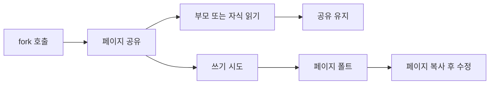

# Copy-on-Write

## 핵심 포인트

- **Copy-on-Write는 실제 수정이 발생할 때까지 데이터를 복사하지 않는 최적화 기법**이다.
- 프로세스 생성, 가상 메모리, 불변 자료구조, 데이터베이스 스냅샷에서 활용된다.
- 읽기만 하는 동안에는 메모리를 공유하고, 쓰기 시 **페이지 폴트 또는 복사 비용**이 발생한다.

## 개념 설명

Copy-on-Write, 줄여서 COW는 여러 실행 주체가 동일한 데이터를 우선 공유하도록 만든다. 각 주체가 데이터를 읽을 때는 원본 메모리를 그대로 사용하므로 즉시 전체 복사가 일어나지 않는다. 그러나 한쪽이 데이터를 수정하면 공유 상태를 유지할 수 없기 때문에 수정하려는 페이지를 복사한 뒤 해당 주체가 복사본을 수정한다.

운영체제의 `fork()`가 대표적인 사례다. 부모 프로세스와 자식 프로세스는 생성 직후 동일한 가상 주소 공간을 가리키지만, 실제 물리 페이지는 공유한다. 페이지 테이블은 해당 페이지를 읽기 전용으로 표시한다. 자식이나 부모가 쓰기를 시도하면 CPU가 페이지 폴트를 발생시키고, 운영체제는 페이지를 복사한 뒤 쓰기 작업을 재시도한다.

따라서 `fork()` 직후에는 큰 프로세스라도 빠르게 생성할 수 있다. 다만 자식이 대부분의 페이지를 수정하면 결국 많은 복사가 발생하므로 최악의 경우 메모리 사용량과 성능이 크게 증가한다. 읽기 중심 작업에는 효과적이지만, 빈번한 쓰기에는 이점이 줄어든다.

파일 시스템의 스냅샷, 컨테이너 이미지 레이어, Git 객체, 언어 런타임의 불변 컬렉션도 유사한 원리를 사용한다. 실무에서는 공유 데이터의 변경 가능성, 페이지 단위 복사 비용, 동시성 문제를 함께 고려해야 한다.

## 코드 예제

```c
#include <stdio.h>
#include <stdlib.h>
#include <unistd.h>
#include <sys/wait.h>

int main(void) {
    int *value = malloc(sizeof(int));
    *value = 10;

    pid_t pid = fork();
    if (pid == 0) {
        *value = 20; // 이 순간 해당 페이지가 복사될 수 있음
        printf("child: %d\n", *value);
    } else {
        wait(NULL);
        printf("parent: %d\n", *value);
    }

    free(value);
    return 0;
}
```

`fork()` 직후 부모와 자식은 `value`가 있는 페이지를 공유한다. 자식이 `*value = 20`을 수행하면 운영체제는 자식용 페이지를 복사한다. 따라서 출력은 자식이 `20`, 부모가 `10`이 되며, 서로의 변경이 영향을 주지 않는다. 실제 복사 시점은 `fork()` 호출 시점이 아니라 **처음 쓰기가 발생한 시점**이다.

## 동작 흐름



## 면접 질문

### 1. `fork()`는 프로세스 메모리를 즉시 전부 복사하는가?

아니다. Copy-on-Write를 사용하므로 페이지를 우선 공유하고, 부모나 자식이 해당 페이지를 수정할 때만 복사한다.

### 2. Copy-on-Write가 항상 성능을 향상시키는가?

아니다. 읽기 중심 작업에서는 복사 비용을 줄이지만, 공유 페이지를 많이 수정하면 페이지 폴트와 복사가 반복되어 오히려 비용이 커질 수 있다.

## 한 줄 정리

**Copy-on-Write는 공유를 먼저 하고, 실제 쓰기가 발생한 순간에만 필요한 데이터만 복사하는 최적화다.**
