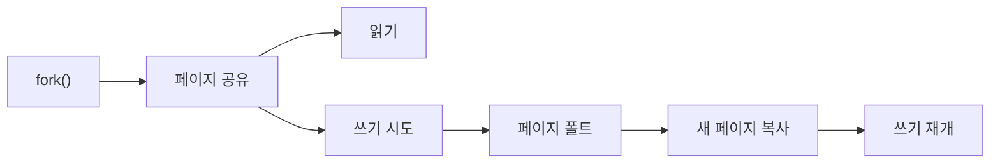

# Copy-on-Write(COW)

- 복사 대신 공유하고, 실제 수정 시점에만 복사하는 지연 복사 전략이다.
- 핵심 구현은 **공유 자원 + 참조 카운트 + 쓰기 감지 + 실제 복사**다.
- `fork()`, 프로세스 메모리, 컨테이너 이미지, 파일시스템 스냅샷, 불변 자료구조에서 활용된다.

## 개념 설명

Copy-on-Write는 처음부터 데이터를 복제하지 않고 원본과 복사본이 같은 메모리나 블록을 가리키게 한다. 읽기만 수행할 때는 공유 상태를 유지하므로 복사 비용과 메모리 사용량을 줄일 수 있다.

운영체제의 `fork()`가 대표적인 사례다. 부모 프로세스의 페이지 테이블을 자식에게 복사하되, 실제 물리 페이지는 복사하지 않는다. 부모와 자식의 페이지 테이블 엔트리는 동일한 물리 페이지를 가리키고, 해당 페이지를 읽기 전용으로 표시한다. 각 물리 페이지에는 참조 카운트를 둔다.

이후 어느 프로세스가 쓰기를 시도하면 CPU의 페이지 보호 예외가 발생한다. 커널은 페이지 폴트 핸들러에서 해당 페이지의 참조 카운트를 확인하고, 공유 중이면 새 물리 페이지를 할당해 내용을 복사한다. 쓰기를 요청한 프로세스의 페이지 테이블만 새 페이지를 가리키도록 변경한 뒤 쓰기를 재실행한다. 참조 카운트가 1이면 복사 없이 쓰기 권한만 복구할 수도 있다.

구현 시 페이지 테이블 변경과 참조 카운트 갱신의 동기화가 중요하다. 멀티코어 환경에서는 원자적 카운터나 적절한 락이 필요하다. 또한 첫 쓰기 때 페이지 폴트와 전체 페이지 복사가 발생하므로, 쓰기가 많으면 일반적인 즉시 복사보다 느릴 수 있다. 배열·문자열 라이브러리의 COW는 내부 버퍼, 길이, 참조 카운트를 함께 관리해야 하며, 한 객체의 변경이 다른 객체에 보이지 않도록 쓰기 직전에 분리해야 한다.

## 코드 예시

```c
void write_byte(PageRef *p, size_t i, char v) {
    if (p->refcount > 1) {
        PageRef *q = alloc_page();
        memcpy(q->data, p->data, PAGE_SIZE);
        atomic_dec(&p->refcount);
        q->refcount = 1;
        p = q;                 // 실제 구현에서는 소유자의 포인터도 갱신
    }
    p->data[i] = v;
}
```



## 면접 질문

### 1. `fork()` 직후 부모와 자식은 왜 같은 메모리를 수정해도 서로 영향을 주지 않는가?

페이지를 읽기 전용으로 공유하다가 쓰기 시 페이지 폴트가 발생한다. 커널이 수정하려는 프로세스에만 페이지를 복사하므로 이후에는 서로 다른 물리 페이지를 사용한다.

### 2. Copy-on-Write가 항상 성능을 향상시키는가?

아니다. 읽기 중심이고 실제 변경이 적을 때 유리하다. 반대로 공유 직후 많은 페이지를 수정하면 페이지 폴트와 복사 비용이 한꺼번에 발생해 즉시 복사보다 느릴 수 있다.

**한 줄 요약:** Copy-on-Write는 공유를 기본값으로 두고, 쓰기 순간의 보호 예외를 이용해 필요한 부분만 분리하는 지연 복사 기법이다.
