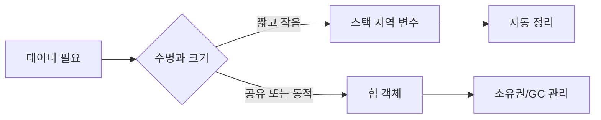

# 스택 vs 힙 할당

- **스택(Stack)**: 함수 호출 단위로 자동 관리되며 빠르지만, 크기와 생명주기가 제한적이다.
- **힙(Heap)**: 동적으로 할당되어 더 유연하지만, 할당·해제 비용과 메모리 단편화가 발생할 수 있다.
- **현업 핵심**: “무조건 스택이 빠르다”가 아니라 객체 수명, 크기, 소유권, 동시성을 기준으로 선택한다.

## 개념 설명

스택은 함수 호출 프레임에 지역 변수, 매개변수, 반환 주소 등을 저장한다. 함수가 종료되면 프레임 전체가 자동으로 제거되므로 해제 누락이 적고 할당 비용도 낮다. 다만 큰 배열을 지역 변수로 만들거나 재귀 호출이 깊어지면 스택 오버플로가 발생할 수 있다. 스레드마다 스택이 따로 존재하므로 스레드 생성 시 스택 크기도 운영 비용에 영향을 준다.

힙은 실행 중 필요한 크기와 수명의 데이터를 저장한다. 객체가 함수 종료 후에도 살아 있어야 하거나, 크기를 런타임에 결정해야 할 때 적합하다. 대신 C/C++에서는 직접 해제하거나 RAII를 적용해야 하며, 잘못 관리하면 메모리 누수, 이중 해제, use-after-free가 발생한다. Java, C#, Go 같은 언어도 객체 대부분은 힙에 있지만 GC가 회수 시점을 관리한다. 따라서 “GC 언어에는 메모리 문제가 없다”가 아니라, 불필요한 객체 생성과 긴 참조 유지로 지연 시간과 메모리 사용량이 증가할 수 있다.

실무에서는 요청 처리 중 잠깐 사용하는 값은 지역 변수로 두고, 캐시·세션·작업 큐처럼 여러 함수나 스레드가 공유하는 데이터는 명확한 소유권과 수명 정책을 가진 힙 객체로 관리한다. C++의 `vector`는 객체 자체가 스택에 있어도 내부 버퍼는 힙에 있을 수 있다. 또한 컴파일러의 escape analysis나 최적화에 따라 소스 코드와 실제 할당 위치가 달라질 수 있으므로 성능 판단은 프로파일러로 검증해야 한다.

## 코드 예시

```cpp
#include <memory>
#include <vector>

void process() {
    int count = 10;                    // 스택: 함수 종료 시 자동 소멸
    auto job = std::make_unique<int>(42); // 힙: unique_ptr이 소유
    std::vector<int> buffer(1000);     // vector 객체는 스택, 원소는 힙
    // job과 buffer는 이 함수가 끝날 때 자동 정리된다.
}
```

## 메모리 수명과 선택 기준



## 면접 질문

### 1. 스택 할당이 일반적으로 힙 할당보다 빠른 이유는?

스택은 포인터 이동과 프레임 정리 중심으로 동작하며, 메모리 재사용 패턴이 단순하다. 힙은 적절한 블록 탐색, 메타데이터 관리, 동기화 등 추가 비용이 발생할 수 있다. 단, 실제 차이는 언어 런타임과 최적화에 따라 측정해야 한다.

### 2. 지역 변수의 주소를 반환하면 왜 위험한가?

지역 변수는 스택 프레임에 있으므로 함수가 끝나면 수명이 종료된다. 반환된 주소는 해제된 영역을 가리키는 댕글링 포인터가 된다. 필요한 데이터는 값으로 반환하거나 적절한 소유권을 가진 힙 객체로 반환해야 한다.

> **한 줄 정리:** 데이터의 크기보다 수명과 소유권을 먼저 판단하고, 성능은 프로파일링으로 검증하라.
