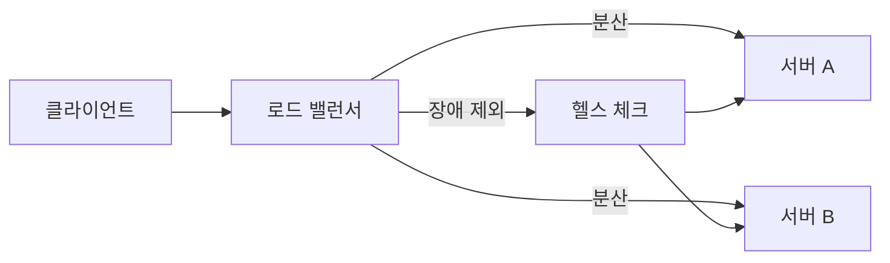

# 로드 밸런싱(Load Balancing)

- 여러 서버에 요청을 분산해 **성능과 가용성**을 높인다.
- 로드 밸런서는 교통경찰처럼 요청을 적절한 서버로 전달한다.
- 분산 알고리즘, 헬스 체크, 세션 처리 방식이 핵심이다.

## 개념 설명

로드 밸런싱은 하나의 서버에 요청이 몰리지 않도록 여러 서버에 작업을 나누는 기술이다. 식당에 손님이 몰렸을 때 안내 직원이 비어 있는 테이블로 손님을 보내는 상황과 비슷하다. 직원이 없다면 한 테이블에만 줄이 길어지고, 다른 테이블은 놀게 된다. 서버도 마찬가지로 한 대에만 트래픽이 집중되면 응답이 느려지거나 장애가 발생한다.

클라이언트와 서버 사이에 위치한 **로드 밸런서**는 요청을 받아 백엔드 서버 중 하나를 선택한다. 대표적인 분산 방식은 다음과 같다.

- **라운드 로빈**: 서버를 순서대로 선택한다. 단순하지만 서버 성능 차이를 고려하지 않는다.
- **가중치 기반**: 성능이 좋은 서버에 더 많은 요청을 보낸다.
- **최소 연결**: 현재 연결 수가 가장 적은 서버를 선택한다.
- **IP 해시**: 같은 클라이언트를 같은 서버로 보내 세션 유지에 도움을 준다.

로드 밸런서는 주기적으로 서버에 요청을 보내 정상 여부를 확인하는 **헬스 체크**도 수행한다. 장애 서버가 감지되면 해당 서버를 분배 대상에서 제외한다. 따라서 일부 서버가 고장 나도 서비스 전체가 중단되지 않을 수 있다.

계층에 따라 **L4 로드 밸런서**는 TCP/IP와 포트 정보를 기준으로 빠르게 전달하고, **L7 로드 밸런서**는 HTTP 경로, 헤더, 쿠키 등을 보고 `/api`와 `/static` 요청을 다르게 라우팅할 수 있다. 다만 로드 밸런서 자체가 단일 장애 지점이 되지 않도록 이중화하고, 세션을 서버 메모리에만 저장하지 않도록 Redis 같은 외부 저장소를 사용할 수 있다.

## 설정 예시

```nginx
http {
    upstream app_servers {
        least_conn;
        server app1:8080;
        server app2:8080;
        server app3:8080 backup;
    }

    server {
        listen 80;

        location / {
            proxy_pass http://app_servers;
        }
    }
}
```

`least_conn`은 연결 수가 가장 적은 서버를 우선 선택한다. `backup` 서버는 주 서버들이 사용할 수 없을 때 투입된다.

## 요청 흐름



## 면접 질문

### 1. 로드 밸런싱을 사용하는 이유는 무엇인가요?

트래픽을 여러 서버에 분산해 응답 성능을 높이고, 특정 서버 장애가 전체 서비스 장애로 이어지는 것을 줄이기 위해 사용합니다.

### 2. L4와 L7 로드 밸런서의 차이는 무엇인가요?

L4는 TCP나 포트 같은 전송 계층 정보를 기준으로 전달하고, L7은 HTTP 경로·헤더·쿠키처럼 애플리케이션 계층 정보를 활용해 더 세밀하게 라우팅합니다.

> **한 줄 정리:** 로드 밸런싱은 요청을 여러 서버에 알맞게 나누고, 장애 서버를 제외해 서비스의 성능과 안정성을 높이는 기술이다.
