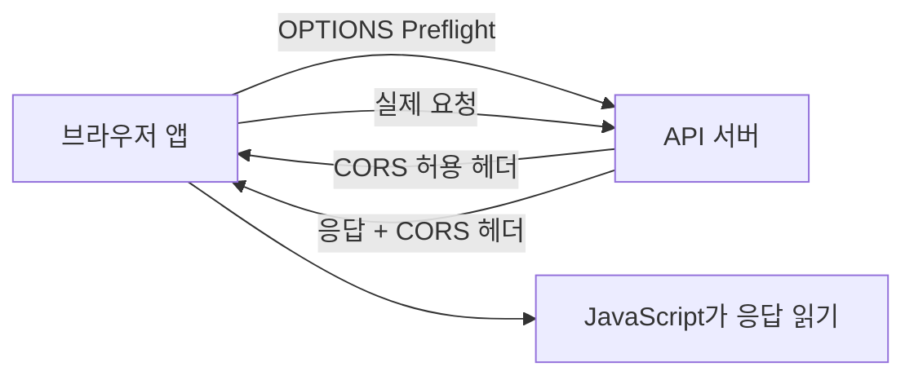

# CORS 실무 트러블슈팅

- **CORS는 브라우저의 동일 출처 정책(SOP)을 보완하는 접근 제어 메커니즘**이며, 서버가 허용한 교차 출처 요청만 브라우저가 응답에 접근하게 한다.
- 장애의 핵심은 **요청 전송 실패가 아니라 응답을 자바스크립트가 읽지 못하는 경우**가 많다는 점이다. 서버 로그에는 200이 남아도 브라우저에서는 CORS 오류가 발생할 수 있다.
- 해결은 프론트엔드가 아니라 **API 서버 또는 프록시에서 Origin, 메서드, 헤더, 인증 정보를 정확히 허용**하는 방식으로 해야 한다.

## 개념 설명

출처(origin)는 `프로토콜 + 호스트 + 포트`의 조합이다. 따라서 `https://app.example.com`과 `https://api.example.com`은 호스트가 달라 서로 다른 출처다. 브라우저는 다른 출처로 요청할 때 서버의 CORS 응답 헤더를 확인한다.

가장 단순한 요청은 바로 전송되지만, `PUT`, `DELETE`, `Authorization`, `application/json` 같은 조건이 있으면 먼저 **Preflight 요청(OPTIONS)** 을 보낸다. 서버는 `Access-Control-Allow-Origin`, `Access-Control-Allow-Methods`, `Access-Control-Allow-Headers` 등을 응답해야 본 요청이 진행된다.

실무에서 자주 발생하는 문제는 다음과 같다.

1. `Access-Control-Allow-Origin`에 프론트엔드의 실제 Origin이 없거나 포트가 다르다.
2. OPTIONS 라우팅이 인증 미들웨어에 막혀 401/403을 반환한다.
3. `Authorization` 또는 `Content-Type`이 `Access-Control-Allow-Headers`에 없다.
4. 쿠키 인증인데 서버에 `Access-Control-Allow-Credentials: true`가 없거나, 클라이언트에 `credentials: "include"`가 없다.
5. 자격 증명을 사용할 때 `Allow-Origin: *`를 설정한다. 이 조합은 허용되지 않는다.
6. 운영 환경의 Nginx, CDN, API Gateway가 백엔드의 CORS 헤더를 덮어쓴다.

DevTools의 **Network 탭에서 OPTIONS와 실제 요청을 모두 확인**하고, Request Headers의 `Origin`, Response Headers의 CORS 헤더, 상태 코드부터 점검한다. Postman은 브라우저 보안 정책을 적용하지 않으므로 Postman 성공만으로 CORS 정상 여부를 판단하면 안 된다. 개발 환경에서는 프록시로 우회할 수 있지만, 이는 브라우저와 API의 출처를 같게 보이게 하는 개발 편의책일 뿐 서버 설정을 대체하지 않는다.

## 코드 예시

```js
app.use(cors({
  origin: ['http://localhost:3000'],
  methods: ['GET', 'POST', 'PUT', 'DELETE', 'OPTIONS'],
  allowedHeaders: ['Content-Type', 'Authorization'],
  credentials: true
}));

app.options('*', cors());

fetch('https://api.example.com/me', {
  credentials: 'include',
  headers: { Authorization: `Bearer ${token}` }
});
```

## 요청 흐름



## 면접 질문

### 1. CORS는 서버 간 통신에도 적용되는가?

아니다. CORS는 주로 브라우저가 다른 출처의 응답을 읽을 때 적용하는 보안 정책이다. 서버 간 HTTP 통신이나 Postman 요청은 일반적으로 CORS 검사를 받지 않는다.

### 2. Preflight 요청이 발생하는 조건은 무엇인가?

단순 요청 조건을 벗어날 때 발생한다. 대표적으로 `PUT/DELETE`, `Authorization` 헤더, `application/json` Content-Type 사용 등이 있으며, 브라우저가 OPTIONS로 서버의 허용 여부를 먼저 확인한다.

> **한 줄 정리:** CORS 오류는 브라우저가 임의로 고치는 문제가 아니라, 실제 Origin과 Preflight 조건에 맞춰 서버·프록시의 응답 헤더를 검증하고 수정하는 문제다.
