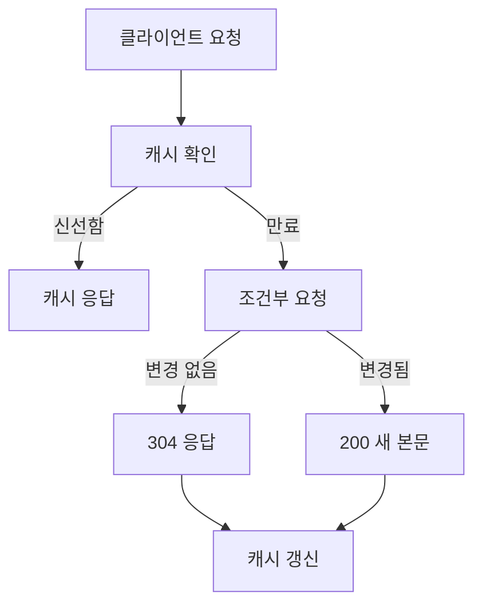

# HTTP 캐싱

- **목적:** 같은 리소스를 다시 요청할 때 네트워크와 서버 처리 비용을 줄이고 응답 속도를 높인다.
- **핵심 헤더:** `Cache-Control`, `ETag`, `Last-Modified`, `Age`, `Vary`가 캐시 동작을 결정한다.
- **검증과 만료:** 캐시가 신선하면 재사용하고, 오래되면 조건부 요청으로 변경 여부만 확인한다.

## 개념 설명

HTTP 캐싱은 브라우저, 프록시, CDN 등이 서버 응답을 저장해 두었다가 이후 요청에 재사용하는 기능이다. 캐시는 URL뿐 아니라 요청 메서드, 일부 헤더, `Vary` 설정에 따라 저장 대상을 구분한다. 일반적으로 `GET`과 `HEAD` 응답이 주요 캐시 대상이다.

`Cache-Control: max-age=60`은 응답을 60초 동안 신선한 것으로 간주한다는 뜻이다. 신선한 동안에는 서버에 요청하지 않고 캐시된 응답을 바로 반환한다. `public`은 공유 캐시도 저장할 수 있음을, `private`은 사용자 브라우저에만 저장해야 함을 의미한다. 로그인 정보나 개인정보가 포함된 응답에는 보통 `private, no-store`를 검토한다.

캐시가 만료되어도 전체 본문을 다시 받는 것은 비효율적이다. 서버가 `ETag`를 내려주면 클라이언트는 다음 요청에 `If-None-Match`를 보내 변경 여부를 묻는다. 변경되지 않았다면 서버는 `304 Not Modified`와 본문 없는 응답을 반환한다. 파일의 수정 시간을 기준으로 하는 방식은 `Last-Modified`와 `If-Modified-Since` 조합이다.

정적 파일은 해시를 파일명에 포함하고 긴 `max-age`를 사용할 수 있다. 예를 들어 `app.a1b2c3.js`는 내용이 바뀌면 이름도 바뀌므로 오래 캐시해도 안전하다. 반대로 HTML 문서는 최신 배포 정보를 가리켜야 하므로 짧은 TTL이나 재검증 정책이 적절하다. `Vary: Accept-Encoding`은 압축 방식처럼 요청 헤더에 따라 다른 응답을 저장하게 한다.

## 코드 예제

```js
import express from "express";
const app = express();

app.get("/app.js", (req, res) => {
  res.set({
    "Cache-Control": "public, max-age=31536000, immutable",
    "ETag": '"app-a1b2c3"',
    "Content-Type": "application/javascript"
  });
  if (req.headers["if-none-match"] === '"app-a1b2c3"')
    return res.status(304).end();
  res.sendFile("/srv/assets/app.a1b2c3.js");
});

app.listen(3000);
```

## 캐시 흐름



## 면접 질문

### 1. `Cache-Control: no-cache`와 `no-store`의 차이는?

`no-cache`는 저장은 허용하지만 사용 전에 서버 재검증이 필요하다. `no-store`는 응답을 저장하지 말라는 의미다.

### 2. `ETag`를 사용하는 조건부 요청의 장점은?

콘텐츠가 변경되지 않았을 때 `304`로 본문을 재전송하지 않아 대역폭을 절약하고, 수정 시간보다 정확하게 변경 여부를 판단할 수 있다.

## 한 줄 정리

HTTP 캐싱은 `Cache-Control`로 수명을 정하고, `ETag` 기반 조건부 요청으로 최신성과 성능을 함께 확보하는 기술이다.
