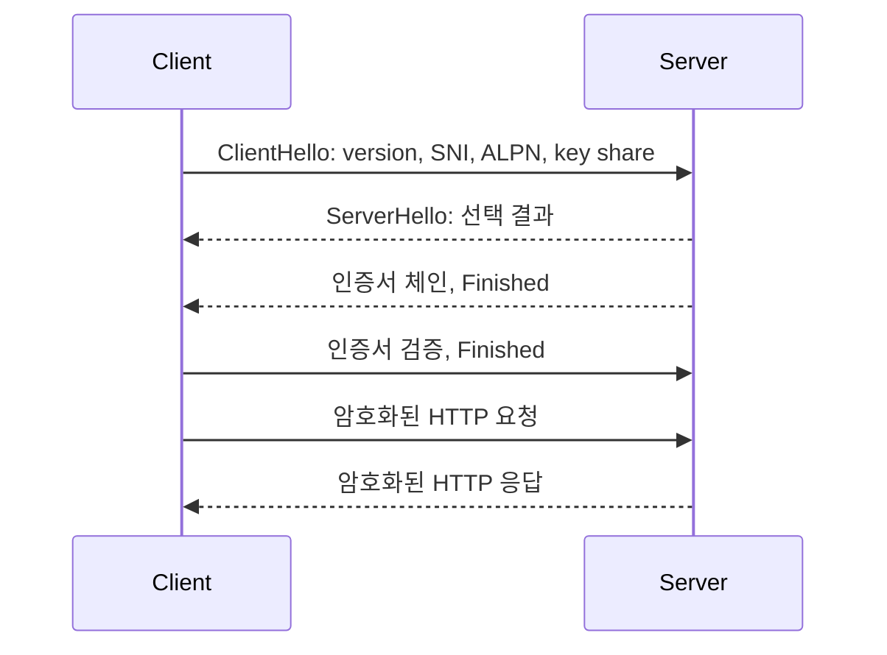

# TLS 핸드셰이크: 실무 트러블슈팅 중심 정리

- **목적:** 서버 신원 확인, 암호화 알고리즘 협상, 세션 키 합의
- **TLS 1.3:** `ClientHello`와 `ServerHello` 이후 암호화가 빠르게 시작되어 보통 1-RTT로 연결된다.
- **장애 핵심:** 인증서 체인·SNI·ALPN·시스템 시간·TLS 버전·프록시 설정을 분리해서 확인한다.

## 개념 설명

TLS 핸드셰이크는 애플리케이션 데이터가 오가기 전에 안전한 통신 조건을 합의하는 과정이다. 클라이언트는 `ClientHello`에서 지원하는 TLS 버전, 암호 스위트, 키 교환 정보, SNI, ALPN을 보낸다. SNI는 하나의 IP에서 여러 도메인을 서비스할 때 올바른 인증서를 선택하게 한다. ALPN은 HTTP/1.1과 HTTP/2 같은 애플리케이션 프로토콜을 협상한다.

서버는 `ServerHello`와 인증서 체인을 응답하고, 자신의 개인키를 직접 전송하지 않은 채 키 교환을 완료한다. 클라이언트는 인증서의 서명, 유효 기간, 호스트 이름, 신뢰 가능한 루트까지의 체인을 검증한다. 이후 양측은 핸드셰이크로 합의한 비밀에서 대칭 세션 키를 만들고 HTTP 요청을 암호화한다.

실무에서 `certificate verify failed`가 발생하면 서버 인증서 만료보다 **중간 인증서 누락**, 클라이언트의 오래된 CA 저장소, 컨테이너의 잘못된 시간 설정을 먼저 확인한다. `wrong version number`는 TLS 버전 자체보다 HTTPS 포트에 평문 HTTP를 보냈거나 프록시가 TLS를 종료하는 경우가 흔하다. `handshake_failure`는 지원 암호 스위트, TLS 최소 버전, mTLS 클라이언트 인증서 정책을 비교한다. HTTP/2가 되지 않으면 인증서가 아니라 ALPN 또는 프록시 설정 문제일 수 있다.

장애를 재현할 때는 브라우저보다 `openssl s_client`로 SNI, 인증서 체인, ALPN, TLS 버전을 명시해 확인한다. 로드밸런서와 백엔드 양쪽에서 각각 테스트해야 TLS 종료 지점과 실제 장애 위치를 구분할 수 있다.

```bash
# SNI와 인증서 체인 확인
openssl s_client -connect example.com:443 \
  -servername example.com -showcerts </dev/null

# TLS 1.2 및 HTTP/2 협상 확인
openssl s_client -connect example.com:443 \
  -servername example.com -tls1_2 -alpn h2 </dev/null 2>/dev/null \
  | grep -E 'Protocol|Cipher|ALPN|Verify return'
```



## 면접 질문

1. **TLS에서 비대칭키와 대칭키를 모두 사용하는 이유는?**  
   비대칭키는 신원 확인과 키 교환에 사용하고, 실제 데이터는 성능이 좋은 대칭키로 암호화한다.

2. **인증서가 정상인데도 HTTP/2가 활성화되지 않는 이유는?**  
   인증서 검증과 별개로 ALPN 협상이 실패했거나, 중간 프록시가 HTTP/2를 지원·전달하지 않기 때문이다.

## 한 줄 정리

TLS 장애는 “인증서 문제”로 뭉뚱그리지 말고 **버전·SNI·체인·시간·ALPN·TLS 종료 지점**을 단계별로 분리해 진단한다.
