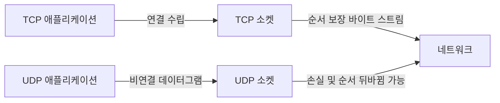

# TCP vs UDP

- **TCP**: 연결을 먼저 수립하고, 데이터의 순서·전달·중복을 관리하는 신뢰성 중심 프로토콜
- **UDP**: 연결 과정 없이 데이터그램을 빠르게 전송하며, 신뢰성 제어를 애플리케이션에 맡기는 프로토콜
- 선택 기준은 “반드시 도착해야 하는가”와 “지연 시간이 더 중요한가”이다. 웹·파일 전송은 TCP, 실시간 음성·게임·DNS는 UDP가 자주 사용된다.

## 개념 설명

TCP는 3-way handshake로 연결을 수립한 뒤 데이터를 **바이트 스트림**으로 주고받는다. 송신 데이터가 여러 번의 `send`로 나뉘어도 수신자는 메시지 경계를 알 수 없으므로, 길이 헤더나 구분자를 애플리케이션이 설계해야 한다. 패킷 손실이 발생하면 재전송하고, 순서가 뒤섞인 데이터는 재조립한다. 또한 흐름 제어와 혼잡 제어를 제공해 수신 버퍼나 네트워크 상태에 맞춰 전송량을 조절한다. 그 결과 안정적이지만 연결 수립과 제어 정보 때문에 UDP보다 지연과 오버헤드가 커질 수 있다.

UDP는 별도의 연결 수립 없이 각 데이터그램을 독립적으로 보낸다. 전달 여부, 순서, 중복 제거를 보장하지 않으며, 수신 애플리케이션이 필요하면 시퀀스 번호·타임아웃·재전송 로직을 직접 구현해야 한다. 대신 헤더가 작고 지연이 낮으며 브로드캐스트와 멀티캐스트에 적합하다. 일부 손실을 허용하는 영상·음성 스트리밍, 실시간 게임에 유리하다. DNS처럼 짧은 요청과 응답에도 적합하지만, 큰 데이터 전송에는 보통 TCP가 편리하다.

UDP가 항상 빠른 것은 아니다. 네트워크 혼잡 시 손실이 늘 수 있고, 신뢰성 기능을 직접 구현하면 복잡도가 커진다. 반대로 TCP도 애플리케이션 요구에 따라 충분히 빠를 수 있다. 보안은 두 프로토콜 자체의 역할이 아니므로 TCP에는 TLS, UDP에는 DTLS 또는 QUIC 같은 별도 계층을 사용한다.

## 코드 예제

```python
import socket

# TCP: 연결 수립 후 바이트 스트림 통신
tcp = socket.socket(socket.AF_INET, socket.SOCK_STREAM)
tcp.connect(("example.com", 80))
tcp.sendall(b"GET / HTTP/1.0\r\nHost: example.com\r\n\r\n")
response = tcp.recv(4096)
tcp.close()

# UDP: 연결 없이 데이터그램 전송
udp = socket.socket(socket.AF_INET, socket.SOCK_DGRAM)
udp.sendto(b"ping", ("127.0.0.1", 9999))
data, address = udp.recvfrom(1024)
udp.close()
```

TCP의 `recv(4096)`은 한 번의 `sendall`과 정확히 대응하지 않는다. 반면 UDP의 `recvfrom`은 한 번의 데이터그램 단위를 받지만, 데이터그램이 손실되거나 순서가 바뀔 수 있다.



## 면접 질문

### 1. TCP는 패킷 단위가 아닌 스트림이라고 하는 이유는?

TCP는 애플리케이션의 여러 송수신 호출 경계를 보존하지 않고 연속된 바이트로 전달하기 때문이다. 따라서 애플리케이션은 길이 정보나 구분자를 사용해 메시지를 직접 구분해야 한다.

### 2. UDP 위에 신뢰성 기능을 직접 구현하면 TCP와 같은가?

같지 않다. 재전송과 순서 제어만 추가해도 흐름 제어, 혼잡 제어, 연결 관리 등 TCP의 모든 동작이 자동으로 동일해지는 것은 아니다. 요구에 맞춘 경량 프로토콜을 설계할 수 있다는 점이 차이다.

> **한 줄 요약:** TCP는 정확하고 순서 있는 전달, UDP는 낮은 지연과 단순한 데이터그램 전송에 적합하다.
