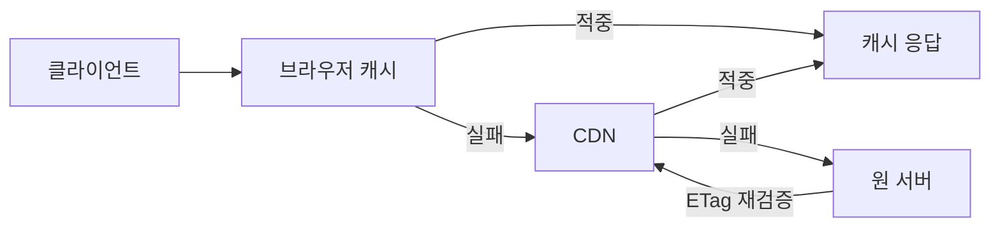

# HTTP 캐싱

## 핵심 포인트

- `Cache-Control`로 캐시 수명과 재검증 정책을 명시하고, 정적 파일과 API를 서로 다르게 운영한다.
- `ETag`·`Last-Modified`를 사용하면 변경되지 않은 응답을 본문 없이 검증해 트래픽을 줄일 수 있다.
- 브라우저·CDN·서버 캐시는 계층적으로 동작하므로 캐시 키, 무효화, 개인정보 노출을 함께 설계해야 한다.

## 개념 설명

HTTP 캐싱은 이전 응답을 브라우저나 CDN에 저장해 원 서버 요청과 응답 시간을 줄이는 기술이다. 캐시는 먼저 응답의 `Cache-Control: max-age`를 확인한다. 유효 기간 안이면 원 서버에 요청하지 않고 캐시된 응답을 반환한다. 만료된 경우에도 `ETag`를 `If-None-Match`로 보내 변경 여부를 재검증할 수 있으며, 변경이 없으면 서버는 `304 Not Modified`만 응답한다.

현업에서는 이미지, JS, CSS 같은 버전이 붙은 정적 파일에 `public, max-age=31536000, immutable`을 적용한다. 파일명이 바뀌면 새 URL이 생성되므로 긴 캐시 수명이 안전하다. 반면 사용자별 API 응답은 `private, no-store` 또는 짧은 `max-age`를 사용한다. `public`으로 설정하면 CDN이나 공유 프록시에 개인정보가 저장될 수 있다.

CDN 캐시에서는 URL뿐 아니라 쿼리 파라미터, `Host`, `Accept-Encoding` 등이 캐시 키에 영향을 준다. `Vary` 헤더가 필요한 경우도 있지만 값이 너무 다양하면 적중률이 급격히 떨어진다. 배포 직후 오래된 JS가 남는 문제는 파일명 해시, CDN purge, 짧은 `s-maxage`로 해결한다. 쿠키가 붙은 요청을 무조건 캐시하거나, 인증 헤더를 무시하도록 설정하는 것은 데이터 유출의 원인이 될 수 있다.

서버 응답은 캐시 정책을 명확히 포함해야 하며, 개발자는 브라우저 개발자 도구의 `Age`, `X-Cache`, `Cache-Control`, `ETag`를 확인해 실제 적중 여부를 검증해야 한다. 캐싱은 빠르게 만드는 기능이지만, 정확한 무효화 전략이 없으면 최신성보다 장애 비용이 커질 수 있다.

## 코드 예시

```http
HTTP/1.1 200 OK
Cache-Control: public, max-age=31536000, immutable
ETag: "app-8f3a"
Content-Type: application/javascript

GET /app.8f3a.js HTTP/1.1
If-None-Match: "app-8f3a"

HTTP/1.1 304 Not Modified
Cache-Control: public, max-age=31536000
```

## 캐시 처리 흐름



## 면접 질문

### 1. `ETag`와 `Cache-Control: no-cache`는 어떤 관계인가요?

`no-cache`는 저장 금지가 아니라 사용 전 재검증을 의미한다. 저장은 가능하며, `ETag`와 조건부 요청을 함께 사용해 변경되지 않으면 `304`를 반환한다. 저장 자체를 막으려면 `no-store`를 사용한다.

### 2. 정적 파일에 긴 캐시 수명을 적용하는 방법은 무엇인가요?

파일명에 콘텐츠 해시를 포함한다. 예를 들어 `app.js`를 `app.8f3a.js`로 배포하면 내용 변경 시 URL이 달라져 기존 캐시를 자연스럽게 우회할 수 있다.

> **한 줄 정리:** HTTP 캐싱은 `Cache-Control`, 검증 헤더, 버전이 있는 URL, 안전한 무효화 전략을 함께 설계해야 실무에서 효과적이다.
