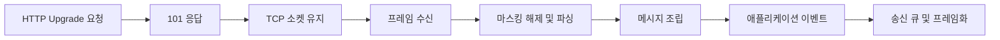

# WebSocket: 지속 연결과 프레임 처리의 내부 구현

- **HTTP Upgrade 핸드셰이크**로 TCP 연결을 WebSocket 연결로 전환한다.
- 이후 데이터는 HTTP 메시지가 아니라 **프레임(frame)** 단위로 송수신한다.
- 서버는 이벤트 루프에서 소켓을 감시하며, 마스킹·opcode·버퍼·백프레셔를 처리한다.

## 개념 설명

WebSocket은 애플리케이션 프로토콜이지만 전송 계층에서는 일반적인 TCP 연결을 사용한다. 클라이언트가 먼저 HTTP 요청을 보낸다.

```http
GET /chat HTTP/1.1
Upgrade: websocket
Connection: Upgrade
Sec-WebSocket-Key: <random-value>
Sec-WebSocket-Version: 13
```

서버가 `101 Switching Protocols`를 반환하면 같은 TCP 연결의 프로토콜이 HTTP에서 WebSocket으로 바뀐다. 서버는 `Sec-WebSocket-Key`에 GUID를 이어 붙이고 SHA-1 및 Base64를 적용한 값을 `Sec-WebSocket-Accept`로 응답해 핸드셰이크를 검증한다.

연결 이후 데이터는 WebSocket 프레임으로 전달된다. 프레임의 주요 필드는 `FIN`, `RSV`, `opcode`, `MASK`, payload length, masking key, payload다. `opcode`가 `0x1`이면 텍스트, `0x2`이면 바이너리, `0x8`은 종료, `0x9`와 `0xA`는 Ping/Pong이다. 큰 메시지는 여러 프레임으로 분할할 수 있으며, 수신자는 `FIN`이 1인 지점까지 조립한다.

클라이언트가 서버로 보내는 프레임은 반드시 마스킹한다. payload의 각 바이트를 `mask[i mod 4]`와 XOR하여 전송하고, 서버가 다시 같은 키로 XOR해 복원한다. 이는 암호화가 아니라 중간 프록시가 요청 내용을 오인하지 않도록 하는 규칙이다. 기밀성이 필요하면 `wss`와 TLS를 사용한다.

서버는 보통 논블로킹 소켓과 이벤트 루프를 사용한다. 읽기 이벤트가 오면 커널 수신 버퍼의 일부만 읽을 수 있으므로 애플리케이션 버퍼에 누적한 뒤 완전한 헤더와 payload가 모였는지 확인한다. 반대로 송신 버퍼가 가득 차면 `send()`가 일부만 성공할 수 있다. 따라서 남은 데이터를 큐에 보관하고 writable 이벤트에서 재전송해야 한다. 이를 무시하면 메모리 증가와 연결 장애가 발생한다.

## 코드 예시

```javascript
import { WebSocketServer } from "ws";

const wss = new WebSocketServer({ port: 8080 });
wss.on("connection", (socket) => {
  socket.on("message", (data, isBinary) => {
    if (socket.readyState === socket.OPEN) {
      socket.send(data, { binary: isBinary });
    }
  });
  socket.on("error", console.error);
  socket.on("close", () => console.log("closed"));
});
```

## 처리 흐름



## 면접 질문

### 1. WebSocket과 HTTP Long Polling의 차이는?

WebSocket은 한 번 핸드셰이크한 TCP 연결을 지속하며 양방향 통신한다. Long Polling은 HTTP 요청을 서버가 지연 응답한 뒤 클라이언트가 다시 요청하므로 요청·응답 오버헤드가 반복된다.

### 2. WebSocket 마스킹은 암호화인가?

아니다. 마스킹은 payload를 XOR로 변환해 프록시 오인 문제를 줄이는 규칙이다. 보안과 기밀성은 TLS 기반의 `wss`가 제공한다.

## 한 줄 정리

WebSocket은 HTTP Upgrade 후 TCP 연결을 유지하고, 이벤트 루프가 프레임·버퍼·마스킹·송신 압력을 관리하는 양방향 프로토콜이다.
