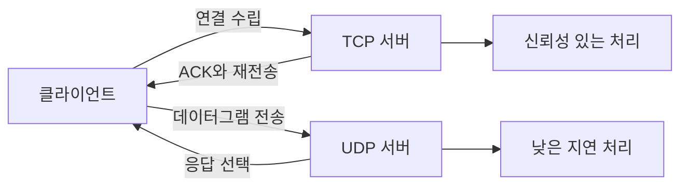

# TCP vs UDP: 현업에서의 선택 기준

- **TCP**: 연결 지향, 순서 보장, 재전송과 흐름 제어를 제공한다. HTTP, DB, SSH처럼 데이터 유실이 치명적인 서비스에 적합하다.
- **UDP**: 비연결형, 낮은 지연, 전송 보장 없음. DNS, 실시간 게임, 음성·영상 스트리밍처럼 일부 손실보다 지연이 중요한 서비스에 적합하다.
- 프로토콜 선택은 “빠른가?”보다 **유실 허용 여부, 지연 민감도, 신뢰성 구현 주체**를 기준으로 결정한다.

## 개념 설명

TCP는 3-way handshake로 연결을 수립한 뒤 바이트 스트림을 전송한다. 패킷 순서를 관리하고 손실된 데이터를 재전송하므로 애플리케이션이 신뢰성 로직을 직접 구현하지 않아도 된다. 반면 연결 수립, ACK, 재전송 때문에 지연과 오버헤드가 발생한다. 또한 패킷 하나가 지연되면 뒤의 데이터도 기다리는 Head-of-Line Blocking이 발생할 수 있다.

UDP는 연결 수립 없이 데이터그램을 전송한다. 패킷 순서, 중복, 유실을 보장하지 않으므로 매우 가볍고 빠르지만, 필요하다면 애플리케이션이 시퀀스 번호, 타임아웃, 재전송을 구현해야 한다. 게임의 위치 정보는 최신 값이 과거 값보다 중요하므로 일부 유실을 허용하고 UDP를 사용한다. 반대로 결제 요청이나 주문 이벤트는 중복·유실 방지가 필수이므로 TCP와 함께 멱등성 키, 타임아웃, 재시도 정책을 설계한다.

웹 서비스는 전통적으로 TCP 기반 HTTP/1.1, HTTP/2를 사용한다. HTTP/3는 UDP 위에 QUIC을 구현해 연결 설정 시간을 줄이고 스트림별 독립 처리를 제공한다. 따라서 “UDP는 신뢰성이 없다”는 말은 전송 계층 기본 기능에 대한 설명이며, QUIC처럼 상위 프로토콜이 신뢰성을 추가할 수 있다.

## 실무 코드 예시

```python
import socket

# TCP: 연결 후 안정적인 스트림 전송
tcp = socket.socket(socket.AF_INET, socket.SOCK_STREAM)
tcp.connect(("api.example.com", 443))
tcp.sendall(b"request")
response = tcp.recv(4096)
tcp.close()

# UDP: 연결 없이 빠른 데이터그램 전송
udp = socket.socket(socket.AF_INET, socket.SOCK_DGRAM)
udp.sendto(b"player-position", ("game.example.com", 9000))
udp.close()
```

## 요청 흐름 비교



## 면접 질문

### 1. TCP의 신뢰성은 어떻게 보장되나요?

시퀀스 번호와 ACK로 순서를 확인하고, 타임아웃이 발생하거나 손실이 감지되면 데이터를 재전송한다. 흐름 제어와 혼잡 제어로 수신 버퍼와 네트워크 상태도 반영한다.

### 2. 실시간 게임에서 TCP 대신 UDP를 사용하는 이유는 무엇인가요?

위치·조준 정보는 최신 데이터가 중요하고 일부 과거 패킷은 폐기할 수 있다. TCP의 재전송과 순서 보장이 오히려 지연을 키울 수 있어 UDP를 사용하며, 필요한 신뢰성은 애플리케이션에서 선택적으로 구현한다.

**한 줄 정리:** 데이터 유실이 허용되지 않으면 TCP, 지연이 더 중요한 실시간 데이터라면 UDP를 우선 검토한다.
