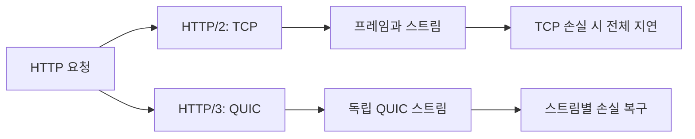

# HTTP/2 vs HTTP/3: 내부 구현 관점

- **HTTP/2**는 하나의 TCP 연결 위에서 여러 스트림을 다중화하지만, TCP 패킷 손실 시 모든 스트림이 함께 대기하는 Head-of-Line Blocking이 발생한다.
- **HTTP/3**는 QUIC 위에서 동작하며, 스트림별 손실 복구와 연결 ID 기반 이동을 제공한다. 전송 계층은 TCP가 아니라 UDP 기반이다.
- HTTP/2의 헤더 압축은 **HPACK**, HTTP/3는 QUIC의 독립 스트림 특성에 맞춘 **QPACK**을 사용한다.

## 개념 설명

### HTTP/2 내부 동작

HTTP/2는 클라이언트와 서버 사이에 보통 하나의 TCP 연결을 만들고, 그 안에서 여러 **스트림(stream)**을 생성한다. 요청과 응답은 다시 작은 **프레임(frame)**으로 분할된다. `HEADERS`, `DATA`, `SETTINGS`, `WINDOW_UPDATE` 등이 대표적이다.

스트림 다중화 덕분에 HTTP/1.1처럼 요청마다 연결을 만들거나 응답 순서를 강제로 맞출 필요가 줄어든다. 그러나 TCP는 바이트 스트림의 순서와 신뢰성을 보장한다. 특정 TCP 세그먼트가 유실되면 해당 세그먼트 이후 데이터는 커널 TCP 버퍼에 도착해도 애플리케이션으로 전달되지 않는다. 결과적으로 손실과 무관한 다른 HTTP/2 스트림도 대기한다. 이를 **TCP 수준 HOL Blocking**이라 한다.

HPACK은 헤더를 정적 테이블과 동적 테이블로 관리한다. 양 끝점이 동일한 동적 테이블 상태를 유지해야 하므로 헤더 블록의 처리 순서가 중요하다. 또한 HTTP/2는 TLS 위에서 주로 사용되며, ALPN으로 `h2`를 협상한다.

### HTTP/3 내부 동작

HTTP/3는 HTTP 메시지를 QUIC 스트림에 매핑한다. QUIC은 UDP 위에서 동작하지만, 패킷 번호·ACK·재전송·혼잡 제어·TLS 1.3 암호화를 사용자 공간 프로토콜로 직접 구현한다. 연결 수립과 암호화 협상이 결합되어 일반적인 TCP+TLS보다 초기 왕복을 줄일 수 있다.

각 QUIC 스트림은 독립적으로 순서가 보장된다. 한 스트림의 패킷이 유실되어도 다른 스트림의 데이터는 처리할 수 있어 TCP 수준 HOL을 완화한다. 다만 동일 스트림 내부의 순서 보장과 혼잡 제어 때문에 손실 비용이 사라지는 것은 아니다.

QUIC은 IP와 포트가 바뀌어도 **Connection ID**로 연결을 식별할 수 있다. 따라서 Wi-Fi에서 모바일 네트워크로 전환할 때 TCP처럼 연결을 새로 맺지 않고 연결을 유지할 수 있다. QPACK은 헤더 압축 상태 공유로 인한 블로킹을 줄이도록 설계되었지만, 압축 효율과 구현 복잡성 사이의 균형이 필요하다. 방화벽과 프록시가 UDP를 제한하면 HTTP/3에서 HTTP/2로 폴백할 수 있다.

## 동작 흐름

## 면접 질문

### 1. HTTP/2도 다중화하는데 HTTP/3가 필요한 이유는?

HTTP/2의 다중화는 TCP 위에서 동작하므로 한 TCP 패킷 손실이 모든 스트림을 지연시킨다. HTTP/3는 QUIC 스트림별로 손실을 처리해 이 영향을 줄인다.

### 2. QUIC은 왜 UDP를 사용하는가?

UDP는 최소한의 데이터그램만 제공하므로 QUIC이 연결 관리, 신뢰성, 암호화, 혼잡 제어를 직접 설계할 수 있다. 이를 통해 빠른 연결 수립과 연결 마이그레이션을 지원한다.

## 한 줄 정리

**HTTP/2는 TCP 위의 프레임 다중화이고, HTTP/3는 QUIC의 독립 스트림과 빠른 연결 제어를 활용한 HTTP다.**
