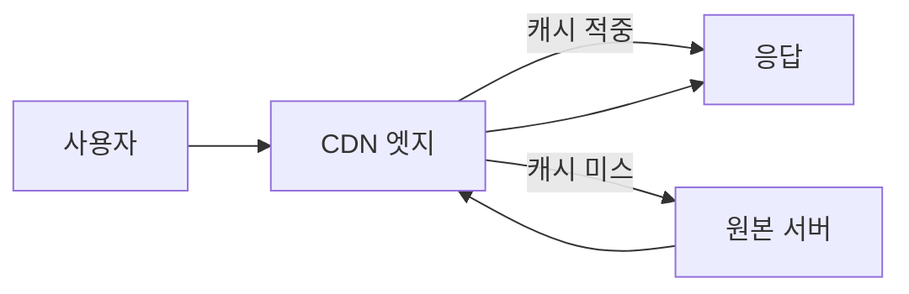

# CDN: 빠르게 전달하는 법보다 올바르게 캐시하는 법

- **CDN은 사용자와 원본 서버 사이의 엣지 서버에 정적·동적 응답을 캐시해 지연 시간과 원본 부하를 줄인다.**
- **캐시 키, TTL, 무효화 정책을 잘못 설계하면 오래된 데이터 노출·사용자 간 데이터 혼재·캐시 폭탄이 발생한다.**
- **CDN은 보안 경계가 아니다. 인증, 권한 검사, 개인정보 응답 캐싱 여부를 원본과 함께 설계해야 한다.**

## 개념 설명

CDN(Content Delivery Network)은 여러 지역의 엣지 서버가 콘텐츠를 사용자와 가까운 위치에서 제공하는 분산 네트워크다. 사용자가 요청하면 엣지는 먼저 캐시를 조회하고, **캐시 적중(hit)** 시 즉시 응답한다. 없거나 만료된 경우 **캐시 미스(miss)** 로 원본 서버에 요청한 뒤 결과를 저장하고 전달한다.

가장 중요한 설계 요소는 `Cache-Control`이다. `public`은 공유 캐시 저장을 허용하고, `private`은 브라우저 같은 개인 캐시에만 저장하도록 한다. 로그인 정보, 장바구니, 결제 결과처럼 사용자별 응답은 기본적으로 `private, no-store`를 고려해야 한다. 반대로 버전이 URL에 포함된 정적 파일(`/app.abc123.js`)은 긴 `max-age`를 사용하기 좋다.

자주 하는 실수는 HTML까지 무조건 장시간 캐시하는 것이다. 배포 후에도 이전 HTML이 남아 새 JavaScript를 참조하지 못할 수 있다. 또 URL 쿼리 파라미터를 캐시 키에서 제외하면 사용자·언어·실험군별 응답이 섞일 수 있다. 반대로 의미 없는 추적 파라미터까지 캐시 키에 포함하면 동일 콘텐츠가 수많은 키로 분산되어 적중률이 떨어진다.

`Purge`만 배포 전략으로 의존하는 것도 안티패턴이다. 전파 지연과 비용이 존재하므로 파일명 해시 기반 버전닝을 사용하고, 긴 TTL과 안전한 롤백을 조합한다. `stale-while-revalidate`는 오래된 응답을 먼저 제공하면서 백그라운드 갱신이 가능하지만, 실시간성이 중요한 데이터에는 부적절하다.

또한 CDN 앞단에 인증 없이 원본 주소가 노출되면 공격자가 CDN을 우회해 원본을 직접 공격할 수 있다. 원본은 CDN의 허용 IP, 전용 인증 헤더, 사설 네트워크 등으로 제한한다. 캐시 적중률만 높이는 것이 목표가 아니라, **정확성·보안·무효화 가능성**까지 함께 검증해야 한다.

## 설정 예시

```http
# 해시가 포함된 정적 파일
Cache-Control: public, max-age=31536000, immutable

# 배포와 자주 변경되는 HTML
Cache-Control: public, max-age=60, stale-while-revalidate=300

# 사용자별 개인정보 응답
Cache-Control: private, no-store
```

## 요청 흐름



## 면접 질문

1. **CDN 캐시 키에 포함해야 할 값은 무엇인가요?**  
   응답을 실제로 다르게 만드는 경로, 필요한 쿼리, 헤더, 쿠키만 포함한다. 과소 포함은 데이터 혼재를, 과다 포함은 적중률 저하를 만든다.

2. **정적 파일에 긴 TTL을 적용해도 배포가 가능한 이유는 무엇인가요?**  
   파일 내용이 바뀌면 파일명에 해시나 버전을 바꾸는 캐시 버스팅을 사용하기 때문이다. HTML은 짧게 캐시해 새 파일 경로를 빠르게 전달한다.

> **한 줄 요약:** CDN 성능은 캐시 적중률보다 먼저, 올바른 캐시 범위와 무효화·보안 정책에서 결정된다.
