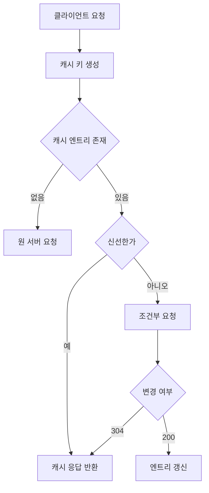

# HTTP 캐싱: 내부 구현과 검증 흐름

- **캐시 키**로 요청을 식별하고 저장된 응답을 조회한다.
- **신선도 계산** 후 캐시된 응답을 그대로 반환하거나 원 서버에 재검증한다.
- `ETag`, `Last-Modified`, `Cache-Control`, `Vary`가 캐시 동작을 결정한다.

## 개념 설명

HTTP 캐시는 브라우저, 프록시, CDN, 서버 내부 등 여러 계층에 존재한다. 캐시 구현의 첫 단계는 요청을 키로 변환하는 것이다. 일반적으로 메서드와 URL이 기본 키가 되며, `Vary: Accept-Encoding`이 있으면 해당 요청 헤더도 키에 포함된다. 따라서 같은 URL이라도 압축 지원 여부나 언어에 따라 별도 응답이 저장될 수 있다.

응답을 저장할 때 캐시는 본문뿐 아니라 상태 코드, 헤더, 저장 시각, 만료 정보, 검증자(validator)를 함께 보관한다. `Cache-Control: max-age=60`이면 저장 시각부터 60초 동안 신선한 응답으로 판단한다. 신선하면 원 서버에 요청하지 않고 즉시 반환한다. 만료된 경우에도 캐시를 바로 폐기하지 않고 조건부 요청으로 재검증할 수 있다.

`ETag`는 응답 표현의 버전 식별자다. 클라이언트는 다음 요청에 `If-None-Match`를 보내고, 서버가 변경되지 않았으면 `304 Not Modified`만 반환한다. 이때 캐시는 기존 본문을 재사용하므로 전송 비용을 줄인다. `Last-Modified`와 `If-Modified-Since`도 같은 목적이지만 초 단위 시간 해상도와 시계 오차의 영향을 받는다.

공유 캐시가 사용자별 응답을 저장하면 정보가 유출될 수 있다. 인증 정보가 포함된 응답에는 보통 `private` 또는 `no-store`를 사용한다. `no-cache`는 저장 금지가 아니라 사용 전 재검증을 의미하고, `no-store`가 저장 자체를 금지한다. 여러 요청이 동시에 만료되면 캐시 스탬피드가 발생하므로, 구현에서는 단일 비행 요청(single-flight), 확률적 조기 갱신, 짧은 stale 허용 정책을 사용한다.

## 코드 예시

```http
HTTP/1.1 200 OK
Cache-Control: public, max-age=60, stale-while-revalidate=30
ETag: "user-v7"
Vary: Accept-Encoding
Content-Encoding: gzip

{"id":42,"name":"Kim"}
```

```http
GET /users/42 HTTP/1.1
If-None-Match: "user-v7"

HTTP/1.1 304 Not Modified
Cache-Control: public, max-age=60
ETag: "user-v7"
```

## 캐시 조회와 재검증 흐름



## 면접 질문

### 1. `no-cache`와 `no-store`의 차이는?

`no-cache`는 저장할 수 있지만 사용 전에 원 서버 재검증이 필요하다. `no-store`는 응답을 저장하지 않는다.

### 2. `Vary`가 캐시 키에 미치는 영향은?

`Vary`에 지정된 요청 헤더 값까지 캐시 키에 포함한다. 잘못 설정하면 캐시 적중률이 낮아지거나 사용자별 응답이 섞일 수 있다.

> **한 줄 정리:** HTTP 캐싱은 응답을 저장하는 기능이 아니라, 캐시 키·신선도·검증자·동시성 정책을 조합해 네트워크 비용과 일관성을 조절하는 시스템이다.
