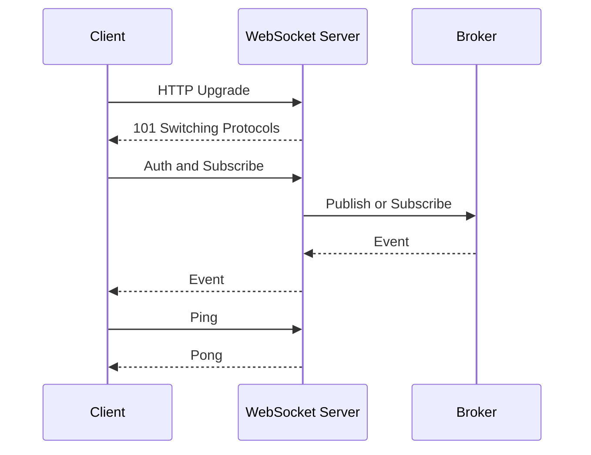

# WebSocket: 실수와 안티패턴 중심 정리

- WebSocket은 HTTP 연결을 `Upgrade`한 뒤, 하나의 TCP 연결에서 양방향 실시간 통신을 제공한다.
- 핵심 운영 이슈는 연결 자체보다 인증, 재연결, heartbeat, 메시지 폭주, 수평 확장이다.
- `ws://`는 평문이므로 운영 환경에서는 반드시 `wss://`와 적절한 연결 종료 처리를 사용한다.

## 개념 설명

WebSocket 연결은 처음에는 HTTP 요청으로 시작하며, 서버가 `101 Switching Protocols`를 응답하면 WebSocket 세션으로 전환된다. 이후에는 클라이언트와 서버가 언제든 메시지를 보낼 수 있어 폴링보다 지연과 오버헤드가 작다. 다만 WebSocket은 TCP 위에서 동작하므로 메시지 전달이 자동으로 영구 보장되는 프로토콜은 아니다. 재연결 시 유실된 이벤트를 복구하려면 메시지 ID, 순서 번호, 재조회 API가 필요하다.

가장 흔한 실수는 연결 성공을 로그인 성공으로 간주하는 것이다. 핸드셰이크 직후 토큰을 검증하고 권한과 구독 채널을 서버에서 결정해야 한다. URL 쿼리의 토큰은 프록시와 로그에 남기 쉬우므로 짧은 수명의 토큰이나 쿠키를 사용하고, Origin 검증도 수행한다. 단, CORS 설정만으로 WebSocket 보안이 해결되지는 않는다.

또 다른 안티패턴은 무한 재연결이다. 네트워크 장애 때 모든 클라이언트가 동시에 재접속하면 서버가 다시 장애 나는 thundering herd가 발생한다. 지수 백오프와 jitter, 최대 재시도 간격을 적용하고, 인증 실패나 명시적 종료에는 재시도하지 않는다. 연결이 살아 있는 것처럼 보여도 중간 프록시가 끊을 수 있으므로 ping/pong 또는 애플리케이션 heartbeat와 timeout을 둔다.

메시지 처리에서도 큰 JSON 하나에 모든 데이터를 담거나 수신 즉시 무제한으로 처리하면 메모리와 이벤트 루프가 고갈된다. 메시지 크기 제한, 스키마 검증, rate limit, backpressure를 적용한다. 서버를 여러 대로 늘리면 한 연결은 특정 서버에 붙으므로 로컬 메모리만 믿지 말고 Redis Pub/Sub, 메시지 브로커 또는 외부 상태 저장소를 사용한다. 배포 시에는 연결 종료 코드와 재연결 정책을 함께 설계한다.

## 코드 예시

```js
const ws = new WebSocket("wss://api.example.com/events");
let timer;

ws.onopen = () => {
  ws.send(JSON.stringify({ type: "auth", token }));
  timer = setInterval(() => ws.send(JSON.stringify({ type: "ping" })), 20000);
};

ws.onmessage = ({ data }) => {
  const msg = JSON.parse(data);
  if (msg.type === "pong") return;
  if (!isValidSchema(msg)) return;
  handleEvent(msg);
};

ws.onclose = () => {
  clearInterval(timer);
  scheduleReconnectWithJitter();
};

ws.onerror = () => ws.close();
```

## 통신 흐름



## 면접 질문

### 1. WebSocket과 HTTP 폴링의 차이는?

WebSocket은 연결을 유지하며 서버도 능동적으로 데이터를 push한다. 폴링은 클라이언트가 주기적으로 요청하므로 실시간성이 낮고 요청 오버헤드가 반복된다. 다만 단방향 알림이나 인프라 제약이 큰 환경에서는 SSE나 폴링이 더 단순할 수 있다.

### 2. WebSocket 연결이 끊겼을 때 어떻게 설계하는가?

지수 백오프와 jitter로 재연결하고, 인증 실패·정상 종료는 재시도하지 않는다. 마지막으로 처리한 이벤트 ID를 저장해 재연결 후 누락분을 조회하며, heartbeat timeout으로 유령 연결을 정리한다.

**한 줄 정리:** WebSocket은 연결보다 재연결·상태 복구·보안·확장성까지 설계해야 운영 가능한 실시간 시스템이 된다.
