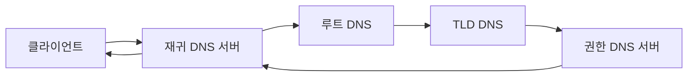

# DNS 해석(DNS Resolution)

- 도메인 이름을 IP 주소로 변환하는 계층형 분산 시스템이다.
- 브라우저·OS·리졸버의 캐시를 먼저 확인하므로 매번 권한 DNS 서버까지 요청하지 않는다.
- 재귀 조회와 반복 조회를 구분하고, TTL·레코드 타입·실패 원인을 설명할 수 있어야 한다.

## 개념 설명

DNS는 `example.com` 같은 사람이 읽는 이름을 `93.184.216.34` 같은 IP 주소로 변환한다. 사용자가 URL을 입력하면 브라우저 캐시, OS 캐시, hosts 파일을 차례로 확인한다. 결과가 없으면 클라이언트는 설정된 DNS 서버(보통 통신사나 사내 DNS)에 재귀 질의를 보낸다.

재귀 DNS 서버는 캐시를 확인한 뒤 필요하면 루트 DNS 서버에 질의한다. 루트는 `.com` 같은 TLD DNS 서버의 위치를 알려주고, TLD 서버는 `example.com`의 권한 있는(Authoritative) DNS 서버를 알려준다. 최종적으로 권한 DNS 서버가 `A` 또는 `AAAA` 레코드를 반환한다. 일반 사용자는 전체 조회 과정을 직접 수행하지 않고 재귀 DNS 서버에 결과를 요청한다.

주요 레코드는 IPv4 주소를 나타내는 `A`, IPv6 주소를 나타내는 `AAAA`, 다른 이름을 가리키는 `CNAME`, 메일 서버를 지정하는 `MX`, 네임서버를 지정하는 `NS`, 도메인 소유권이나 정책 정보를 담는 `TXT`가 있다. `CNAME`은 별칭이므로 최종 IP를 얻기 위해 추가 조회가 발생할 수 있다.

각 응답에는 TTL(Time To Live)이 있어 캐시 유지 시간이 결정된다. TTL이 길면 DNS 조회 부하는 줄지만 IP 변경 전파가 늦어질 수 있다. DNS는 기본적으로 UDP 53번 포트를 사용하며, 응답이 크거나 특정 상황에서는 TCP 53번을 사용한다. DNS over HTTPS(DoH)와 DNS over TLS(DoT)는 질의를 암호화하지만, DNS 서버 자체의 신뢰 문제까지 자동으로 해결하지는 않는다.

```bash
dig www.example.com A
dig www.example.com +trace
```



## 면접 질문

### 1. DNS 재귀 조회와 반복 조회의 차이는 무엇인가요?

재귀 조회는 클라이언트가 DNS 서버에 최종 답변을 요구하는 방식이다. DNS 서버가 다른 서버에 대신 질의한다. 반복 조회는 서버가 직접 최종 답을 주지 않고, 다음에 질의할 서버의 정보를 반환하는 방식이다. 루트, TLD, 권한 DNS 서버 사이의 조회가 대표적인 반복 조회다.

### 2. DNS 변경 후에도 이전 IP로 접속되는 이유는 무엇인가요?

브라우저, OS, 재귀 DNS 서버 또는 중간 네트워크 장비가 TTL 동안 이전 응답을 캐시하기 때문이다. TTL을 낮추면 변경 전파 시간을 줄일 수 있지만 조회량과 DNS 서버 부하는 증가한다. 또한 로컬 캐시를 비우거나 재귀 DNS 서버가 만료할 때까지 기다려야 한다.

**한 줄 정리:** DNS 해석은 캐시를 우선 확인한 뒤 재귀 DNS가 계층형 서버를 따라 도메인을 IP로 변환하는 과정이다.
