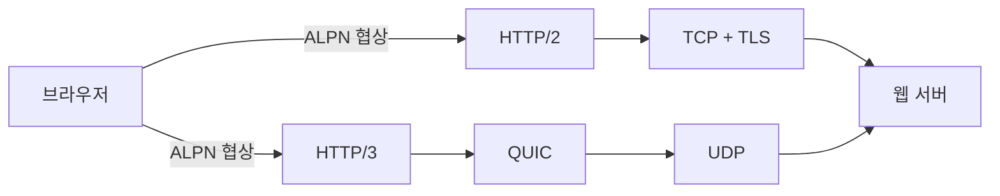

# HTTP/2 vs HTTP/3: 차이와 자주 하는 실수

- **HTTP/2**는 TCP 위에서 스트림 다중화, 헤더 압축(HPACK), 바이너리 프레이밍을 제공한다.
- **HTTP/3**는 UDP 기반의 QUIC 위에서 동작하며, 스트림별 독립성과 연결 마이그레이션을 제공한다.
- HTTP/3가 항상 빠른 것은 아니다. 네트워크 환경, 서버·CDN 지원, 핸드셰이크 비용을 함께 측정해야 한다.

## 개념 설명

HTTP/1.1은 요청마다 연결을 만들거나 파이프라이닝을 사용했지만, HOL(Head-of-Line) 문제와 연결 증가가 발생했다. HTTP/2는 하나의 TCP 연결에서 여러 요청·응답을 스트림으로 multiplexing하여 연결 수를 줄인다. 다만 TCP 패킷 하나가 유실되면 해당 연결의 모든 스트림이 재전송을 기다리므로 **전송 계층의 HOL**은 남아 있다.

HTTP/3는 QUIC을 사용한다. QUIC은 UDP 위에서 신뢰성, 순서 제어, 혼잡 제어, TLS 1.3 핸드셰이크를 구현한다. 한 스트림의 패킷 손실이 다른 스트림을 막지 않아 무선·불안정 네트워크에서 유리하다. 네트워크가 Wi-Fi에서 LTE로 바뀌어도 연결 ID를 이용해 연결을 유지할 수 있다. HTTP/3의 헤더 압축은 HPACK이 아니라 QPACK이다.

자주 하는 실수는 **“UDP라서 HTTP/3는 신뢰성이 없다”**고 생각하는 것이다. 신뢰성은 QUIC이 제공하며, 단순 UDP 애플리케이션과 다르다. 반대로 **“HTTP/3면 무조건 성능이 향상된다”**고 단정하는 것도 안티패턴이다. 짧은 요청이 많거나 서버가 HTTP/3를 제대로 지원하지 않으면 이점이 작을 수 있다.

또한 HTTP/2에서 도메인 샤딩으로 연결을 늘리던 방식을 그대로 유지하면 multiplexing 이점이 줄어든다. `h2`, `h3`를 애플리케이션 코드에서 강제로 선택하기보다 서버가 ALPN과 `Alt-Svc`로 협상하게 해야 한다. HTTP/2 Server Push는 브라우저 지원과 캐시 예측 문제가 커서 일반적인 최적화 수단으로 사용하지 않는 편이 안전하다.

```bash
curl --http2 -I https://example.com
curl --http3 -I https://example.com
curl -I https://example.com
```



## 면접 질문

### 1. HTTP/2도 multiplexing을 지원하는데 HTTP/3가 필요한 이유는?

HTTP/2는 TCP 위에서 동작해 한 패킷 손실이 모든 스트림을 막을 수 있다. HTTP/3의 QUIC은 스트림별로 손실을 처리해 전송 계층 HOL을 줄인다.

### 2. HTTP/3가 UDP를 사용하는데 보안과 신뢰성은 어떻게 보장하는가?

QUIC이 TLS 1.3을 내장해 암호화와 인증을 제공하고, 자체적으로 재전송·순서 제어·혼잡 제어를 수행한다.

> **한 줄 정리:** HTTP/2는 TCP 다중화, HTTP/3는 QUIC 기반 스트림 독립성이 핵심이며, 실제 선택은 측정과 점진적 협상으로 결정한다.
