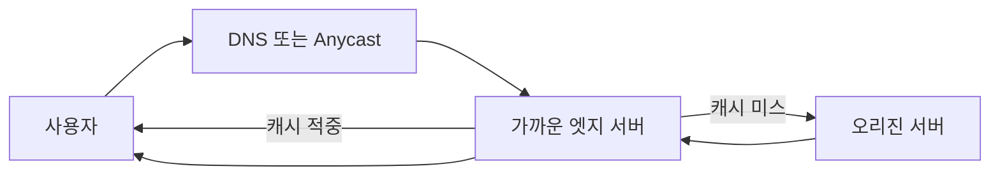

# CDN(Content Delivery Network)

- **핵심 목적:** 사용자와 가까운 엣지 서버에서 정적·캐시 가능한 콘텐츠를 제공해 지연 시간과 오리진 서버 부하를 줄인다.
- **핵심 구성:** 사용자는 DNS 또는 Anycast를 통해 가까운 PoP(Point of Presence)로 연결되고, 캐시 미스 시 오리진에서 콘텐츠를 가져온다.
- **핵심 면접 포인트:** 캐시 적중률, TTL, 캐시 무효화, HTTPS, 원본 보호, 동적 콘텐츠 처리 방식을 설명할 수 있어야 한다.

## 개념 설명

CDN은 전 세계 여러 위치에 분산된 엣지 서버에 콘텐츠를 복제·캐싱하는 네트워크다. 사용자가 오리진 서버에 직접 요청하는 대신 가까운 엣지 서버에 요청하므로 네트워크 왕복 시간과 오리진의 트래픽이 감소한다. 이미지, JavaScript, CSS, 동영상, 다운로드 파일처럼 변경이 적은 정적 콘텐츠에 특히 효과적이다.

일반적인 요청 흐름은 다음과 같다.

1. 사용자가 `cdn.example.com`에 요청한다.
2. DNS 또는 Anycast 라우팅이 지리적 거리, 네트워크 상태, 서버 부하를 고려해 적절한 엣지를 선택한다.
3. 엣지에 콘텐츠가 있으면 **캐시 적중(Cache Hit)** 으로 즉시 응답한다.
4. 없거나 만료되었다면 **캐시 미스(Cache Miss)** 로 오리진에서 가져와 저장한 뒤 사용자에게 응답한다.

캐시 정책은 `Cache-Control`, `Expires`, URL, 쿼리 스트링 등을 기준으로 결정한다. 배포 직후 오래된 파일이 제공되는 문제는 TTL을 줄이거나 캐시 퍼지(Purge)를 수행해 해결한다. 실무에서는 파일명에 해시를 넣는 버전닝(`app.a1b2.js`)으로 무효화 비용을 줄인다.

CDN이 모든 요청을 해결하는 것은 아니다. 로그인, 결제처럼 사용자별 상태가 필요한 동적 요청은 오리진이나 애플리케이션 서버에서 처리한다. 다만 CDN은 TLS 종료, WAF, DDoS 방어, 압축, HTTP/2·HTTP/3 지원 등을 제공해 보안과 성능을 함께 개선할 수 있다. 원본 서버는 CDN에서만 접근하도록 방화벽과 인증을 설정해야 우회 공격을 막을 수 있다.

## 면접 질문 1

**Q. CDN 캐시 적중률을 높이면서 최신 콘텐츠도 보장하려면 어떻게 하나요?**  
**A.** 정적 파일은 긴 TTL과 콘텐츠 해시 기반 파일명을 사용하고, HTML처럼 변경이 잦은 파일은 짧은 TTL을 적용한다. 긴급 변경 시에는 캐시 퍼지를 사용하며, 쿠키나 불필요한 쿼리 스트링 때문에 캐시 키가 과도하게 분리되지 않는지 확인한다.

## 면접 질문 2

**Q. CDN을 사용해도 원본 서버가 공격받을 수 있는 이유와 대응 방법은 무엇인가요?**  
**A.** 공격자가 오리진 IP를 직접 알아내 CDN을 우회하거나, 캐시되지 않는 동적 요청을 대량 전송할 수 있다. 오리진은 CDN IP 대역만 허용하고, 보안 그룹·WAF·Rate Limit을 적용하며, 오리진 도메인과 IP를 외부에 노출하지 않아야 한다.

> **한 줄 정리:** CDN은 가까운 엣지에서 콘텐츠를 캐싱해 지연 시간과 오리진 부하를 줄이지만, 캐시 정책·무효화·원본 보호가 성능과 안정성을 결정한다.
