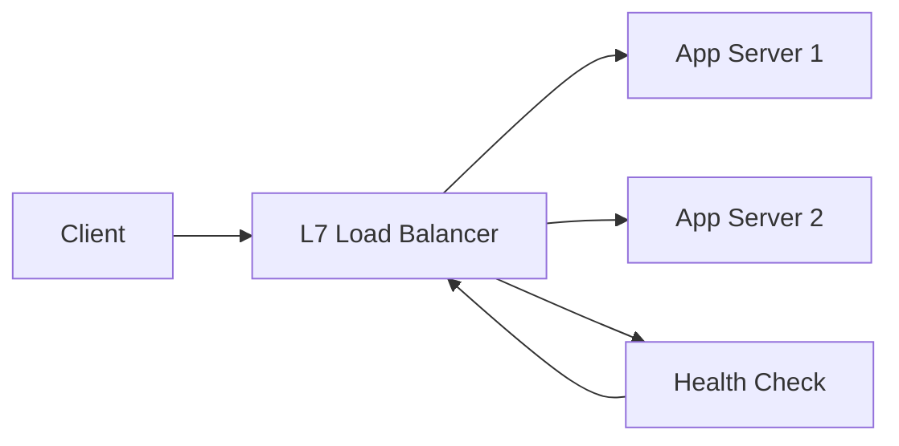

# 로드 밸런싱과 성능 최적화

- **목표:** 요청을 여러 서버에 분산해 처리량을 높이고, 평균 및 tail latency를 낮추며, 특정 서버 장애가 전체 서비스로 전파되지 않게 한다.
- **핵심 선택:** L4는 TCP·UDP 수준에서 빠르게 전달하고, L7은 HTTP 경로·헤더·쿠키를 기준으로 정교하게 라우팅한다.
- **최적화 포인트:** 알고리즘, 연결 재사용, 헬스 체크, 세션 처리, 장애 서버 격리, 관측 지표를 함께 설계해야 한다.

## 개념 설명

로드 밸런서는 클라이언트 요청을 여러 백엔드로 분배하는 구성 요소다. L4 로드 밸런서는 패킷을 빠르게 전달하므로 오버헤드가 작지만 애플리케이션 내용은 이해하지 못한다. L7 로드 밸런서는 URL, HTTP 메서드, 헤더, 쿠키를 활용해 API별 라우팅이나 카나리 배포를 수행할 수 있다.

대표 알고리즘은 `Round Robin`, `Weighted Round Robin`, `Least Connections`, `IP Hash`다. 서버 성능이 동일하면 Round Robin이 단순하고, 처리 능력이 다르면 가중치를 둔다. 요청 처리 시간이 길거나 연결 유지가 중요하면 Least Connections가 유리하다. 단, 연결 수가 적어도 요청 비용이 큰 경우에는 실제 응답 시간이나 큐 길이를 반영하는 동적 라우팅이 더 적합하다.

성능 최적화에서는 단순한 균등 분배보다 **병목 지점과 tail latency**를 봐야 한다. Keep-Alive와 커넥션 풀로 TCP·TLS 연결 비용을 줄이고, HTTP/2 또는 HTTP/3를 상황에 맞게 사용한다. 헬스 체크는 빠른 장애 격리에 필요하지만 너무 빈번하면 백엔드 부하가 증가하므로 주기와 타임아웃을 조절한다. 장애 서버에는 즉시 신규 요청을 보내지 않고, 연결을 자연스럽게 종료하는 connection draining을 적용한다.

세션을 특정 서버에 고정하는 sticky session은 구현이 쉽지만 확장성과 장애 복구를 저해한다. 가능하면 세션을 Redis 같은 외부 저장소에 두고 무상태 서버로 운영한다. 또한 로드 밸런서 자체가 병목이 되지 않도록 수평 확장, 커넥션 제한, 큐 길이, CPU, 응답 시간, 4xx·5xx 비율을 관측해야 한다. 부하 테스트에서는 평균값보다 p95·p99 지연 시간과 재시도 폭증 여부를 확인한다.

```nginx
upstream api {
    least_conn;
    server app1:8080 weight=3 max_fails=3 fail_timeout=10s;
    server app2:8080 weight=1 max_fails=3 fail_timeout=10s;
    keepalive 64;
}
server {
    location / {
        proxy_http_version 1.1;
        proxy_set_header Connection "";
        proxy_pass http://api;
    }
}
```



## 면접 질문

### 1. Round Robin보다 Least Connections가 유리한 경우는?

각 요청의 처리 시간이 다르거나 장시간 연결이 많을 때다. 연결 수가 적은 서버로 새 요청을 보내 부하 편중을 줄일 수 있지만, 요청별 비용 차이까지 항상 반영하지는 못한다.

### 2. Sticky Session을 사용하면 어떤 문제가 생기는가?

특정 서버에 트래픽이 몰리고 서버 장애 시 세션이 끊길 수 있다. 세션을 외부 저장소에 분리해 무상태 서버로 만들면 확장성과 장애 대응이 좋아진다.

> **한 줄 정리:** 좋은 로드 밸런싱은 균등 분배가 아니라 tail latency, 연결 비용, 장애 격리까지 최적화하는 설계다.
