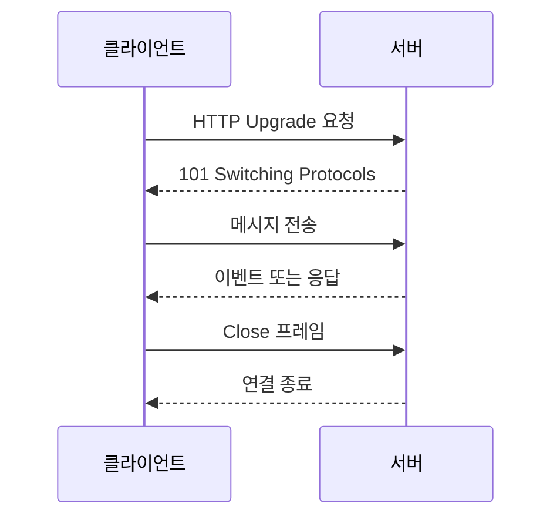

# WebSocket

- **HTTP 기반 핸드셰이크 후 TCP 연결을 계속 유지**하며, 서버와 클라이언트가 모두 언제든 데이터를 보낼 수 있다.
- 실시간 채팅, 알림, 게임, 주식 시세처럼 **낮은 지연 시간과 양방향 통신**이 필요한 기능에 적합하다.
- 연결 수명, 인증, 재연결, 메시지 순서, 다중 서버 확장까지 애플리케이션이 직접 설계해야 한다.

## 개념 설명

WebSocket은 처음에 HTTP 또는 HTTPS 요청으로 연결을 시작한 뒤, `Upgrade` 헤더를 사용해 프로토콜을 WebSocket으로 전환한다. 핸드셰이크가 성공하면 일반적인 요청-응답 모델이 아니라 하나의 연결에서 양방향으로 메시지를 주고받는다.

`ws://`는 평문 연결이고, `wss://`는 TLS가 적용된 암호화 연결이다. 운영 환경에서는 보통 `wss://`를 사용한다. WebSocket은 TCP 위에서 동작하므로 데이터의 순서와 전송 신뢰성은 보장되지만, 연결이 끊겼을 때 자동 복구하지는 않는다.

데이터는 프레임 단위로 전달되며 텍스트와 바이너리를 모두 지원한다. 제어 프레임인 Ping/Pong은 연결 상태 확인과 유휴 연결 유지에 사용하고, Close 프레임으로 정상 종료한다. 서버는 인증 토큰 검증, 메시지 크기 제한, 권한 확인을 수행해야 한다.

대규모 서비스에서는 여러 WebSocket 서버 중 어느 서버에 연결될지 알 수 있다. 따라서 로드 밸런서의 세션 고정만으로 해결하기보다 Redis Pub/Sub, 메시지 브로커 등을 사용해 서버 간 이벤트를 전파한다. 연결마다 메모리와 파일 디스크립터를 사용하므로 타임아웃, 연결 수 제한, 백프레셔도 고려해야 한다.

SSE는 서버에서 클라이언트로만 전달하는 단방향 스트리밍에 적합하고 자동 재연결이 편리하다. 반면 WebSocket은 양방향 통신이 가능하지만 운영 복잡도가 더 높다.

## 코드 예시

```javascript
const socket = new WebSocket("wss://example.com/chat");

socket.onopen = () => {
  socket.send(JSON.stringify({ type: "join", roomId: 1 }));
};

socket.onmessage = ({ data }) => {
  const message = JSON.parse(data);
  console.log("수신:", message);
};

socket.onclose = () => console.log("연결 종료");
socket.onerror = error => console.error("소켓 오류", error);
```

## 동작 흐름



## 면접 질문

### 1. WebSocket과 HTTP 폴링의 차이는 무엇인가요?

HTTP 폴링은 클라이언트가 주기적으로 요청해야 하므로 요청 오버헤드와 지연이 발생한다. WebSocket은 최초 핸드셰이크 이후 연결을 유지해 서버가 즉시 데이터를 전달할 수 있으며, 양방향 통신이 가능하다.

### 2. WebSocket 서버를 여러 대로 확장할 때 무엇을 고려해야 하나요?

클라이언트 연결이 특정 서버에 유지되므로 서버 간 메시지 공유가 필요하다. Redis Pub/Sub나 Kafka 같은 브로커를 사용하고, 연결 인증·재연결·하트비트·메시지 중복 처리·로드 밸런싱 정책을 함께 설계해야 한다.

> **한 줄 정리:** WebSocket은 지속 연결 기반의 양방향 실시간 통신 기술이며, 운영에서는 재연결과 다중 서버 메시지 동기화가 핵심이다.
