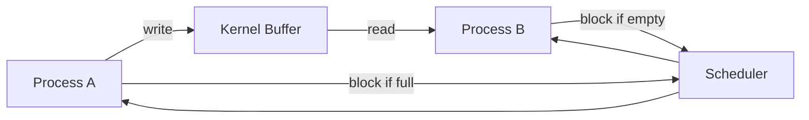

# IPC (Inter-Process Communication)

- 프로세스는 기본적으로 **독립된 주소 공간**을 가지므로, 통신은 커널을 경유하는 경우가 많다.
- IPC의 핵심은 **데이터 전달 + 동기화 + 권한/오버헤드 관리**이다.
- 구현 관점에서는 **copy 비용, 블로킹, 스케줄링, 커널 버퍼 관리**가 성능을 좌우한다.

## Concept explanation

IPC는 서로 다른 프로세스가 데이터를 주고받는 메커니즘이다. 내부 구현 관점에서 보면, 핵심 차이는 **메모리 공유 방식인지, 커널을 통한 전달 방식인지**이다. 예를 들어 파이프, 메시지 큐, 소켓은 보통 커널 내부 버퍼에 데이터를 넣고 빼는 구조라서 사용자 공간 → 커널 공간 → 다른 사용자 공간으로 복사가 발생한다. 반면 공유 메모리는 한 번 매핑을 끝내면 같은 물리 메모리를 여러 프로세스가 접근하므로 복사 비용이 적지만, 대신 **동기화 문제**를 직접 해결해야 한다.

파이프/소켓은 읽기·쓰기 호출 시 프로세스가 블로킹될 수 있고, 버퍼가 가득 차거나 비어 있으면 커널이 대기 상태로 전환한다. 이때 스케줄러가 개입해 다른 태스크를 실행한다. 따라서 IPC 성능은 단순한 API 사용법보다 **버퍼 크기, 동시성, 문맥 전환 횟수**에 크게 좌우된다. 인터뷰에서는 “왜 공유 메모리가 빠른가?”, “왜 소켓은 유연하지만 상대적으로 비싼가?”를 내부 동작으로 설명할 수 있어야 한다.

### Code example

```c
int fd[2];
pipe(fd);
if (fork() == 0) {
    close(fd[1]);
    char buf[16];
    read(fd[0], buf, sizeof(buf));
} else {
    close(fd[0]);
    write(fd[1], "hello", 5);
}
```

### Mermaid



## Interview questions

1. **공유 메모리와 파이프의 차이는?**  
   공유 메모리는 같은 메모리를 직접 보므로 빠르지만 동기화가 필요하다. 파이프는 커널 버퍼를 거쳐 안전하지만 복사와 시스템 콜 비용이 있다.

2. **IPC에서 성능 병목은 어디서 생기나?**  
   주로 사용자-커널 간 복사, 문맥 전환, 블로킹/깨우기, 버퍼 크기 부족에서 발생한다.

**Takeaway:** IPC는 “어떤 API를 쓰는가”보다 “커널 경유 비용과 동기화를 어떻게 줄이는가”가 핵심이다.
