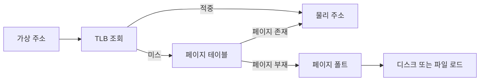

# 페이징과 세그먼테이션: 성능 최적화 관점

- **페이징**은 고정 크기 페이지로 외부 단편화를 줄이지만, 주소 변환과 페이지 폴트 비용이 핵심이다.
- **세그먼테이션**은 코드·데이터·스택처럼 논리 단위로 보호와 공유를 쉽게 하지만, 외부 단편화가 발생할 수 있다.
- 실무 성능은 **TLB 적중률, 메모리 지역성, 페이지 폴트, 페이지 크기, 메모리 압력**에 크게 좌우된다.

## 개념 설명

페이징은 가상 주소를 `페이지 번호 + 오프셋`으로 나누고, 페이지 테이블을 통해 물리 프레임으로 변환한다. 페이지 크기가 작으면 내부 단편화가 줄고 필요한 데이터만 세밀하게 적재할 수 있지만, 페이지 테이블 크기와 TLB 미스 가능성이 증가한다. 큰 페이지(huge page)는 TLB 엔트리 하나로 더 넓은 영역을 매핑해 주소 변환 비용을 줄이지만, 사용하지 않는 메모리까지 적재하거나 메모리 회수 단위가 커질 수 있다.

TLB 적중 시 변환 비용은 작지만, 미스가 나면 페이지 테이블을 추가로 조회한다. 따라서 연속적인 메모리 접근, 배열 순회, 데이터 구조의 캐시 친화적 배치로 지역성을 높이는 것이 중요하다. 페이지 폴트는 디스크 I/O까지 발생할 수 있어 매우 느리므로, 작업 집합이 물리 메모리에 유지되도록 과도한 프로세스 수와 메모리 할당을 피해야 한다. `mmap` 사용 시에도 파일 매핑 범위를 무분별하게 늘리면 폴트와 메모리 압력이 증가한다.

세그먼테이션은 세그먼트별 base와 limit으로 논리 주소를 검사한다. 코드 공유, 읽기 전용 데이터, 스택 보호처럼 의미 단위의 권한 관리에 유리하지만, 세그먼트 크기가 달라 외부 단편화와 compaction 비용이 생긴다. 현대 운영체제는 일반적으로 페이징을 주로 사용하고, 세그먼테이션의 보호·논리 개념은 페이지 권한과 메모리 영역 관리로 보완한다.

성능 최적화 시에는 페이지 폴트율과 TLB miss를 측정하고, NUMA 환경에서는 스레드와 데이터가 같은 노드에 배치되도록 해야 한다. 무조건 huge page를 적용하기보다 접근 패턴, 메모리 점유율, 할당·회수 비용을 함께 검증한다.

## 면접 질문

### 1. TLB가 성능에 중요한 이유는?

TLB는 최근 페이지 번호와 프레임 번호를 캐시한다. 적중하면 페이지 테이블 메모리 접근을 줄이지만, 미스가 나면 추가 조회가 발생하므로 지역성을 높이고 적절한 페이지 크기를 선택해야 한다.

### 2. 큰 페이지가 항상 성능을 향상시키는가?

아니다. TLB miss를 줄이는 장점이 있지만 내부 단편화, 메모리 회수 단위 증가, 불필요한 적재가 발생할 수 있다. 대규모 연속 접근에서 측정 후 적용해야 한다.

> **한 줄 요약:** 페이징·세그먼테이션의 성능은 주소 변환 자체보다 TLB 지역성, 페이지 폴트, 페이지 크기와 메모리 배치 최적화에 달려 있다.
