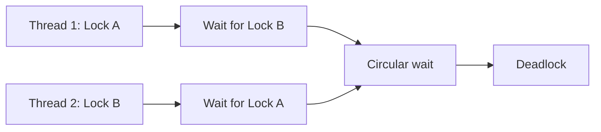

# Lock과 Deadlock: 자주 하는 실수와 안티패턴

- **락의 목적은 공유 상태의 원자성·가시성 보장**이지, 모든 코드를 무조건 감싸는 것이 아니다.
- **Deadlock은 락 획득 순서와 자원 점유 범위가 어긋날 때** 주로 발생한다.
- 실무에서는 **일관된 락 순서, 짧은 임계 구역, 예외에도 해제되는 구조**가 가장 중요하다.

## 개념 설명

락(lock)은 여러 스레드가 공유 자원에 동시에 접근할 때 데이터 경쟁을 막는 동기화 수단이다. Mutex는 한 번에 하나의 스레드만 진입시키고, Read-Write Lock은 읽기 동시성을 허용하되 쓰기 시 배타적으로 동작한다. Spinlock은 짧은 대기에서 컨텍스트 스위칭 비용을 줄일 수 있지만, 오래 기다리는 경우 CPU를 낭비한다.

**임계 구역을 지나치게 크게 잡는 것**은 대표적인 안티패턴이다. I/O, 네트워크 호출, 긴 계산, 외부 API 호출을 락 안에서 수행하면 다른 스레드가 불필요하게 대기한다. 반대로 너무 작게 쪼개면 여러 연산이 하나의 원자적 작업이어야 하는데 중간 상태가 노출될 수 있다.

Deadlock은 일반적으로 다음 네 조건이 동시에 존재할 때 가능하다.

1. 상호 배제: 자원을 한 스레드만 사용한다.
2. 점유 후 대기: 락을 가진 채 다른 락을 기다린다.
3. 비선점: 다른 스레드가 락을 강제로 빼앗을 수 없다.
4. 순환 대기: 스레드들이 원형으로 서로의 락을 기다린다.

가장 흔한 실수는 함수마다 락 획득 순서가 다른 경우다. 예를 들어 A→B 순서와 B→A 순서가 함께 존재하면 경쟁 시 교착 상태가 된다. 모든 락에 전역 순서를 부여하고 항상 그 순서대로 획득하면 순환 대기를 제거할 수 있다.

또한 `tryLock`이나 타임아웃은 deadlock을 완화하지만 자동으로 올바른 동시성 로직을 만들어 주지는 않는다. 획득 실패 시 작업을 재시도하거나 롤백하는 정책이 필요하다. 락 해제를 `finally`에 두지 않는 것, 락을 반환 객체나 콜백 밖으로 노출하는 것, 재진입 여부를 확인하지 않는 것도 자주 발생하는 버그다. 가능하면 불변 객체, 원자 자료구조, 메시지 전달로 공유 상태 자체를 줄이는 편이 안전하다.

```java
void transfer(Account a, Account b, int amount) {
    Account first = a.id() < b.id() ? a : b;
    Account second = first == a ? b : a;
    first.lock();
    try {
        second.lock();
        try {
            a.withdraw(amount);
            b.deposit(amount);
        } finally {
            second.unlock();
        }
    } finally {
        first.unlock();
    }
}
```



## 면접 질문

1. **Deadlock의 발생 조건은 무엇인가요?**  
   상호 배제, 점유 후 대기, 비선점, 순환 대기 네 가지 조건이 동시에 필요하다. 락 순서 통일로 순환 대기를 제거하는 방식이 대표적인 예방책이다.

2. **Deadlock과 livelock의 차이는 무엇인가요?**  
   Deadlock은 서로 영원히 대기하며 진행하지 않는 상태이고, livelock은 락을 양보하거나 재시도하지만 상태만 계속 바뀌고 실제 작업은 진행되지 않는 상태다.

> **한 줄 요약:** 락은 짧고 일관된 순서로 획득하며, 해제는 반드시 보장하고 공유 상태는 가능한 한 줄여라.
