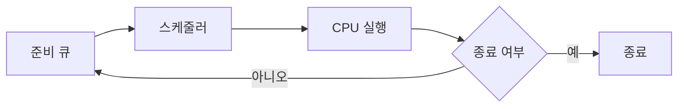

# 스케줄링 알고리즘

- **목표:** CPU 이용률과 처리량을 높이고, 대기 시간·응답 시간·반환 시간을 줄인다.
- **핵심 기준:** 선점 여부, 공정성, 평균 대기 시간, 기아(starvation) 발생 가능성을 비교한다.
- **면접 포인트:** 일반적인 최적 알고리즘은 없으며, 배치 시스템·대화형 시스템·실시간 시스템의 요구사항에 따라 선택한다.

## 개념 설명

스케줄링은 여러 프로세스 또는 스레드 중 CPU를 사용할 대상을 결정하는 정책이다. 주요 평가지표는 다음과 같다.

- **반환 시간(Turnaround Time):** 도착부터 종료까지의 시간
- **대기 시간(Waiting Time):** 준비 큐에서 기다린 시간
- **응답 시간(Response Time):** 요청 후 처음 CPU를 얻기까지의 시간
- **처리량(Throughput):** 단위 시간당 완료한 작업 수
- **CPU 이용률:** CPU가 실제 작업을 수행한 비율

**FCFS(First-Come, First-Served)**는 도착 순서대로 실행하며 구현이 단순하지만, 긴 작업이 앞에 있으면 짧은 작업이 오래 기다리는 convoy effect가 발생한다. **SJF(Shortest Job First)**는 실행 시간이 짧은 작업을 먼저 처리해 평균 대기 시간이 이론적으로 최소지만, 실행 시간을 미리 알기 어렵고 긴 작업이 기아 상태가 될 수 있다. **SRTF(Shortest Remaining Time First)**는 SJF의 선점형 버전이다.

**Round Robin**은 각 프로세스에 일정한 시간 할당량(time quantum)을 주고 순환한다. 응답성이 좋지만 할당량이 너무 작으면 문맥 교환 비용이 커지고, 너무 크면 FCFS와 비슷해진다. **우선순위 스케줄링**은 우선순위가 높은 작업부터 실행하며, aging으로 오래 기다린 작업의 우선순위를 높여 기아를 완화한다.

운영체제의 일반 스케줄러는 우선순위, 실행 이력, CPU affinity 등을 함께 고려한다. 실시간 시스템에서는 **EDF(Earliest Deadline First)**처럼 마감 시간이 빠른 작업을 우선하거나, 고정 우선순위 방식인 **Rate Monotonic**을 사용한다.

## 코드 예시: Round Robin

```python
from collections import deque

def round_robin(jobs, quantum):
    q, time, result = deque(jobs), 0, []
    while q:
        name, remain = q.popleft()
        run = min(remain, quantum)
        time += run
        remain -= run
        result.append((name, time))
        if remain:
            q.append((name, remain))
    return result

print(round_robin([("A", 5), ("B", 3), ("C", 1)], 2))
```

## 동작 흐름



## 면접 질문

### 1. 선점형과 비선점형 스케줄링의 차이는?

**선점형**은 실행 중인 프로세스를 중단하고 다른 프로세스에 CPU를 할당할 수 있다. 응답성이 좋지만 문맥 교환 비용과 동기화 문제가 증가한다. **비선점형**은 프로세스가 종료되거나 대기 상태가 될 때까지 실행하므로 단순하지만 긴 작업이 CPU를 독점할 수 있다.

### 2. Round Robin의 time quantum은 어떻게 정하는가?

너무 작으면 문맥 교환이 많아져 처리량이 감소하고, 너무 크면 응답성이 나빠져 FCFS처럼 동작한다. 따라서 문맥 교환 비용보다 충분히 크면서 사용자가 체감하는 응답 시간을 만족하도록 workload와 시스템 목표에 맞춰 조정한다.

> **한 줄 정리:** 스케줄링은 성능·응답성·공정성의 균형을 맞추는 문제이며, 면접에서는 선점성·기아·time quantum·평가지표를 함께 설명해야 한다.
