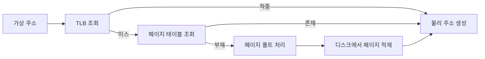

# 페이징과 세그멘테이션: 자주 하는 실수와 안티패턴

- **페이징**은 가상 주소 공간을 고정 크기 페이지로, 물리 메모리를 같은 크기의 프레임으로 나눈다.
- **세그멘테이션**은 코드·데이터·스택처럼 의미가 다른 가변 크기 영역으로 나눈다.
- 실무에서는 페이징과 TLB, 페이지 폴트, 권한 검사가 핵심이며, “페이지 폴트 = 오류”로 이해하면 안 된다.

## 개념 설명

페이징에서 가상 주소는 **페이지 번호 + 오프셋**으로 구성된다. 페이지 번호로 페이지 테이블을 조회해 물리 프레임 번호를 얻고, 오프셋은 그대로 사용한다. 예를 들어 페이지 크기가 4KiB이면 오프셋은 12비트다. 페이지 테이블은 프로세스마다 존재하며, 실제 접근 시에는 빠른 캐시인 **TLB**가 먼저 조회된다.

TLB 미스는 페이지 테이블을 다시 확인하는 상황이지, 곧바로 페이지 폴트는 아니다. 페이지 테이블에서 해당 페이지가 물리 메모리에 없거나 권한이 맞지 않을 때 페이지 폴트가 발생한다. 운영체제는 디스크나 스왑 영역에서 페이지를 읽어 프레임에 배치한 뒤 실행을 재개할 수 있다. 따라서 페이지 폴트는 정상적인 가상 메모리 동작일 수도 있지만, 반복되면 성능 저하를 일으킨다.

페이징의 주요 낭비는 할당 단위보다 작은 공간이 남는 **내부 단편화**다. 반면 세그멘테이션은 크기가 서로 달라 외부 단편화가 발생하기 쉽다. 세그먼트의 논리적 의미와 권한을 표현하기 쉽지만, 연속 공간 확보와 재배치가 부담이다. 현대 운영체제는 일반적으로 페이징을 중심으로 사용하며, 세그먼트는 제한적이거나 호환성 목적으로 다룬다.

자주 하는 실수는 페이지와 프레임을 같은 것으로 부르는 것, TLB 미스와 페이지 폴트를 혼동하는 것, 모든 페이지 폴트를 프로그램 버그로 단정하는 것이다. 또한 페이지 크기를 무조건 크게 하면 좋다고 생각하면 안 된다. 큰 페이지는 TLB 효율을 높이지만 내부 단편화와 불필요한 메모리 로딩을 늘릴 수 있다. 주소 계산 시 페이지 번호와 오프셋의 비트 수를 섞는 것도 흔한 오류다.

안티패턴은 페이지 폴트가 잦은데도 무작정 메모리만 늘리는 것이다. 실제 원인이 랜덤 접근, 과도한 워킹셋, 잘못된 캐시 정책일 수 있으므로 TLB 적중률, major/minor fault, 메모리 접근 패턴을 함께 측정해야 한다. 보안 측면에서도 페이징 자체가 격리를 보장한다고 생각하지 말고, 읽기·쓰기·실행 권한과 사용자·커널 모드 검사를 확인해야 한다.

## 면접 질문

### 1. TLB 미스와 페이지 폴트의 차이는?

TLB 미스는 TLB에 변환 정보가 없어 페이지 테이블을 조회하는 상황이다. 페이지 폴트는 페이지가 메모리에 없거나 접근 권한이 맞지 않아 예외 처리가 필요한 상황이다. TLB 미스가 항상 페이지 폴트로 이어지지는 않는다.

### 2. 페이징과 세그멘테이션의 단편화 차이는?

페이징은 고정 크기 할당으로 내부 단편화가 주로 발생하고, 세그멘테이션은 가변 크기 할당으로 외부 단편화가 주로 발생한다.

> **한 줄 요약:** 페이지·프레임, TLB 미스·페이지 폴트를 구분하고, 페이지 폴트와 단편화의 원인을 측정으로 판단하라.
