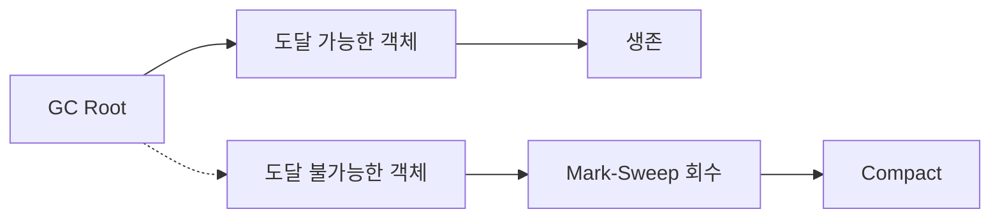

# Garbage Collection(GC)

- GC는 프로그램이 더 이상 접근할 수 없는 객체를 자동으로 회수해 메모리 누수를 줄인다.
- 핵심 과정은 **도달 가능성 판단**, **메모리 회수**, 필요 시 **압축 및 세대별 최적화**다.
- 면접에서는 Stop-The-World, 세대별 GC, 메모리 누수와 참조 카운팅의 차이를 자주 묻는다.

## 개념 설명

Garbage Collection은 개발자가 직접 `free`를 호출하지 않아도 힙에 생성된 객체의 수명을 관리하는 기능이다. GC는 일반적으로 스택 변수, 전역 변수, 레지스터 등에서 시작하는 **GC Root**를 기준으로 객체 그래프를 탐색한다. Root에서 도달할 수 없는 객체는 애플리케이션이 더 이상 사용할 수 없으므로 가비지로 판단한다.

대표적인 알고리즘은 **Mark-Sweep**이다. 먼저 도달 가능한 객체를 표시(Mark)하고, 표시되지 않은 객체를 제거(Sweep)한다. 이때 빈 공간이 흩어지면 외부 단편화가 생길 수 있어, 살아 있는 객체를 한쪽으로 이동시키는 **Compact** 단계를 추가하기도 한다.

대부분의 JVM GC는 **세대별 가설(Generational Hypothesis)**을 활용한다. 새 객체는 Young Generation에 배치하고, 짧은 생명을 가진 객체를 자주 수집한다. 여러 번 살아남은 객체는 Old Generation으로 승격한다. Young GC는 비교적 짧지만 자주 발생하고, Old GC 또는 Full GC는 비용이 크고 애플리케이션 일시 정지 시간이 길어질 수 있다.

GC 중 애플리케이션 실행이 멈추는 시간을 **Stop-The-World(STW)**라고 한다. 현대 수집기는 동시 마킹, 병렬 처리, 지역 수집 등을 사용해 STW 시간을 줄이지만, GC 비용이 완전히 사라지는 것은 아니다. 따라서 GC 성능은 처리량, 지연 시간, 힙 크기, 객체 생성률을 함께 보고 판단해야 한다.

참조 카운팅은 객체가 참조되는 횟수를 세어 0이 되면 회수하는 방식이다. 즉시 회수할 수 있지만 순환 참조를 처리하지 못한다. 반면 추적 기반 GC는 순환 참조도 회수할 수 있으나 탐색과 일시 정지 비용이 발생한다. GC가 있어도 정적 컬렉션, 리스너, 캐시 등에 불필요한 참조를 계속 보관하면 논리적 메모리 누수가 발생한다.

```java
List<byte[]> cache = new ArrayList<>();

void handleRequest() {
    byte[] data = loadData();
    cache.add(data); // 계속 참조되어 GC 대상이 되지 않음
}
```



## 면접 질문

### 1. GC가 있는데도 메모리 누수가 발생할 수 있나요?

가능하다. GC는 **도달 불가능한 객체**만 회수한다. 전역 컬렉션, 캐시, 이벤트 리스너 등이 더 이상 필요 없는 객체를 계속 참조하면 객체는 도달 가능하므로 회수되지 않는다. 캐시 크기 제한, 만료 정책, 리스너 해제 등이 해결책이다.

### 2. Young GC와 Full GC의 차이는 무엇인가요?

Young GC는 Young 영역을 대상으로 하며 짧은 생명 객체를 빠르게 회수한다. Full GC는 일반적으로 Old 영역을 포함한 더 넓은 영역을 정리하므로 비용과 STW 시간이 크다. Full GC가 빈번하면 객체 생성량, 힙 크기, 승격 실패, 메모리 누수를 함께 점검한다.

## 한 줄 정리

GC는 도달 불가능한 객체를 자동 회수하지만, 참조를 잘못 관리하면 메모리 누수와 긴 GC 지연은 여전히 발생한다.
