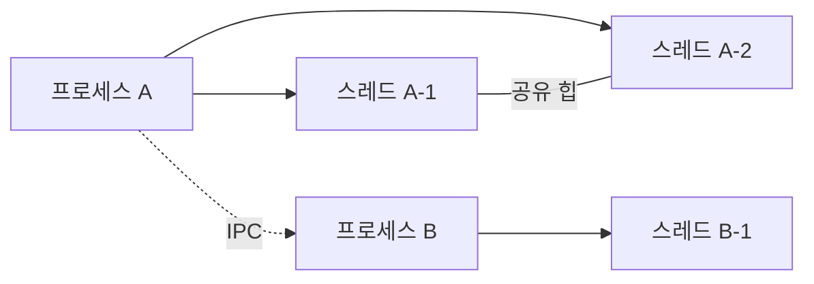

# 프로세스 vs 스레드

## 핵심 요약

- **프로세스(Process)**: 실행 중인 프로그램이며, 독립적인 메모리 공간과 자원을 가진다.
- **스레드(Thread)**: 프로세스 내부의 실행 흐름으로, 같은 프로세스의 메모리를 공유한다.
- 프로세스는 **안정성과 격리**, 스레드는 **빠른 작업 전환과 자원 공유**에 유리하지만 동기화 문제가 발생할 수 있다.

## 개념 설명

프로세스는 운영체제로부터 독립된 주소 공간을 할당받는다. 일반적으로 코드, 데이터, 힙, 스택 영역을 가지며, 한 프로세스의 오류가 다른 프로세스에 직접 영향을 주기 어렵다. 대신 프로세스 간 통신(IPC)이 필요하므로 생성과 문맥 교환 비용이 상대적으로 크다. IPC에는 파이프, 소켓, 공유 메모리, 메시지 큐 등이 있다.

스레드는 프로세스 내부에서 실제 작업을 수행하는 실행 단위다. 같은 프로세스의 코드, 데이터, 힙을 공유하고, 각자 독립적인 스택과 레지스터를 가진다. 메모리를 공유하므로 통신이 빠르지만, 여러 스레드가 동시에 데이터를 변경하면 경쟁 조건과 데이터 불일치가 발생할 수 있다. 이를 막기 위해 mutex, synchronized, semaphore, atomic 연산 등을 사용한다.

면접에서는 “스레드가 프로세스보다 무조건 빠른가?”를 구분해야 한다. 스레드는 생성 및 전환 비용이 작고 공유 메모리 접근이 편리하지만, 락 경합과 동기화 비용이 발생한다. CPU 코어가 여러 개라면 병렬 실행이 가능하고, 단일 코어에서는 동시성만 제공된다. 또한 한 스레드의 치명적 오류가 프로세스 전체를 종료시킬 수 있다.

```python
import threading
import multiprocessing

def work():
    print("작업 실행")

threading.Thread(target=work).start()
multiprocessing.Process(target=work).start()
```



## 면접 질문 1

**Q. 프로세스와 스레드의 가장 큰 차이는 무엇인가?**

**A.** 프로세스는 독립된 메모리 공간을 가지지만, 스레드는 같은 프로세스의 코드·데이터·힙을 공유하고 스택은 독립적으로 가진다. 따라서 프로세스는 격리성이 높고, 스레드는 통신과 전환이 효율적이다.

## 면접 질문 2

**Q. 멀티스레드에서 발생하는 문제와 해결 방법은?**

**A.** 공유 데이터에 동시에 접근하면 경쟁 조건이 발생할 수 있다. mutex나 synchronized로 임계 영역을 보호하고, atomic 자료형이나 불변 객체를 사용해 공유 상태를 줄인다. 락을 사용할 때는 교착 상태를 피하도록 락 획득 순서도 일관되게 관리해야 한다.

## 한 줄 정리

**프로세스는 격리를 위한 단위이고, 스레드는 자원을 공유하며 실행하는 단위다.**
