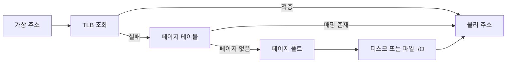

# 가상 메모리: 성능 최적화 관점

- **TLB 적중률과 페이지 지역성**이 높을수록 주소 변환 비용과 캐시 미스가 줄어든다.
- **페이지 폴트와 스와핑**은 디스크 I/O를 유발하므로 워킹 셋을 물리 메모리에 유지해야 한다.
- 성능 최적화에는 **연속 접근, 적절한 페이지 크기, 메모리 사용량 제한, NUMA 인식**이 중요하다.

## 개념 설명

가상 메모리는 프로세스가 연속적이고 독립적인 주소 공간을 사용하게 하며, 운영체제가 가상 주소를 물리 주소로 매핑한다. 메모리는 일반적으로 페이지 단위로 관리되고, 페이지 테이블이 매핑 정보를 보관한다. 변환 결과는 TLB(Translation Lookaside Buffer)에 캐시된다.

CPU가 주소에 접근하면 먼저 TLB를 조회한다. TLB 적중 시 빠르게 물리 주소를 얻지만, 실패하면 페이지 테이블을 여러 단계 탐색해야 한다. 따라서 무작위 접근보다 배열을 순차적으로 탐색하는 코드가 TLB와 CPU 캐시 모두에 유리하다. 큰 페이지(예: 2MB Huge Page)는 TLB 엔트리 하나가 더 넓은 메모리를 담당해 TLB 미스를 줄일 수 있지만, 내부 단편화와 관리 비용이 증가한다.

페이지가 물리 메모리에 없으면 페이지 폴트가 발생한다. 운영체제는 디스크나 파일에서 페이지를 읽고, 필요하면 다른 페이지를 내보낸다. 이 과정은 메모리 접근보다 매우 느리므로 페이지 폴트율과 major fault를 모니터링해야 한다. 지속적인 페이지 교체(thrashing)는 CPU 사용률을 낮추고 지연 시간을 크게 증가시킨다.

최적화 시에는 데이터 구조를 작게 만들고, 자주 함께 사용하는 데이터를 가까이 배치한다. 프로세스의 워킹 셋이 RAM보다 커지지 않도록 버퍼 크기와 동시성을 조절하며, 컨테이너의 메모리 제한도 실제 워킹 셋보다 여유 있게 설정한다. 서버에서는 `vmstat`, `/proc/<pid>/stat`, `perf`, 애플리케이션 메트릭으로 TLB 미스, minor/major fault, RSS, swap 발생을 확인한다. NUMA 시스템에서는 스레드와 메모리를 같은 노드에 배치해야 원격 메모리 접근 지연을 줄일 수 있다.

```c
#include <stddef.h>
#include <stdint.h>

#define N (64 * 1024 * 1024)
static uint8_t buf[N];

uint64_t sequential(void) {
    uint64_t sum = 0;
    for (size_t i = 0; i < N; i += 64) sum += buf[i];
    return sum;
}

uint64_t sparse(void) {
    uint64_t sum = 0;
    for (size_t i = 0; i < N; i += 4096) sum += buf[i];
    return sum;
}
```

## 주소 변환 흐름



## 면접 질문

### 1. TLB 미스와 페이지 폴트의 차이는?

TLB 미스는 주소 변환 캐시에서 매핑을 찾지 못한 상황이며, 페이지 테이블 탐색으로 해결될 수 있다. 페이지 폴트는 해당 페이지가 물리 메모리에 없거나 접근 권한이 맞지 않는 상황으로, 필요하면 디스크 I/O가 발생한다.

### 2. Huge Page가 항상 성능을 높이는가?

아니다. TLB 미스를 줄이는 장점이 있지만, 메모리 낭비와 할당 실패 가능성이 커진다. 큰 연속 메모리를 장기간 사용하는 데이터베이스나 대규모 캐시에는 유리하지만, 작은 객체가 많거나 메모리 변동이 큰 서비스에는 신중해야 한다.

> **핵심 요약:** 가상 메모리 성능은 워킹 셋을 RAM에 유지하고, 지역성을 높여 TLB 미스와 페이지 폴트를 줄이는 데서 결정된다.
