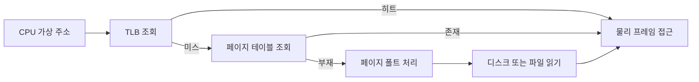

# 페이징과 세그멘테이션: 실무 트러블슈팅 관점

- **페이징**은 가상 메모리를 고정 크기 페이지로 나눠 외부 단편화를 줄이지만, 페이지 폴트와 TLB 미스 비용이 발생한다.
- **세그멘테이션**은 코드·데이터·스택처럼 논리적 단위로 나누어 보호와 공유에 유리하지만, 외부 단편화가 생길 수 있다.
- 실무에서는 세그멘테이션 자체보다 **페이지 폴트, RSS 증가, 스왑, TLB 효율, 메모리 매핑 상태**를 주로 관찰한다.

## 개념 설명

프로세스가 사용하는 주소는 일반적으로 **가상 주소**다. 페이징에서는 가상 주소를 `페이지 번호 + 오프셋`으로 나누고, 페이지 테이블을 통해 페이지 번호를 물리 메모리의 프레임 번호로 변환한다. 오프셋은 그대로 유지된다. 최근 변환 결과는 TLB에 캐시되므로 TLB 히트율이 낮으면 메모리 접근이 느려진다.

페이지가 물리 메모리에 없으면 **페이지 폴트**가 발생한다. 운영체제는 디스크나 파일에서 페이지를 읽고 페이지 테이블을 갱신한 뒤 명령을 재실행한다. 정상적인 수요 페이징도 최초 접근 시 폴트를 만들 수 있지만, 지속적인 `major fault`와 스왑 발생은 성능 저하의 신호다.

세그멘테이션은 세그먼트마다 base와 limit을 둔다. 논리 주소가 한계를 넘으면 보호 예외가 발생한다. 현대 x86-64 운영체제는 평탄한(flat) 세그먼트 모델을 주로 사용하므로, 실제 메모리 관리의 핵심은 페이징이다. 다만 실행 파일의 코드·데이터 영역, 스택, 공유 라이브러리는 논리적 세그먼트와 유사한 매핑 단위로 관리된다.

트러블슈팅 시 `free`의 available 메모리, 프로세스별 RSS와 VSZ, `/proc/<pid>/smaps`의 익명·파일 매핑, `vmstat`의 `si/so`, `sar -B`의 페이지 폴트 수를 함께 본다. RSS가 커도 파일 캐시일 수 있고, VSZ가 크다고 실제 RAM을 많이 쓰는 것은 아니다. 컨테이너에서는 cgroup 메모리 제한 때문에 호스트 여유 메모리와 무관하게 OOM Kill이 발생할 수 있다. 큰 페이지(huge page)는 TLB 미스를 줄일 수 있지만 내부 단편화와 설정 복잡성이 증가한다.

```bash
pid=1234
grep -E 'Vm(Size|RSS|Swap)' /proc/$pid/status
vmstat 1 5
cat /proc/$pid/smaps_rollup
dmesg -T | grep -Ei 'oom|out of memory|page allocation'
```



## 면접 질문

### 1. 페이지 폴트는 항상 오류인가?

아니다. 최초 접근한 페이지를 메모리에 올리는 정상적인 minor fault도 있다. 디스크 I/O가 필요한 major fault가 반복되면 스래싱과 응답 지연을 의심한다.

### 2. 페이징과 세그멘테이션의 가장 큰 차이는?

페이징은 고정 크기 블록으로 물리 메모리 할당을 단순화하고 외부 단편화를 줄인다. 세그멘테이션은 논리적 단위와 보호 권한을 표현하기 쉽지만 외부 단편화가 발생한다.

**한 줄 정리:** 메모리 장애는 주소 변환 이론보다 RSS·페이지 폴트·스왑·cgroup 제한을 함께 측정해 원인을 좁히는 것이 핵심이다.
