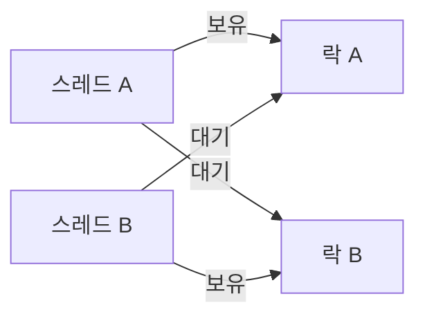

# 락과 데드락

- **락(Lock)**: 여러 스레드가 공유 자원에 동시에 접근하지 못하도록 문을 잠그는 장치다.
- **데드락(Deadlock)**: 서로 락을 놓지 않고 상대방의 락을 기다려 프로그램이 영원히 멈추는 상태다.
- 데드락은 **상호 배제, 점유와 대기, 비선점, 순환 대기**가 모두 성립할 때 발생한다.

## 개념 설명

은행 창구에 통장 원장이 하나뿐이라고 생각해 보자. 여러 직원이 동시에 잔액을 수정하면 한 명의 결과가 다른 사람의 결과를 덮어쓸 수 있다. 이때 원장을 사용하는 동안 열쇠를 빌리는 것이 **락**이다. 한 직원이 열쇠를 가진 동안 다른 직원은 기다린다. 작업이 끝나면 반드시 열쇠를 반납해야 한다.

락은 공유 데이터의 **임계 영역(critical section)** 을 보호한다. 예를 들어 재고가 1개 남았을 때 두 주문이 동시에 처리되면, 실제로는 한 명만 성공해야 하지만 둘 다 구매할 수 있다. 락을 사용하면 확인과 차감 작업을 한 덩어리로 실행해 문제를 막는다.

하지만 열쇠가 두 개라면 문제가 생길 수 있다. 직원 A가 원장 열쇠를 가진 채 금고 열쇠를 기다리고, 직원 B가 금고 열쇠를 가진 채 원장 열쇠를 기다리면 둘 다 양보하지 못한다. 이것이 **데드락**이다. 데드락 상태에서는 CPU가 바빠 보이지 않아도 해당 작업은 진행되지 않는다.

예방 방법은 락 획득 순서를 항상 동일하게 정하는 것이다. 모든 코드가 `계좌 A → 계좌 B` 순서로 락을 얻으면 순환 대기가 사라진다. 또한 락을 짧게 보유하고, 중첩 락을 줄이며, 타임아웃이나 `tryLock`으로 무한 대기를 피할 수 있다. 운영 환경에서는 스레드 덤프를 통해 서로 어떤 락을 기다리는지 확인한다.

## 코드 예시

```java
final Object lockA = new Object();
final Object lockB = new Object();

void transfer() {
    synchronized (lockA) {       // 항상 A를 먼저 획득
        synchronized (lockB) {   // 그다음 B를 획득
            moveMoney();
        }
    }
}
```

## 데드락 발생 흐름



## 면접 질문

### 1. 데드락의 발생 조건 4가지는?

**상호 배제**, **점유와 대기**, **비선점**, **순환 대기**다. 하나라도 제거하면 데드락을 예방할 수 있다.

### 2. 데드락과 경쟁 조건의 차이는?

경쟁 조건은 실행 순서에 따라 결과가 달라지는 문제이고, 데드락은 스레드들이 서로 자원을 기다리며 영원히 멈추는 문제다. 락은 경쟁 조건을 줄이지만, 잘못 사용하면 데드락을 만들 수 있다.

## 한 줄 정리

**락은 공유 자원을 안전하게 지키는 열쇠이고, 데드락은 서로 열쇠를 쥔 채 상대의 열쇠를 기다리는 교착 상태다.**
