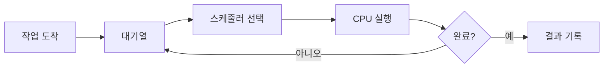

# 스케줄링 알고리즘과 실무 트러블슈팅

- **목표가 다르면 알고리즘도 달라진다:** 처리량, 응답시간, 공정성, 마감시간 중 무엇을 우선할지 먼저 정한다.
- **평균값만 보면 위험하다:** 평균 지연시간뿐 아니라 p95/p99, 대기열 길이, 컨텍스트 스위치 횟수를 함께 본다.
- **장애는 알고리즘보다 운영 조건에서 발생한다:** 우선순위 역전, 기아, CPU 포화, I/O 블로킹, 잘못된 타임슬라이스를 점검한다.

## 개념 설명

스케줄링은 여러 작업에 CPU 또는 실행 기회를 배분하는 정책이다. 대표적으로 **FCFS**는 도착 순서대로 처리해 구현이 단순하지만, 긴 작업 하나가 뒤의 짧은 작업을 막는 convoy effect가 발생한다. **SJF**는 짧은 작업을 먼저 실행해 평균 대기시간을 줄이지만, 실행시간을 미리 알아야 하며 긴 작업이 기아 상태가 될 수 있다.

**Round Robin**은 각 작업에 타임슬라이스를 배정하고 순환한다. 대화형 서비스의 응답성에 유리하지만 슬라이스가 너무 짧으면 컨텍스트 스위치 비용이 커지고, 너무 길면 FCFS처럼 동작한다. **우선순위 스케줄링**은 긴급 작업을 먼저 처리하지만 낮은 우선순위 작업이 계속 밀릴 수 있어 aging으로 우선순위를 점진적으로 높인다.

실무에서는 알고리즘 이름보다 병목의 위치가 중요하다. CPU 사용률이 100%이고 run queue가 길면 워커 수를 무작정 늘리지 말고 작업 분할, 배압, 수평 확장을 검토한다. CPU는 여유인데 지연시간이 높다면 락 경합, 디스크·네트워크 I/O, 외부 API 대기를 확인한다. 우선순위가 높은 작업이 낮은 작업의 락을 기다리면 우선순위 역전이므로 priority inheritance나 락 범위 축소를 적용한다.

모니터링에서는 작업 도착률, 처리율, 대기시간, 실행시간, p99 지연, run queue, context switch, CPU steal을 함께 수집한다. 장애 재현 시 작업별 큐 체류시간과 실제 실행시간을 분리하면 스케줄러 문제와 애플리케이션 처리 지연을 구분할 수 있다.

## 간단한 Round Robin 예시

```python
from collections import deque

def round_robin(jobs, quantum):
    q, time, result = deque(jobs), 0, []
    while q:
        name, remain = q.popleft()
        run = min(remain, quantum)
        time += run
        remain -= run
        result.append((name, time))
        if remain:
            q.append((name, remain))
    return result

print(round_robin([("A", 5), ("B", 2), ("C", 4)], 2))
```

## 처리 흐름



## 면접 질문

**Q1. Round Robin의 타임슬라이스가 너무 작으면 어떤 문제가 생기나요?**  
A. 컨텍스트 스위치가 증가해 실제 작업 시간이 줄고 처리량이 악화됩니다.

**Q2. 우선순위가 낮은 작업의 기아를 어떻게 방지하나요?**  
A. 오래 기다린 작업의 우선순위를 올리는 aging을 적용하거나 최소 실행 기회를 보장합니다.

> 핵심: 스케줄링 튜닝은 알고리즘 선택보다 p99 지연, 대기열, 실행·대기 원인을 분리해 관측하는 것에서 시작한다.
