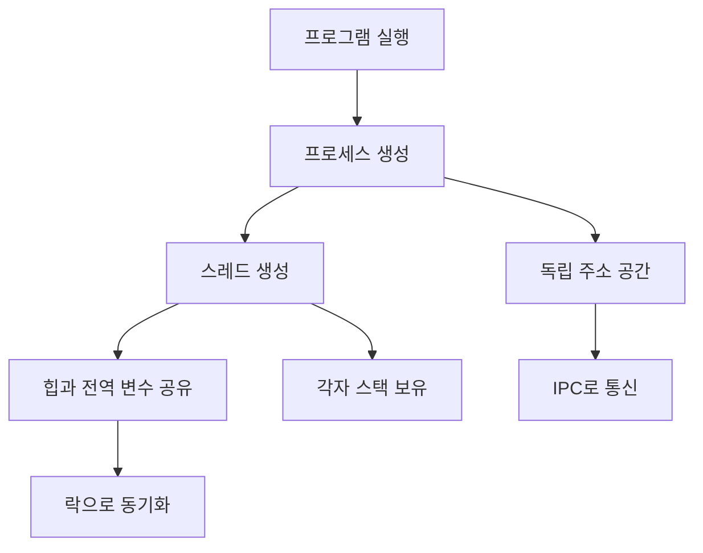

# 프로세스 vs 스레드

## 핵심 요약

- **프로세스(Process)**는 독립적인 메모리 공간을 가진 실행 단위이며, 장애 격리와 보안에 유리하다.
- **스레드(Thread)**는 프로세스 내부의 실행 흐름으로, 같은 메모리를 공유하므로 생성과 전환 비용이 낮다.
- 공유 메모리는 빠르지만 경쟁 조건이 발생할 수 있어 락, 원자 연산, 메시지 전달 등 동기화가 필요하다.

## 개념 설명

프로세스는 운영체제가 프로그램을 실행하기 위해 만든 자원 단위다. 각 프로세스는 일반적으로 독립된 가상 주소 공간, 힙, 전역 변수, 파일 디스크립터 등을 가진다. 한 프로세스의 잘못된 메모리 접근이 다른 프로세스에 직접 영향을 주기 어렵기 때문에 격리 수준이 높다. 대신 프로세스 생성과 문맥 교환에는 상대적으로 큰 비용이 들며, 프로세스 간 데이터 공유에는 파이프, 소켓, 공유 메모리, 메시지 큐 같은 IPC가 필요하다.

스레드는 프로세스 안에서 실제 작업을 수행하는 실행 흐름이다. 같은 프로세스의 스레드들은 코드 영역, 힙, 전역 데이터를 공유하지만, 스택과 레지스터는 각자 가진다. 따라서 데이터를 쉽게 공유할 수 있고 I/O 대기 중 다른 스레드가 실행되도록 만들기 쉽다. 그러나 여러 스레드가 같은 변수를 동시에 수정하면 실행 순서에 따라 결과가 달라지는 경쟁 조건이 발생한다.

CPU 코어가 여러 개라면 여러 프로세스나 스레드가 실제로 병렬 실행될 수 있다. 다만 Python의 CPython 구현은 GIL 때문에 CPU 연산 중심 작업에서 여러 스레드가 동시에 Python 바이트코드를 실행하지 못한다. 이런 경우 프로세스 기반 병렬화가 적합하며, 네트워크나 파일 I/O 중심 작업은 스레드가 효율적일 수 있다.

```python
import os
import threading
from multiprocessing import Process

def work(kind):
    print(f"{kind}: PID={os.getpid()}, TID={threading.get_ident()}")

if __name__ == "__main__":
    thread = threading.Thread(target=work, args=("thread",))
    process = Process(target=work, args=("process",))
    thread.start()
    process.start()
    thread.join()
    process.join()
    print("main:", os.getpid())
```

위 코드에서 스레드는 메인 프로세스와 같은 PID를 출력하지만, 프로세스는 별도의 PID를 출력한다. 스레드는 주소 공간을 공유하고 프로세스는 주소 공간이 분리되므로, 전역 리스트를 수정하는 실험에서도 두 실행 단위의 관찰 결과가 다를 수 있다. 공유 데이터에 접근한다면 `Lock` 같은 동기화 도구를 사용해야 한다.



## 면접 질문

### 1. 프로세스와 스레드의 가장 큰 차이는 무엇인가요?

프로세스는 독립된 주소 공간을 가지지만, 스레드는 같은 프로세스의 주소 공간을 공유한다. 따라서 프로세스는 격리와 안정성이 높고, 스레드는 통신과 생성 비용 측면에서 유리하다.

### 2. 멀티스레드에서 경쟁 조건은 왜 발생하며 어떻게 해결하나요?

여러 스레드가 공유 데이터를 동시에 읽고 수정하면서 연산 순서가 보장되지 않아 발생한다. 뮤텍스, 세마포어, 원자 연산, 불변 객체, 메시지 전달 방식으로 공유 상태를 안전하게 관리한다.

## 한 줄 정리

**프로세스는 격리와 안정성, 스레드는 공유와 효율성이 핵심이며 작업 특성에 따라 선택한다.**
