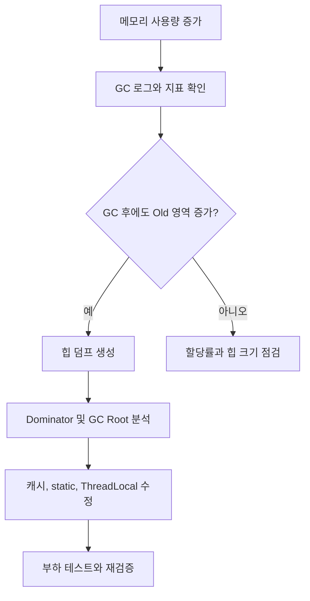

# Garbage Collection과 실무 트러블슈팅

- GC는 도달 가능한 객체를 제외한 메모리를 회수하지만, 메모리 누수 자체를 해결하지는 못한다.
- 장애 분석은 `Heap 사용량`, `GC pause`, `할당률`, `Old 영역 증가`를 함께 봐야 한다.
- 튜닝보다 먼저 힙 덤프와 객체 참조 경로를 확인해 누수 원인을 제거해야 한다.

## 개념 설명

Garbage Collection(GC)은 프로그램이 더 이상 참조하지 않는 객체를 찾아 메모리를 회수하는 런타임 기능이다. 대표적으로 JVM은 객체를 Young Generation과 Old Generation으로 나누어 관리한다. 새 객체는 주로 Young 영역에 생성되고, 여러 번 살아남으면 Old 영역으로 이동한다.

일반적인 흐름은 다음과 같다.

1. 애플리케이션이 객체를 할당한다.
2. Young 영역이 차면 Minor GC가 실행된다.
3. 계속 사용되는 객체는 생존 기간에 따라 Old 영역으로 승격된다.
4. Old 영역이 부족하면 Major 또는 Full GC가 발생한다.
5. GC 중 애플리케이션이 멈추는 시간을 `STW(Stop-The-World)`라고 한다.

실무에서 흔한 증상은 응답 시간 급증, CPU 사용률 상승, `OutOfMemoryError`, 컨테이너 재시작이다. 특히 GC 직후에도 Old 영역 사용량이 줄지 않으면 단순히 힙이 작은 것이 아니라 객체가 계속 참조되고 있을 가능성이 높다. `static` 컬렉션, 무제한 캐시, 종료되지 않은 리스너와 스레드, `ThreadLocal`, 큰 세션 객체가 대표적인 원인이다.

트러블슈팅 순서는 다음과 같다.

- 모니터링에서 힙 사용률, GC 횟수와 pause time, allocation rate를 확인한다.
- GC 로그로 Full GC 반복 여부와 GC 후 회수량을 확인한다.
- 힙 덤프를 생성해 dominator tree와 retained size가 큰 객체를 찾는다.
- 해당 객체의 GC Root 참조 경로를 따라 `static`, 캐시, 스레드 등을 점검한다.
- 원인 수정 후 부하 테스트로 힙 사용량과 pause time이 안정되는지 검증한다.

GC 튜닝으로 힙 크기나 수집기만 바꾸면 증상을 늦출 수는 있지만, 누수 객체가 계속 쌓이면 결국 장애가 재발한다. 또한 컨테이너 환경에서는 JVM 힙 외에 메타스페이스, 스레드 스택, Direct Memory도 사용하므로 프로세스 메모리 전체를 확인해야 한다.

## 코드 예시

```java
class UserService {
    private static final Map<String, byte[]> CACHE = new HashMap<>();

    void cache(String userId, byte[] profile) {
        CACHE.put(userId, profile); // 만료/상한 없음
    }
}

// 개선: 크기와 만료 시간을 제한한 캐시 사용
Cache<String, byte[]> cache = Caffeine.newBuilder()
    .maximumSize(10_000)
    .expireAfterAccess(Duration.ofMinutes(10))
    .build();
```

## GC 문제 분석 흐름



## 면접 질문

### 1. GC 후에도 메모리가 줄지 않는 이유는?

객체가 여전히 GC Root에서 참조되고 있기 때문이다. `static` 필드, 활성 스레드, `ThreadLocal`, 캐시 등이 대표적이며, 힙 덤프의 GC Root 경로로 확인한다.

### 2. Full GC가 자주 발생할 때 무엇을 먼저 확인하는가?

GC 로그에서 발생 주기, pause time, GC 전후 Old 영역 크기를 확인한다. 이후 힙 덤프로 누수 여부를 판단하고, 누수가 없다면 할당률·힙 크기·수집기 설정을 점검한다.

> **한 줄 정리:** GC 튜닝보다 먼저 “무엇이 객체를 계속 참조하는가”를 찾아야 한다.
