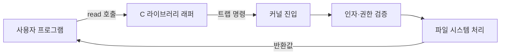

# 시스템 콜(System Call)

## 핵심 포인트

- 시스템 콜은 사용자 프로그램이 커널 기능을 요청하는 공식 인터페이스다.
- 호출 시 사용자 모드에서 커널 모드로 전환되며, 커널은 권한과 인자를 검증한다.
- 파일 입출력, 프로세스 생성, 메모리 관리, 네트워크 통신 등이 시스템 콜을 통해 수행된다.

## 개념 설명

일반 애플리케이션은 하드웨어와 커널 자료구조에 직접 접근할 수 없다. CPU는 사용자 모드와 커널 모드를 분리하고, 파일 디스크립터나 프로세스 테이블 같은 자원을 커널이 관리한다. 따라서 프로그램은 `read`, `write`, `open`, `fork`, `execve`, `mmap` 등의 시스템 콜을 사용해 커널에 작업을 요청한다.

C 표준 라이브러리의 `fopen`, `printf`도 내부적으로 시스템 콜을 호출할 수 있지만, 라이브러리 버퍼링과 추가 처리가 포함될 수 있다. 반면 `read`, `write`는 운영체제가 제공하는 저수준 인터페이스에 가깝다. 시스템 콜은 보통 래퍼 함수가 레지스터에 시스템 콜 번호와 인자를 넣고 특수 명령어를 실행하는 방식으로 진입한다.

커널은 전달된 포인터가 유효한지, 파일 디스크립터에 접근 권한이 있는지 검사한다. 성공하면 처리한 바이트 수나 새 디스크립터를 반환하고, 실패하면 `-1`을 반환하며 `errno`에 원인을 기록한다. 한 번의 호출마다 모드 전환과 검증 비용이 발생하므로 작은 데이터를 반복해서 호출하기보다 버퍼링하는 편이 효율적이다.

`read`와 `write`는 요청한 크기만큼 항상 처리된다고 보장하지 않는다. 파이프, 소켓, 비블로킹 파일에서는 일부 바이트만 처리될 수 있으므로 반환값을 확인하며 반복해야 한다. 인터뷰에서는 시스템 콜과 라이브러리 함수의 차이, 사용자·커널 모드 전환, 부분 읽기와 오류 처리를 함께 설명하면 좋다.

## 코드 예제

```c
#include <fcntl.h>
#include <unistd.h>
#include <stdio.h>

int main(void) {
    int fd = open("input.txt", O_RDONLY);
    if (fd == -1) return 1;

    char buf[128];
    ssize_t n;
    while ((n = read(fd, buf, sizeof buf)) > 0) {
        ssize_t sent = 0;
        while (sent < n) {
            ssize_t w = write(STDOUT_FILENO, buf + sent, n - sent);
            if (w <= 0) return 1;
            sent += w;
        }
    }
    close(fd);
    return n < 0;
}
```

## 호출 흐름



## 면접 질문

### 1. 시스템 콜과 일반 함수 호출의 차이는?

일반 함수 호출은 같은 사용자 모드에서 실행되지만, 시스템 콜은 커널 기능을 요청하므로 사용자 모드에서 커널 모드로 전환된다. 이에 따라 권한 검사와 모드 전환 비용이 발생한다.

### 2. `read()`의 반환값이 요청 크기보다 작을 수 있는 이유는?

파일 종류와 실행 상태에 따라 현재 이용 가능한 데이터만 반환할 수 있기 때문이다. 특히 소켓, 파이프, 비블로킹 파일에서는 부분 읽기를 정상적인 상황으로 보고 반복 처리해야 한다.

> **한 줄 요약:** 시스템 콜은 사용자 프로그램이 권한을 통제하는 커널 자원에 안전하게 접근하기 위한 경계이며, 반환값과 오류를 반드시 확인해야 한다.
