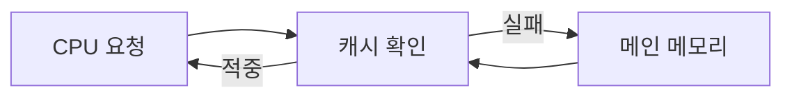

# 메모리 지역성(Memory Locality)

- **시간적 지역성**: 최근 접근한 데이터가 가까운 미래에 다시 사용될 가능성이 높다.
- **공간적 지역성**: 한 주소를 접근하면 인접한 주소도 곧 사용될 가능성이 높다.
- 지역성이 좋으면 **CPU 캐시 적중률이 높아져** 메모리 접근 지연과 실행 시간이 줄어든다.

## 개념 설명

CPU는 연산 속도에 비해 메인 메모리 접근이 매우 느리므로, 자주 사용하는 데이터를 L1·L2·L3 캐시에 임시 저장한다. 캐시는 보통 연속된 메모리 구간인 **캐시 라인** 단위로 데이터를 가져온다. 따라서 현재 데이터 주변을 순차적으로 접근하면 한 번의 메모리 읽기로 여러 값을 캐시에 올릴 수 있다.

**시간적 지역성**은 같은 변수를 반복해서 사용하는 패턴이다. 반복문 안에서 동일한 배열 원소, 지역 변수, 함수 코드가 재사용될 때 나타난다. **공간적 지역성**은 인접한 주소를 차례로 접근하는 패턴이다. 배열을 인덱스 순서대로 순회하는 것이 대표적인 예다.

2차원 배열은 일반적으로 행 우선(row-major)으로 저장된다. C/C++에서 `int matrix[행][열]`의 각 행은 연속되어 있으므로, 행 내부를 먼저 순회하면 공간적 지역성이 좋다. 반대로 열을 먼저 순회하면 매 접근마다 큰 간격을 건너뛰어 캐시 미스가 증가할 수 있다.

지역성은 캐시뿐 아니라 TLB, 디스크 페이지 캐시, 데이터베이스 버퍼 풀에도 적용된다. 다만 캐시 친화적인 코드가 항상 최선은 아니다. 자료 구조의 가독성, 동시성, 분기 예측, 전체 알고리즘 복잡도와 함께 판단해야 한다. 면접에서는 “배열이 빠른 이유”를 연속 메모리 배치와 캐시 라인 활용으로 설명하면 좋다.

## 코드 예제

```cpp
#include <vector>
#include <chrono>
#include <iostream>
using namespace std;

int main() {
    const int N = 4096;
    vector<vector<int>> a(N, vector<int>(N));

    auto start = chrono::high_resolution_clock::now();
    long long sum = 0;

    // 공간적 지역성이 좋음: 행 내부를 연속 접근
    for (int i = 0; i < N; ++i)
        for (int j = 0; j < N; ++j)
            sum += a[i][j];

    cout << sum << '\n';
}
```

행 우선 순회는 인접한 원소를 연속해서 읽으므로 캐시 라인을 효율적으로 사용한다. 열 우선 순회로 바꾸면 논리적으로 같은 결과를 내더라도 캐시 미스가 늘어 성능이 저하될 수 있다. 실제 차이는 컴파일러 최적화, CPU 캐시 크기, 배열 크기에 따라 달라지므로 벤치마크로 확인해야 한다.

## 메모리 접근 흐름



## 면접 질문

### 1. 배열이 연결 리스트보다 순회 성능이 좋은 이유는?

배열은 원소가 연속된 메모리에 저장되어 공간적 지역성이 좋고, 캐시 라인을 효율적으로 사용한다. 연결 리스트는 노드가 흩어져 있어 포인터를 따라갈 때 캐시 미스가 발생하기 쉽다.

### 2. 행렬을 순회할 때 행 우선 접근이 유리한 이유는?

C/C++의 2차원 배열은 행 내부 원소가 연속적으로 배치된다. 따라서 행 우선 접근은 인접 주소를 순서대로 읽어 공간적 지역성을 극대화한다.

> **한 줄 요약:** 메모리 지역성은 데이터를 시간적으로 재사용하고 공간적으로 가깝게 접근해 캐시 효율을 높이는 원리다.
