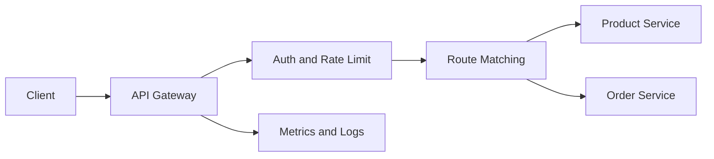

# API Gateway

- **단일 진입점**으로 인증·인가, 라우팅, 로깅, 트래픽 제어를 중앙화한다.
- 서비스별 내부 주소와 구현을 숨겨 **클라이언트와 마이크로서비스의 결합도**를 낮춘다.
- 운영 편의성이 커지는 만큼 병목, 단일 장애점, 과도한 비즈니스 로직 집중을 주의해야 한다.

## 개념 설명

API Gateway는 외부 클라이언트와 여러 백엔드 서비스 사이에 위치하는 역방향 프록시다. 클라이언트는 여러 서비스의 주소를 직접 알지 않고 Gateway의 엔드포인트만 호출한다. Gateway는 요청 경로, HTTP 메서드, 헤더 등을 기준으로 적절한 서비스에 전달한다.

현업에서는 단순 라우팅보다 공통 관심사 처리에 많이 활용된다. 예를 들어 JWT 검증과 권한 확인, API 키 관리, IP 기반 접근 제어, 요청 크기 제한, Rate Limiting, CORS, TLS 종료, 요청·응답 로깅을 Gateway에서 수행한다. 이를 통해 각 서비스가 인증 코드를 반복 구현하지 않아도 된다.

모바일 앱과 웹에서 필요한 데이터 형태가 다르면 BFF(Backend for Frontend) 역할도 수행할 수 있다. 예를 들어 상품 서비스와 재고 서비스를 호출해 화면에 필요한 응답으로 조합한다. 다만 데이터 조합과 복잡한 업무 규칙까지 Gateway에 넣으면 변경 영향이 커지므로, 비즈니스 로직은 도메인 서비스에 두는 것이 원칙이다.

대규모 트래픽 환경에서는 무상태로 구성하고 여러 인스턴스를 로드밸런싱한다. Redis 같은 외부 저장소를 이용해 분산 Rate Limiting을 적용하며, 타임아웃·재시도·서킷 브레이커로 장애 전파를 막는다. 관측성을 위해 요청 ID를 전달하고 상태 코드, 지연 시간, 백엔드별 오류율을 수집한다.

### 현업 적용 사례

- **쇼핑몰**: `/api/products`는 상품 서비스, `/api/orders`는 주문 서비스로 라우팅하고 결제 API에는 짧은 타임아웃과 강한 접근 제어를 적용한다.
- **금융 서비스**: 외부 파트너별 API 키와 호출량을 관리하고, 감사 로그와 민감 정보 마스킹을 Gateway에서 일관되게 수행한다.
- **레거시 전환**: 기존 모놀리식 API와 신규 마이크로서비스를 같은 도메인 아래 노출해 점진적으로 트래픽을 이전한다.
- **장애 대응**: 재고 서비스가 느려질 때 해당 요청만 차단하거나 캐시 응답을 반환해 상품 조회 전체가 영향을 받지 않게 한다.

## 코드 예시

```yaml
spring:
  cloud:
    gateway:
      routes:
        - id: order-service
          uri: http://order-service:8080
          predicates:
            - Path=/api/orders/**
          filters:
            - name: RequestRateLimiter
              args: {key-resolver: "#{@userKeyResolver}"}
            - AddRequestHeader=X-Request-Source, gateway
```

## 요청 흐름



## 면접 질문

### 1. API Gateway와 로드밸런서의 차이는?

로드밸런서는 주로 여러 서버에 트래픽을 분산한다. API Gateway는 여기에 인증, 라우팅, 요청 변환, Rate Limiting, 관측성 같은 API 정책을 추가로 수행한다. 제품에 따라 두 기능이 일부 겹칠 수 있다.

### 2. API Gateway가 장애 나면 어떻게 대응하는가?

다중 인스턴스와 로드밸런서로 이중화하고, 무상태로 설계한다. 타임아웃과 서킷 브레이커로 백엔드 장애 전파를 차단하며, 관리 기능과 데이터 경로를 분리하고 헬스 체크·알람·롤백 체계를 마련한다.

## 한 줄 정리

API Gateway는 공통 API 정책과 트래픽 흐름을 통제하는 핵심 계층이지만, 비즈니스 로직까지 집중시키지 않는 균형이 중요하다.
