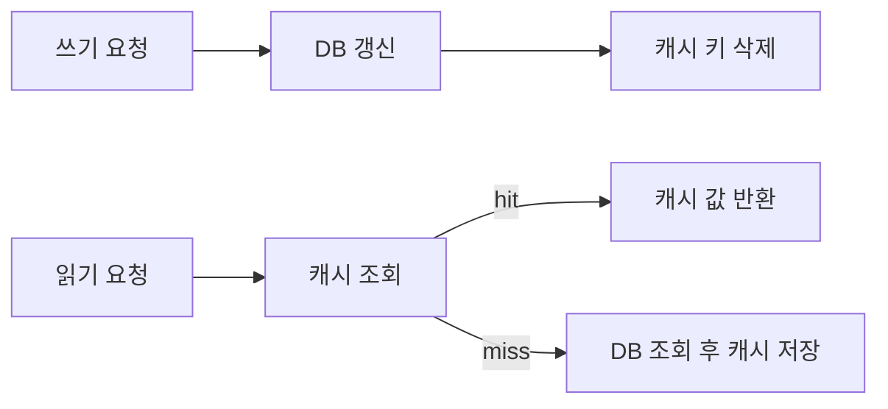

# 캐시 무효화(Cache Invalidation)

- **정확성의 핵심은 원본 데이터와 캐시의 일관성**이며, 만료 시간만으로는 즉시 반영을 보장할 수 없다.
- 내부적으로는 `키 생성 규칙`, `TTL`, `삭제/갱신 순서`, `동시성 제어`가 무효화 품질을 결정한다.
- 분산 환경에서는 무효화 이벤트 전달 실패, 네트워크 지연, 장애 복구 시 재동기화까지 고려해야 한다.

## 개념 설명

캐시는 DB나 외부 API의 결과를 메모리 또는 Redis에 저장해 읽기 비용을 줄인다. 그러나 원본이 변경되면 기존 캐시 값은 **stale data**가 된다. 캐시 무효화란 이 값을 삭제하거나 최신 값으로 교체하는 과정이다.

가장 단순한 방식은 `TTL(Time To Live)`이다. 캐시 항목에 만료 시각을 기록하고, 조회 시 현재 시각이 만료 시각보다 크면 miss로 처리한다. 구현은 보통 해시 테이블의 값에 `payload`, `expireAt`을 함께 저장하며, 지연 삭제 방식에서는 조회 시 삭제하고 주기적인 eviction 스레드가 만료 항목을 정리한다. TTL은 장애 시 오래된 데이터가 영구 보존되는 것을 막지만, 만료 전까지 stale 상태가 지속된다.

**Cache-Aside**는 애플리케이션이 직접 캐시를 관리한다. 조회 miss 시 DB에서 읽어 캐시에 넣고, 쓰기 시 DB 반영 후 캐시를 삭제한다. 일반적으로 “DB 갱신 → 캐시 삭제” 순서를 사용한다. 반대로 캐시를 먼저 삭제하면 DB 쓰기 실패 시 cache miss가 증가하고, DB를 먼저 갱신하지 않으면 오래된 값이 다시 캐시에 저장될 수 있다.

다만 DB 반영 직후 다른 요청이 이전 값을 읽어 캐시에 넣는 경쟁 조건이 생길 수 있다. 이를 줄이려면 짧은 지연 후 재삭제, 버전 필드 비교, 분산 락, 단일 writer 정책 등을 사용한다. 더 강한 일관성이 필요하면 DB 트랜잭션의 변경 로그를 CDC 또는 Outbox에 기록하고, 별도 소비자가 캐시 무효화 이벤트를 발행한다. 이벤트에는 `entityId`, `version`, `operation`을 포함해 순서가 뒤집혀도 낮은 버전 이벤트를 무시할 수 있게 한다.

여러 애플리케이션 서버가 로컬 캐시를 가지면 한 서버의 삭제가 다른 서버에 자동 전달되지 않는다. 따라서 Redis Pub/Sub, 메시지 브로커, CDC를 통해 모든 노드에 무효화 이벤트를 전파한다. 단, Pub/Sub은 소비자 장애 중 메시지를 잃을 수 있으므로 재처리 가능한 스트림이나 주기적 캐시 검증을 함께 고려한다.

## 코드 예시: Cache-Aside 쓰기

```java
void updateUser(User user) {
    db.update(user);                 // 원본을 먼저 변경
    cache.delete("user:" + user.id()); // 관련 캐시 무효화
}

User getUser(long id) {
    String key = "user:" + id;
    User cached = cache.get(key);
    if (cached != null) return cached;

    User fresh = db.find(id);
    cache.put(key, fresh, Duration.ofMinutes(5));
    return fresh;
}
```



## 면접 질문

### 1. 왜 DB 수정 후 캐시를 삭제하나요?

DB가 최종 원본이므로 먼저 성공적으로 반영한 뒤 캐시를 제거해야 한다. 캐시를 먼저 삭제하면 DB 쓰기 실패 시 불필요한 miss가 발생하고, 쓰기와 읽기가 경쟁하면 오래된 값이 캐시에 재저장될 수 있다.

### 2. TTL만 사용하면 충분하지 않은 이유는 무엇인가요?

TTL은 만료 전까지 오래된 값을 반환할 수 있으며, 모든 요청이 동시에 만료되면 DB로 트래픽이 몰리는 thundering herd가 발생한다. 명시적 무효화, jitter가 있는 TTL, single-flight 또는 분산 락을 함께 사용할 수 있다.

> **한 줄 요약:** 캐시 무효화는 삭제 자체보다 원본 변경과 캐시 변경의 순서·동시성·이벤트 전달을 설계하는 문제다.
