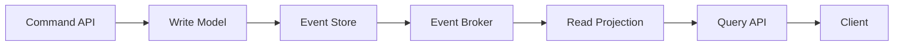

# Event Sourcing과 CQRS: 변경 이력을 중심으로 설계하기

- **Event Sourcing**은 현재 상태가 아니라 상태를 만든 이벤트를 저장한다.
- **CQRS**는 명령 처리 모델과 조회 모델을 분리한다.
- 실무에서는 주문·결제·금융·재고처럼 감사 추적과 조회 성능이 중요한 영역에 효과적이다.

## 개념 설명

### Event Sourcing

일반적인 CRUD는 `주문 상태 = PAID`처럼 최종 상태를 저장한다. Event Sourcing은 `OrderCreated`, `PaymentCompleted` 같은 불변 이벤트를 순서대로 저장하고, 이벤트를 재생해 현재 상태를 계산한다.

```python
events = store.load("order-1")
state = Order()

for event in events:
    state = state.apply(event)

if command == "pay" and state.status == "CREATED":
    store.append("order-1", PaymentCompleted())
```

장점은 변경 이력, 감사 로그, 장애 분석, 특정 시점 상태 재현이다. 예를 들어 결제 취소 분쟁이 발생하면 “누가 언제 어떤 이벤트를 발생시켰는가”를 확인할 수 있다. 이벤트를 새 조회 모델에 다시 투입해 과거 데이터로 인덱스를 재구축하는 것도 가능하다.

반면 이벤트 스키마 변경, 이벤트 순서 보장, 중복 처리, 저장 용량 증가를 관리해야 한다. 이벤트는 이미 발행된 사실이므로 수정하지 않고, 잘못된 이벤트를 보정하는 새 이벤트를 추가한다. 핫 데이터는 스냅샷을 사용해 전체 이벤트 재생 비용을 줄인다.

### CQRS

CQRS는 쓰기 모델과 읽기 모델을 분리한다. 쓰기 모델은 도메인 규칙과 트랜잭션에 집중하고, 읽기 모델은 화면이나 API가 원하는 형태로 비정규화한다. 예를 들어 주문 서비스는 주문 생성과 결제를 처리하고, 별도의 조회 저장소는 고객별 주문 목록과 매출 집계를 빠르게 제공한다.

실무에서는 PostgreSQL에 원본 이벤트를 저장하고 Kafka로 전달한 뒤, Elasticsearch·Redis·별도 RDB에 조회용 Projection을 구축하는 조합이 흔하다. 다만 조회 결과가 즉시 반영되지 않는 **최종 일관성**이 발생한다. 사용자에게 “처리 중” 상태를 보여주거나, 이벤트 처리 지연을 모니터링하고 재처리 큐를 운영해야 한다.

두 패턴은 함께 사용할 수 있지만 필수 조합은 아니다. 조회 요구가 단순한 CRUD 서비스라면 복잡성을 늘리지 않는 편이 낫다. 적용 전 이벤트 재처리 전략, 멱등성 키, 버전 관리, 보관 기간을 먼저 정해야 한다.

## 아키텍처 흐름



## 면접 질문

1. **Event Sourcing에서 이벤트를 수정하면 안 되는 이유는?**  
   이벤트는 과거에 발생한 사실이며 감사 추적과 재생의 기준이기 때문이다. 오류는 보정 이벤트로 처리하고, 스키마 변경은 업캐스팅이나 새 버전 이벤트로 대응한다.

2. **CQRS의 최종 일관성 문제를 어떻게 다루는가?**  
   멱등적 Projection, 재처리 가능한 이벤트 소비자, 지연 모니터링을 구현하고, 사용자 화면에는 처리 중 상태나 최신화 시점을 명확히 표시한다.

> **한 줄 정리:** Event Sourcing은 변경 이력을 원본으로 보존하고, CQRS는 쓰기와 읽기를 분리해 복잡한 도메인의 추적성과 확장성을 높인다.
