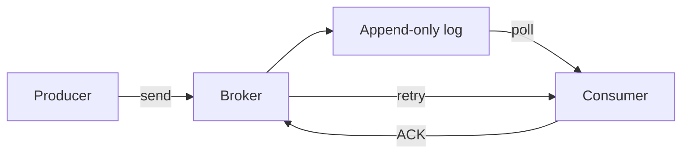

# 메시지 큐(Message Queue)의 내부 구현

## 핵심 요약

- 메시지 큐는 생산자와 소비자를 분리하고, 브로커가 메시지 저장·전달·재처리를 담당한다.
- 내부적으로는 메모리 버퍼, 디스크 로그, 파티션, 오프셋, ACK 상태를 조합해 처리량과 내구성을 얻는다.
- 성능보다 중요한 설계 기준은 순서 보장 범위, 중복 처리, 유실 가능성, 백프레셔 정책이다.

## 개념 설명

생산자는 브로커의 큐 또는 토픽에 메시지를 기록하고, 소비자는 이를 읽는다. 브로커는 보통 네트워크 수신 버퍼에 메시지를 잠시 저장한 뒤 배치 단위로 디스크에 기록한다. 디스크에는 메시지를 하나씩 수정하기보다 append-only 로그로 추가하며, 메시지 위치는 오프셋으로 식별한다. 순차 쓰기와 페이지 캐시를 활용하면 임의 쓰기보다 높은 처리량을 얻을 수 있다.

대규모 시스템은 토픽을 여러 파티션으로 나눈다. 파티션마다 로그와 오프셋이 독립적이므로 병렬 소비가 가능하지만, 일반적으로 전체 토픽의 전역 순서는 보장되지 않는다. 같은 키를 같은 파티션으로 해시하면 해당 키 내부 순서만 유지할 수 있다.

소비자가 메시지를 읽었다고 즉시 삭제하지 않고 ACK를 보내도록 설계하면 장애 복구가 가능하다. ACK 이전에 소비자가 죽으면 브로커는 메시지를 재전달한다. 이 때문에 대부분의 큐는 최소 한 번 전달(at-least-once)을 제공하며, 소비자는 같은 메시지를 여러 번 처리해도 안전한 멱등성을 구현해야 한다. ACK 유실이나 처리 후 장애는 중복의 대표 원인이다.

브로커는 소비자별 오프셋 또는 미확인 메시지 목록을 관리한다. ACK가 너무 늦으면 소비자별 적체가 증가하고, 너무 빨리 ACK하면 실제 처리 전에 장애가 발생할 때 메시지가 유실될 수 있다. 큐 길이 제한, 소비자 수 조절, 생산자 전송 차단은 백프레셔 구현에 해당한다. 복제 브로커는 리더 로그를 팔로워에 복제하며, 복제 완료를 기다린 뒤 ACK하면 내구성이 높아지지만 지연시간은 증가한다.

```python
def consume(queue):
    msg = queue.receive(visibility_timeout=30)
    try:
        process_idempotently(msg.body, msg.id)
        queue.ack(msg.id)
    except TemporaryError:
        queue.nack(msg.id, retry_after=10)
    except PermanentError:
        queue.move_to_dlq(msg)
```



## 면접 질문

### 1. ACK를 처리 전에 보내면 어떤 문제가 생기나요?

ACK 이후 소비자가 장애 나면 브로커는 처리가 끝났다고 판단해 메시지를 재전달하지 않는다. 따라서 유실이 발생할 수 있으며, 안전하게 처리한 뒤 ACK해야 한다.

### 2. 메시지 큐에서 중복 전달이 발생하는 이유는 무엇인가요?

소비자가 처리했지만 ACK 전에 장애가 발생하거나, ACK 응답이 네트워크에서 유실되기 때문이다. 소비 로직을 멱등적으로 만들고 메시지 ID 기반 중복 제거를 적용한다.

## 한 줄 정리

메시지 큐는 로그·오프셋·ACK·재시도를 조합해 비동기성과 장애 복구를 제공하며, 소비자의 멱등성이 안정성의 핵심이다.
