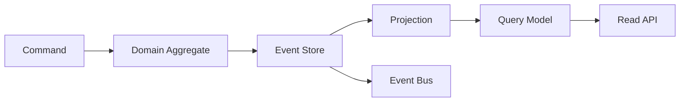

# 이벤트 소싱과 CQRS: 실수와 안티패턴 중심 정리

- **이벤트 소싱**: 현재 상태를 덮어쓰지 않고, 상태 변경 이벤트를 저장해 필요할 때 재생한다.
- **CQRS**: 명령 모델과 조회 모델을 분리한다. 둘은 함께 사용할 수 있지만 필수 조합은 아니다.
- 핵심 위험은 **최종 일관성, 이벤트 스키마 변경, 중복 처리, 운영 복잡도**를 과소평가하는 것이다.

## 개념 설명

이벤트 소싱에서는 `OrderCreated`, `PaymentCompleted`처럼 이미 발생한 사실을 이벤트 스토어에 불변으로 기록한다. 현재 상태는 이벤트를 순서대로 적용해 계산하며, 조회 성능을 위해 별도의 프로젝션을 만든다. 이벤트는 과거의 사실이므로 수정하거나 삭제하지 않고, 잘못된 이벤트는 보정 이벤트로 처리한다.

CQRS는 쓰기와 읽기의 책임을 나눈다. 명령 측은 도메인 규칙과 트랜잭션을 담당하고, 조회 측은 화면이나 검색에 맞는 비정규화 모델을 제공한다. 따라서 조회 DB가 빠르더라도 최신 이벤트가 아직 반영되지 않아 잠시 이전 값이 보일 수 있다.

### 자주 하는 실수와 안티패턴

1. **모든 시스템에 적용**: 단순 CRUD에 이벤트 스토어와 메시지 브로커를 추가하면 개발·운영 비용만 늘어난다. 감사 추적, 복잡한 도메인 규칙, 다양한 조회 요구가 있을 때 선택한다.
2. **이벤트를 현재 상태처럼 수정**: 이벤트를 UPDATE하거나 의미를 바꾸면 과거 재생 결과가 달라진다. 이벤트 버전과 업캐스터를 사용한다.
3. **프로젝션을 진실의 원천으로 사용**: 조회 테이블을 수정해 문제를 숨기지 말고, 원본 이벤트에서 재생 가능한지 검증한다.
4. **중복 이벤트를 고려하지 않음**: 네트워크 재전송은 정상이다. 이벤트 ID, 집계 버전, 멱등 키로 중복 적용을 막는다.
5. **처리 순서를 전역 순서로 가정**: 분산 환경에서 전체 순서는 비싸고 불필요하다. 보통 집계별 순서만 보장하고 경쟁 갱신은 낙관적 잠금으로 막는다.
6. **이벤트 발행과 DB 저장을 따로 처리**: 저장 성공 후 발행 실패가 발생한다. 트랜잭션 아웃박스나 원자적 이벤트 스토어를 사용한다.
7. **무한 재생 비용 방치**: 이벤트가 쌓이면 스냅샷을 사용하되, 스냅샷을 원본 데이터로 착각하지 않는다.
8. **민감정보를 이벤트에 직접 저장**: 이벤트는 오래 보존될 수 있다. 개인정보 최소화, 암호화, 토큰화, 삭제 요구 대응 정책을 먼저 설계한다.

## 코드 예시

```java
void handle(CompleteOrder cmd) {
    var events = store.load(cmd.orderId());
    var order = Order.rehydrate(events);

    order.complete(cmd.paymentId()); // 도메인 규칙 검증
    store.append(
        cmd.orderId(),
        order.newEvents(),
        order.version()             // 낙관적 동시성 제어
    );
}
```

## 처리 흐름



## 면접 질문

### 1. 이벤트 소싱과 일반 CRUD의 가장 큰 차이는?

CRUD는 현재 상태를 저장하고 갱신하지만, 이벤트 소싱은 상태 변경 이력을 불변 이벤트로 저장하고 이를 재생해 상태를 만든다. 감사 추적과 재구성이 강점이지만 저장 공간과 복잡도가 증가한다.

### 2. CQRS 조회 모델이 최신 상태가 아닐 때 어떻게 대응하는가?

최종 일관성을 전제로 UI에 처리 중 상태나 기준 시각을 표시한다. 강한 일관성이 필요한 명령 직후 조회는 명령 응답에 결과를 포함하거나, 해당 집계의 프로젝션 반영을 기다리는 전략을 사용한다.

**한 줄 요약:** 이벤트 소싱과 CQRS는 이력·확장성에 강하지만, 불변 이벤트·멱등성·재처리·일관성 정책 없이는 복잡성만 키우는 안티패턴이 된다.
