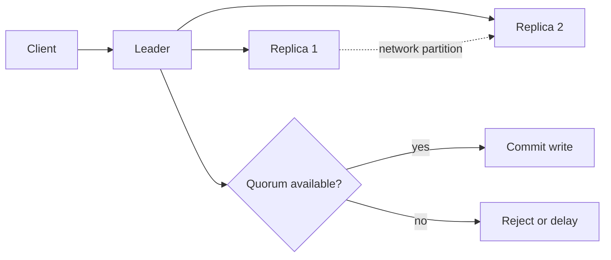

# CAP 정리: 분산 시스템의 선택과 내부 구현

- **Consistency**: 모든 노드가 같은 시점에 같은 데이터를 반환한다.
- **Availability**: 일부 노드가 장애여도 모든 요청에 성공 또는 유효한 응답을 반환한다.
- **Partition Tolerance**: 네트워크 단절이나 메시지 유실이 발생해도 시스템이 계속 동작한다.

## 개념 설명

CAP 정리는 “세 가지를 동시에 완벽하게 보장할 수 없다”는 원칙이다. 특히 실제 분산 시스템에서는 네트워크 분할(Partition)이 발생할 수 있으므로, **P는 선택이 아니라 사실상 필수 조건**이다. 따라서 장애 상황에서 **C와 A 중 무엇을 우선할지** 결정하는 문제가 핵심이다.

내부적으로 노드는 네트워크를 통해 복제 로그나 변경 이벤트를 전달한다. 복제본 간 연결이 끊기면 각 노드는 상대 상태를 알 수 없다. 이때 쓰기 요청을 계속 허용하면 서로 다른 값이 저장되어 Consistency가 깨질 수 있다. 반대로 과반수 응답이나 최신 리더 확인을 기다리면 일관성은 유지되지만, 일부 요청을 거부하거나 지연시켜 Availability가 낮아진다.

- **CP 시스템**: 파티션 발생 시 쓰기나 읽기를 제한한다. Raft, Paxos 기반 합의 시스템과 전통적인 강한 일관성 데이터베이스가 해당한다. 리더는 보통 과반수(쿼럼)를 확보해야 로그를 커밋한다.
- **AP 시스템**: 파티션 중에도 각 노드가 요청을 처리한다. 이후 복구 시 충돌 해결, 버전 벡터, LWW(Last Write Wins), 애플리케이션 병합 등을 수행한다.
- **C의 의미 주의**: CAP의 Consistency는 트랜잭션 일관성이나 ACID 전체가 아니라, 분산 복제본에서의 선형화 가능성에 가깝다.
- 정상 네트워크에서는 많은 시스템이 C와 A를 모두 만족하는 것처럼 보인다. CAP의 선택은 주로 네트워크 분할이 발생한 순간에 드러난다.
- 실무에서는 데이터별로 선택이 다르다. 결제 잔액은 CP, 조회용 추천·카운터는 AP와 최종 일관성이 적합할 수 있다.

## 면접 질문

### 1. CAP에서 왜 P를 포기할 수 없나요?

분산 노드 사이의 네트워크 단절은 현실적으로 발생하며, 이를 허용하지 않으면 시스템이 단일 노드와 유사해집니다. 따라서 분산 시스템은 P를 전제로 C 또는 A를 조정합니다.

### 2. CP 시스템은 파티션이 없을 때도 항상 느린가요?

아닙니다. 정상 상태에서는 복제와 쿼럼 확인 비용만 부담합니다. 지연과 요청 거부가 크게 나타나는 시점은 리더 상실, 네트워크 분할처럼 쿼럼을 확보할 수 없을 때입니다.

**한 줄 정리:** CAP는 장애가 없을 때의 기능 비교가 아니라, 네트워크 분할 시 일관성과 가용성 중 어떤 동작을 선택할지에 대한 설계 원칙이다.
