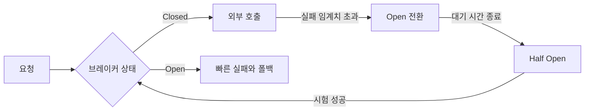

# Circuit Breaker 패턴

- 장애 서비스로의 호출을 일시 차단해 장애 전파와 리소스 고갈을 막는다.
- 상태는 `Closed → Open → Half-Open → Closed`로 전이하며, 실패율과 복구 여부를 기준으로 판단한다.
- 타임아웃, 재시도, 폴백, 메트릭을 함께 설계해야 하며, 브레이커 하나만으로 장애가 해결되지는 않는다.

## 개념 설명

Circuit Breaker는 외부 API나 DB처럼 실패할 수 있는 의존성을 보호하는 패턴이다. 정상 상태인 `Closed`에서는 요청을 통과시키고 실패 횟수 또는 실패율을 기록한다. 임계치를 넘으면 `Open`으로 전환하여 일정 시간 동안 실제 호출을 차단하고 즉시 실패시킨다. 이때 빠른 실패는 스레드, 커넥션 풀, 요청 큐가 함께 고갈되는 것을 방지한다.

Open 상태의 대기 시간이 끝나면 일부 요청만 허용하는 `Half-Open`으로 전환한다. 시험 요청이 성공하면 Closed로 복구하고, 실패하면 다시 Open으로 돌아간다. Half-Open에서 모든 요청을 통과시키면 복구 중인 시스템에 다시 부하를 주므로 동시 시험 요청 수를 제한해야 한다.

자주 하는 실수는 타임아웃 없이 브레이커만 추가하는 것이다. 호출이 오래 대기하면 브레이커가 열려도 이미 리소스가 소진될 수 있다. 반대로 타임아웃을 너무 짧게 잡으면 정상적인 지연을 실패로 집계한다. 재시도를 무제한으로 결합하는 것도 대표적인 안티패턴이다. 원 요청과 재시도가 겹쳐 트래픽 폭증을 일으킬 수 있으므로 횟수, 백오프, 지터를 제한한다.

모든 예외를 실패로 세면 클라이언트의 잘못된 입력까지 장애로 오판한다. 네트워크 오류와 5xx는 보통 실패로 집계하되, 4xx나 비즈니스 거절은 정책에 따라 제외한다. 하나의 전역 브레이커로 모든 고객과 엔드포인트를 묶으면 특정 의존성의 장애가 전체 기능을 차단한다. 보통 서비스·호출 대상·중요도별로 분리한다. 폴백은 캐시나 기본 응답처럼 의미 있는 대체 동작이어야 하며, 빈 성공 응답으로 오류를 숨기지 않는다.

임계치는 고정 실패 횟수만 사용하기보다 최근 시간 창의 실패율과 최소 요청 수를 함께 사용한다. 상태 전환, 차단 수, 지연 시간, 폴백 비율을 관측하고 알림으로 연결해야 한다.

```java
Result call() {
  if (breaker.isOpen()) return fallback();
  try {
    Result r = timeout(500, client::request);
    breaker.recordSuccess();
    return r;
  } catch (TimeoutException | IOException e) {
    breaker.recordFailure();
    return fallback();
  }
}
```



## 인터뷰 질문

### 1. Retry와 Circuit Breaker를 함께 사용할 때 주의할 점은?

재시도 횟수와 전체 시간 예산을 제한하고, 지수 백오프와 지터를 사용한다. 브레이커가 열린 뒤에는 재시도를 수행하지 않아야 하며, 재시도 계층이 여러 곳에 중복되지 않게 한다.

### 2. Circuit Breaker의 Open 상태가 장애를 어떻게 완화하는가?

실패가 예상되는 외부 호출을 즉시 차단해 타임아웃 대기, 스레드 점유, 커넥션 고갈을 줄인다. 단, 적절한 폴백과 복구를 위한 Half-Open 검증이 없으면 단순한 기능 장애로 남는다.

> **한 줄 정리:** Circuit Breaker는 실패를 없애는 장치가 아니라, 실패가 시스템 전체로 전파되지 않도록 빠르게 차단하고 안전하게 복구하는 장치다.
