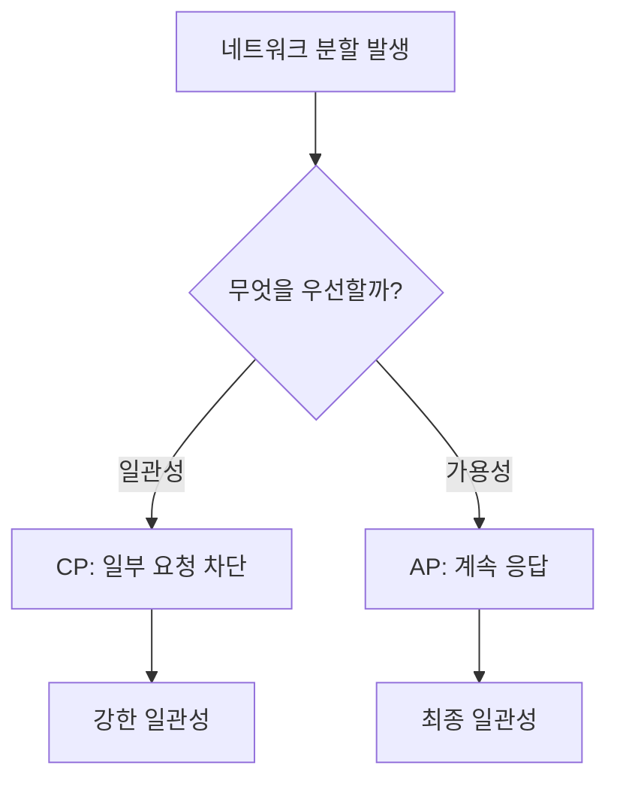

# CAP 정리: 분산 시스템의 일관성·가용성·분할 내성

## 핵심 3가지

- **C(Consistency, 일관성)**: 모든 노드가 같은 시점에 같은 최신 데이터를 반환한다.
- **A(Availability, 가용성)**: 정상 요청은 항상 성공 응답을 받는다. 단, 최신 데이터라는 보장은 별도다.
- **P(Partition Tolerance, 네트워크 분할 내성)**: 노드 간 네트워크 단절이나 메시지 유실이 발생해도 시스템이 동작한다.

## 개념 설명

CAP 정리는 분산 시스템에서 네트워크 분할이 발생했을 때 **일관성(C)**과 **가용성(A)**을 동시에 보장할 수 없다는 주장이다. 흔히 “세 가지 중 두 개를 선택한다”라고 설명하지만, 실제 분산 시스템에서는 네트워크 장애가 언제든 발생하므로 **P는 사실상 필수**다. 따라서 장애 상황에서 CP 또는 AP를 선택하는 문제가 핵심이다.

**CP 시스템**은 데이터 정합성을 우선한다. 네트워크가 분할되면 일부 요청을 거부하거나 대기시켜 오래된 데이터를 반환하지 않는다. 금융 거래, 재고 차감, 리더 선출처럼 중복 처리나 잘못된 값이 치명적인 경우 적합하다. 대표적으로 강한 일관성을 선택한 ZooKeeper, etcd 등을 생각할 수 있다.

**AP 시스템**은 요청 처리를 계속하는 가용성을 우선한다. 분할 중에도 각 노드가 응답하지만, 일시적으로 서로 다른 값을 반환할 수 있다. 이후 복구 과정에서 충돌 해결이나 최종 일관성(eventual consistency)을 사용한다. 소셜 미디어의 좋아요 수, 상품 조회수처럼 잠시 부정확해도 서비스가 계속되는 것이 중요한 경우 적합하다.

여기서 C는 단순히 “모든 복제본의 값이 언젠가 같아진다”는 뜻이 아니라, 보통 **선형화 가능성(linearizability)**에 가까운 강한 일관성을 의미한다. 또한 CAP은 평상시 성능 비교가 아니라 **파티션 장애가 발생한 순간의 트레이드오프**를 설명한다. 실무에서는 PACELC 관점으로 장애가 없을 때도 지연 시간과 일관성 사이의 선택을 함께 고려한다.

## 면접 질문

### 1. CAP에서 P는 왜 선택 사항이 아닌가요?

분산 시스템은 노드 간 통신에 네트워크를 사용하므로 지연, 단절, 패킷 유실이 발생할 수 있다. 이 상황을 무시하지 않고 시스템이 견디도록 설계해야 하므로 P는 현실적으로 필수다. 따라서 실제 선택은 장애 시 **C와 A 중 무엇을 우선할지**다.

### 2. “AP 시스템은 일관성이 없다”는 말이 맞나요?

아니다. AP 시스템도 복구 후 데이터를 맞추는 **최종 일관성**을 제공할 수 있다. 다만 네트워크 분할 중에는 모든 요청에 최신의 동일한 값을 보장하지 않고, 충돌 해결 전략과 데이터 모델에 따라 일시적인 불일치를 허용한다.

## 한 줄 정리

CAP은 네트워크 분할 상황에서 강한 일관성과 지속적인 가용성을 동시에 보장할 수 없다는 분산 시스템의 트레이드오프다.
