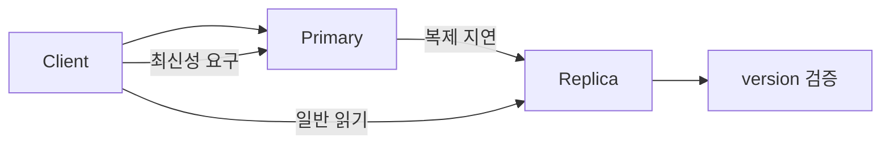

# Consistency Models: 자주 하는 실수와 안티패턴

- **강한 일관성**은 모든 읽기가 최신 쓰기를 즉시 보는 성질이고, **최종 일관성**은 시간이 지나면 복제본이 수렴하는 성질이다.
- 일관성은 “데이터가 항상 같은가”가 아니라 **어떤 읽기가 어떤 쓰기를 볼 수 있는가**에 대한 보장이다.
- 장애 대응에서 재시도, 캐시, 읽기 분산을 잘못 설계하면 모델이 보장하는 수준보다 더 강한 동작을 기대하게 된다.

## 개념 설명

**선형화 가능성(Linearizability)**은 각 연산이 호출과 응답 사이의 한 시점에 원자적으로 실행된 것처럼 보이는 모델이다. 결제 잔액, 재고 차감처럼 순서가 중요한 작업에 적합하지만 지연과 비용이 커진다. **순차 일관성(Sequential Consistency)**은 모든 프로세스의 연산을 하나의 전역 순서로 볼 수 있지만, 실제 시간 순서까지 보장하지는 않는다.

**인과적 일관성(Causal Consistency)**은 원인과 결과 관계의 쓰기 순서를 보존한다. 게시글을 본 뒤 작성한 댓글이 게시글보다 먼저 보이는 문제를 막을 수 있다. **최종 일관성(Eventual Consistency)**은 쓰기가 멈추면 복제본이 결국 같은 값에 도달한다는 약한 보장이다. 따라서 “쓰기 직후 읽기”가 반드시 최신 값을 반환하지 않는다.

### 자주 하는 실수와 안티패턴

1. **최종 일관성을 강한 일관성처럼 사용**  
   회원 탈퇴 직후 로그인 차단, 재고 감소, 권한 변경에는 부적합하다. 강한 읽기, 리더 읽기, 트랜잭션 또는 별도 검증 경로를 사용한다.

2. **DB 트랜잭션 격리 수준과 복제 일관성을 혼동**  
   `READ COMMITTED`는 한 DB 내부의 동시성 규칙이지, 리플리카가 최신 데이터를 읽는다는 뜻이 아니다.

3. **캐시 무효화만 믿기**  
   캐시 삭제와 DB 복제 사이의 순서가 뒤집히면 오래된 값이 다시 캐시될 수 있다. 버전 번호, TTL, write-through 또는 읽기 시 버전 검증을 고려한다.

4. **재시도 시 중복 쓰기 발생**  
   타임아웃은 실패가 아니라 “처리 결과를 모름”일 수 있다. 결제·주문 API에는 멱등 키와 중복 요청 방어가 필요하다.

5. **쿼럼이면 항상 최신이라고 오해**  
   `R + W > N`은 특정 조건에서 읽기·쓰기 집합이 겹침을 보장할 뿐이며, 오래된 읽기 허용 옵션이나 장애 시 정책에 따라 최신성이 깨질 수 있다.

## 코드 예시

```text
// 최종 일관성 리플리카에서 발생 가능한 문제
POST /orders  -> primary에 주문 저장
GET /orders/1 -> replica 조회: 404 (복제 지연)

// 안티패턴: 즉시 재시도만 반복
if (response == 404) retry GET

// 개선: 읽기 일관성 요구를 명시
POST 응답의 version=42 저장
GET 요청에 min_version=42 전달
replica가 version >= 42일 때 응답
```

## 흐름



## 인터뷰 질문

### 1. 최종 일관성 시스템에서 쓰기 직후 읽기 문제를 어떻게 해결하나요?

세션에 마지막으로 관찰한 버전을 저장하고, 읽기에 `min_version`을 전달한다. 해당 버전까지 반영된 리플리카를 읽거나 잠시 리더를 읽는다. 업무상 허용되면 UI에 “동기화 중” 상태를 표시한다.

### 2. 멱등성이 일관성과 어떤 관련이 있나요?

네트워크 재시도는 동일 쓰기를 여러 번 실행할 수 있다. 멱등 키와 고유 제약 조건으로 중복 효과를 제거하면, 최종 상태가 예측 가능해지고 복제·재시도 환경에서도 일관성을 유지하기 쉽다.

> **한 줄 정리:** 일관성 모델의 이름보다 중요한 것은 각 읽기·쓰기 경로가 실제로 어떤 최신성, 순서, 중복 실행을 보장하는지 명시하는 것이다.
