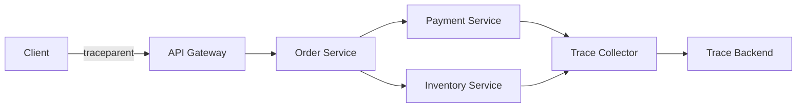

# 분산 추적(Distributed Tracing)

- **Trace**는 하나의 사용자 요청이 여러 서비스와 저장소를 거치는 전체 경로이며, **Span**은 그 안의 개별 작업이다.
- 서비스 간에는 `trace_id`, `span_id`, 부모 관계와 같은 **추적 컨텍스트를 전파**해야 한다.
- 장애 분석에는 로그·메트릭과 함께 사용하며, 샘플링·비동기 전파·민감정보 보호를 고려해야 한다.

## 개념 설명

분산 추적은 마이크로서비스 환경에서 요청의 흐름과 지연 시간을 관찰하는 방법이다. 예를 들어 사용자가 주문을 생성하면 API Gateway → 주문 서비스 → 결제 서비스 → 재고 서비스 → 데이터베이스를 거칠 수 있다. 이 전체 요청이 하나의 **Trace**이고, 각 호출·DB 쿼리·외부 API 요청이 **Span**이다.

각 Span은 보통 이름, 시작·종료 시간, 상태, 부모 Span ID, 속성(attribute), 이벤트를 가진다. `trace_id`가 같으면 여러 서비스의 Span을 하나의 요청으로 연결할 수 있고, `parent_span_id`로 호출 트리를 복원한다. HTTP에서는 W3C Trace Context의 `traceparent` 헤더를 주로 사용한다.

컨텍스트 전파가 끊기면 서비스별 로그는 존재해도 전체 경로를 재구성할 수 없다. 따라서 HTTP 헤더뿐 아니라 메시지 큐의 메시지 속성, 비동기 작업의 실행 컨텍스트에도 전달해야 한다. 단, 사용자 개인정보나 토큰을 Span 속성에 넣으면 안 된다.

모든 요청을 저장하면 비용과 저장량이 커지므로 Head Sampling 또는 오류·지연 요청을 우선 보존하는 Tail Sampling을 사용한다. 추적 데이터는 로그의 `trace_id`와 연결하고, 메트릭으로 전체 추세와 추적 데이터의 세부 원인을 함께 확인한다. 운영 환경에서는 수집기(Collector)를 두어 애플리케이션과 백엔드를 분리하는 구성이 일반적이다.

```python
from opentelemetry import trace

tracer = trace.get_tracer("order-service")

with tracer.start_as_current_span("create_order") as span:
    span.set_attribute("order.id", order_id)
    payment = call_payment_service()  # trace context 자동 전파
    if not payment.ok:
        span.record_exception(payment.error)
        span.set_status(StatusCode.ERROR)
```



## 면접 질문

### 1. 로그와 분산 추적의 차이는 무엇인가?

로그는 특정 시점의 사건과 상세 메시지를 기록하고, 분산 추적은 하나의 요청이 여러 컴포넌트를 통과한 구조와 시간을 보여준다. 로그에 `trace_id`를 포함하면 두 데이터를 상호 연결할 수 있다. 메트릭은 집계된 상태를 빠르게 파악하는 데 적합하다.

### 2. 분산 추적에서 컨텍스트 전파가 중요한 이유는 무엇인가?

서비스마다 새 Trace를 만들면 호출 관계가 끊겨 전체 요청을 추적할 수 없다. 호출자의 `trace_id`와 현재 `span_id`를 HTTP 헤더나 메시지 메타데이터로 전달해야 하며, 비동기 실행에서도 실행 컨텍스트가 유실되지 않도록 처리해야 한다.

**한 줄 정리:** 분산 추적은 `trace_id`와 Span 관계를 기반으로 분산 시스템의 요청 경로와 지연 원인을 연결해 보여주는 기술이다.
