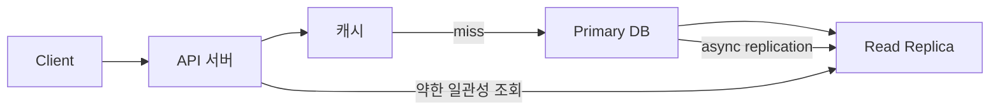

# 일관성 모델과 성능 최적화

- **강한 일관성**은 최신 데이터를 보장하지만, 지연 시간과 가용성을 희생한다.
- **약한 일관성**은 복제·캐시 확장에 유리하지만, 읽기 결과가 잠시 다를 수 있다.
- 성능 최적화의 핵심은 모든 요청에 강한 일관성을 적용하지 않고, **데이터 중요도별로 모델을 분리**하는 것이다.

## 개념 설명

일관성 모델은 여러 클라이언트가 분산 시스템의 데이터를 읽을 때, 어느 시점의 값을 볼 수 있는지 정의하는 규칙이다. 단일 서버와 달리 복제본, 캐시, 네트워크 지연이 존재하면 각 노드의 데이터가 일시적으로 달라질 수 있다.

**선형화 가능성(Strong Consistency)**은 쓰기가 완료된 뒤 모든 읽기가 최신 값을 반환하는 모델이다. 결제 잔액, 재고 차감, 권한 변경처럼 오류 비용이 큰 데이터에 적합하다. 대신 복제 확인, 리더 통신, 분산 락 때문에 쓰기 지연이 증가하고 리더 장애 시 가용성이 낮아질 수 있다.

**최종 일관성(Eventual Consistency)**은 쓰기가 전파되면 언젠가 모든 복제본이 같은 값에 도달한다는 모델이다. 상품 조회 수, 추천 목록, 소셜 피드처럼 약간의 지연이 허용되는 데이터에 적합하다. 지역 캐시와 비동기 복제를 사용하면 읽기 성능과 처리량을 크게 높일 수 있지만, 사용자가 방금 변경한 결과를 즉시 보지 못할 수 있다.

실무에서는 **세션 일관성**도 중요하다. 사용자가 수정한 직후에는 같은 세션에서 최신 값을 보장하는 `Read Your Writes`를 적용하고, 일반 사용자의 읽기는 캐시에서 처리할 수 있다. 캐시 무효화는 TTL, 버전 키, 이벤트 기반 삭제를 조합한다. 성능 측정 시 평균 지연 시간뿐 아니라 p95/p99 지연, 복제 지연, 오래된 읽기 비율을 함께 관찰해야 한다.

### 성능 최적화 전략

1. 데이터 유형을 강한 일관성과 약한 일관성 영역으로 분리한다.
2. 읽기 중심 데이터는 리드 레플리카와 캐시로 확장한다.
3. 쓰기 직후 조회는 원본 DB 또는 세션 캐시로 우회한다.
4. 충돌이 허용되는 카운터·피드는 비동기 처리와 배치 집계를 사용한다.
5. 일관성 수준을 API 옵션으로 노출할 때 기본값은 안전하게 설정한다.

```python
def get_profile(user_id, session):
    cached = cache.get(f"profile:{user_id}")
    if cached and cached["version"] >= session.get("profile_version", 0):
        return cached
    profile = primary_db.read(user_id)  # Read Your Writes
    cache.set(f"profile:{user_id}", profile, ttl=60)
    return profile

def update_profile(user_id, data, session):
    profile = primary_db.update(user_id, data)
    session["profile_version"] = profile["version"]
    cache.delete(f"profile:{user_id}")
    return profile
```



## 면접 질문

### 1. 최종 일관성을 사용하는 상황은?

읽기 확장성과 낮은 지연 시간이 중요하고, 데이터가 잠시 오래되어도 비즈니스 오류가 크지 않은 경우다. 피드, 조회 수, 추천 결과가 대표적이다.

### 2. 캐시 사용 시 최신 데이터가 보이지 않는 문제를 어떻게 줄이나?

쓰기 성공 후 캐시를 삭제하거나 새 버전을 기록하고, 쓰기 직후 요청은 원본 DB로 보낸다. TTL만 사용하면 무효화 지연을 완전히 제어하기 어렵다.

> **한 줄 정리:** 성능 최적화는 일관성을 무조건 약화하는 것이 아니라, 데이터 중요도와 사용자 경험에 맞춰 일관성 비용을 선택하는 과정이다.
