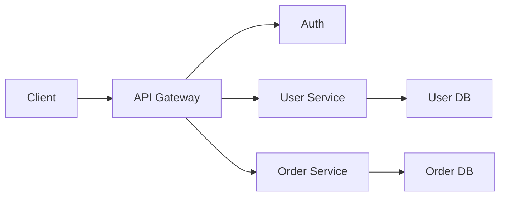

# API Gateway

- **단일 진입점**으로서 클라이언트 요청을 적절한 백엔드 서비스로 라우팅한다.
- 인증·인가, TLS 종료, 로깅, 요청 제한, 응답 변환 등 **공통 기능을 중앙화**한다.
- 편리하지만 장애·병목의 집중점이 될 수 있으므로 **고가용성과 확장성**을 함께 설계해야 한다.

## 개념 설명

API Gateway는 외부 클라이언트와 여러 내부 서비스 사이에 위치하는 역방향 프록시다. 클라이언트는 서비스별 주소를 알 필요 없이 Gateway의 단일 엔드포인트만 호출한다. Gateway는 URL, HTTP 메서드, 헤더 등을 기준으로 요청을 라우팅하고, 필요하면 여러 서비스의 응답을 조합해 하나의 응답으로 반환한다.

주요 책임은 인증 토큰 검증, 권한 확인, TLS 종료, CORS 처리, Rate Limiting, 요청·응답 로깅, 추적 ID 전달, 타임아웃과 재시도, 서킷 브레이커 등이다. 모바일 앱처럼 네트워크 호출을 줄여야 하는 환경에서는 여러 API를 조합하는 BFF(Backend for Frontend) 역할도 수행할 수 있다.

다만 모든 비즈니스 로직을 Gateway에 넣으면 배포 결합도가 높아지고 유지보수가 어려워진다. Gateway는 주로 횡단 관심사와 라우팅을 담당하고, 핵심 도메인 규칙은 각 서비스가 소유하는 것이 바람직하다. 단일 장애 지점이 되지 않도록 여러 인스턴스, 로드 밸런서, 무상태 설계, 헬스 체크를 적용한다. 또한 재시도는 멱등성이 보장되는 요청에 제한하고, 타임아웃을 반드시 설정해야 장애 전파를 막을 수 있다.

## 간단한 라우팅 예시

```nginx
server {
    listen 443 ssl;

    location /users/ {
        proxy_pass http://user-service;
        proxy_set_header X-Request-Id $request_id;
    }

    location /orders/ {
        proxy_pass http://order-service;
        limit_req zone=orders burst=20;
    }
}
```

## 요청 흐름



## 면접 질문

### 1. API Gateway와 로드 밸런서의 차이는 무엇인가?

로드 밸런서는 주로 여러 서버에 트래픽을 분산한다. API Gateway는 라우팅뿐 아니라 인증, Rate Limiting, 프로토콜 변환, 응답 조합, 관측성 같은 API 수준의 정책을 수행한다. 실제 시스템에서는 두 역할이 함께 배치될 수 있다.

### 2. API Gateway가 장애 나면 어떻게 대응하겠는가?

Gateway를 무상태로 만들고 다중 인스턴스와 로드 밸런서를 구성한다. 헬스 체크와 자동 복구를 적용하며, 타임아웃·서킷 브레이커로 장애 전파를 차단한다. 설정 변경은 중앙 관리하되 검증과 점진 배포를 적용하고, 우회 경로 또는 캐시도 검토한다.

**한 줄 정리:** API Gateway는 서비스 접근을 단순화하는 강력한 관문이지만, 공통 기능만 맡기고 고가용성·장애 격리를 반드시 설계해야 한다.
