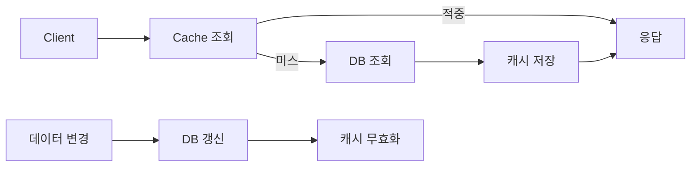

# 캐시 무효화(Cache Invalidation)와 성능 최적화

- **캐시 적중률과 데이터 정합성의 균형**이 핵심이다. TTL이 길수록 빠르지만 오래된 데이터가 남고, 짧을수록 원본 저장소 부하가 증가한다.
- 일반적인 전략은 **Cache-Aside**다. 읽을 때 캐시를 먼저 조회하고, 없으면 DB에서 읽어 캐시에 저장한다. 변경 시에는 캐시를 삭제하거나 새 값으로 갱신한다.
- 무효화 자체보다 **캐시 스탬피드, 대량 삭제, 만료 동시성**이 성능 장애를 만들기 쉽다. TTL에 지터를 넣고, 락·요청 병합·백그라운드 갱신을 활용한다.

## 개념 설명

캐시는 비싼 연산이나 DB 조회 결과를 메모리 또는 분산 저장소에 보관해 응답 시간을 줄인다. 그러나 원본 데이터가 변경되면 캐시 값이 낡기 때문에 무효화 전략이 필요하다.

가장 단순한 방법은 **TTL 기반 만료**다. 구현이 쉽고 장애 시에도 자동 복구되지만, 만료 전까지 stale data가 제공될 수 있다. **명시적 삭제**는 변경 시 관련 키를 즉시 제거하므로 정합성이 좋지만, 모든 연관 키를 정확히 추적해야 한다. **Write-Through**는 쓰기와 캐시 갱신을 함께 처리해 일관성을 높이고, **Write-Behind**는 쓰기를 지연해 처리량을 높이는 대신 데이터 손실 위험이 커진다.

성능 최적화에서는 다음을 함께 고려한다.

1. 조회가 많고 변경이 적은 데이터만 캐시해 적중률을 높인다.
2. TTL에 무작위 지연을 추가해 여러 키가 동시에 만료되는 현상을 줄인다.
3. 캐시 미스 시 여러 요청이 동시에 DB를 조회하지 않도록 분산 락이나 single-flight를 사용한다.
4. 삭제보다 새 값을 원자적으로 갱신하면 삭제 직후 발생하는 캐시 미스를 줄일 수 있다.
5. 키 버저닝(`user:v2:123`)을 사용하면 배포 시 전체 캐시 삭제 없이 새 스키마로 전환할 수 있다.
6. 캐시 적중률, 미스율, 평균 지연 시간, eviction, DB QPS를 함께 모니터링한다.

## 코드 예시: Cache-Aside와 TTL 지터

```js
async function getUser(id) {
  const key = `user:${id}`;
  const cached = await redis.get(key);
  if (cached) return JSON.parse(cached);

  const user = await db.user.findById(id);
  const ttl = 300 + Math.floor(Math.random() * 60);
  await redis.set(key, JSON.stringify(user), { EX: ttl });
  return user;
}

async function updateUser(id, patch) {
  const user = await db.user.update(id, patch);
  await redis.del(`user:${id}`); // 변경 성공 후 무효화
  return user;
}
```



## 면접 질문

### 1. 캐시 무효화가 어려운 이유는 무엇인가?

캐시와 원본 저장소의 변경 시점이 다르고, 하나의 데이터가 여러 키에 복제될 수 있기 때문이다. 따라서 삭제 범위, 동시 요청, 장애 발생 시 재시도까지 고려해야 한다.

### 2. 캐시 스탬피드와 해결 방법은?

인기 키가 동시에 만료되어 많은 요청이 DB로 몰리는 현상이다. 분산 락, 요청 병합, TTL 지터, 사전 갱신(refresh-ahead), stale-while-revalidate로 완화한다.

> **한 줄 정리:** 좋은 캐시 무효화는 빠른 조회뿐 아니라 적중률·정합성·DB 부하·만료 동시성까지 함께 최적화한다.
