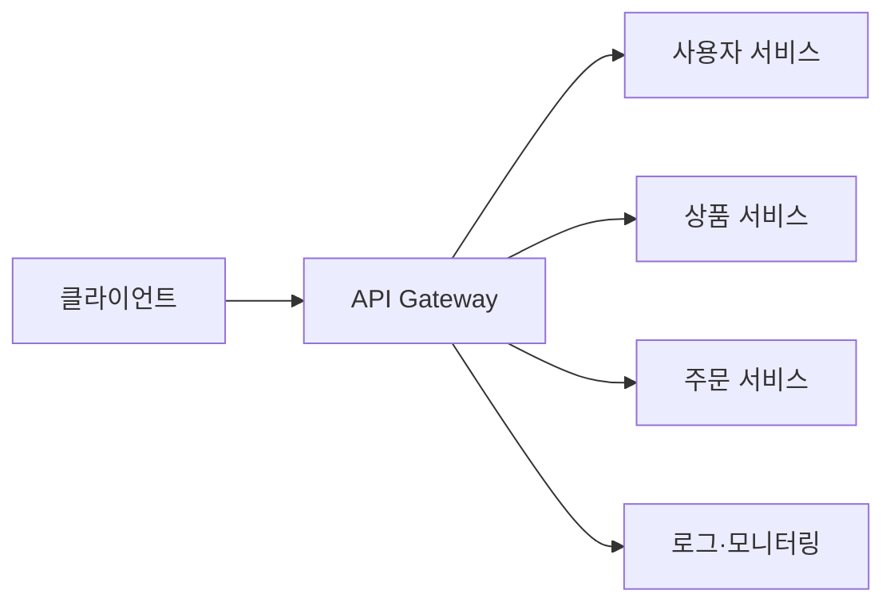

# API Gateway란?

- **클라이언트와 여러 백엔드 서비스 사이의 단일 진입점**이다.
- 인증·인가, 라우팅, 로깅, 속도 제한 같은 **공통 기능을 한곳에서 처리**한다.
- 편리하지만 장애가 집중될 수 있으므로 **고가용성과 적절한 책임 분리**가 중요하다.

## 개념 설명

API Gateway는 여러 마이크로서비스 앞에 놓이는 서버다. 초보자에게는 **아파트의 안내 데스크**에 비유할 수 있다. 방문자가 각 세대의 주소와 규칙을 모두 알 필요 없이 안내 데스크에 요청하면, 데스크가 적절한 세대로 연결해 준다.

예를 들어 쇼핑몰에 사용자 서비스, 상품 서비스, 주문 서비스가 있다고 하자. 클라이언트가 각 서비스에 직접 요청하면 서비스 주소, 인증 방식, 오류 처리 방법을 모두 알아야 한다. API Gateway를 두면 클라이언트는 `api.shop.com`만 알고, Gateway가 요청 경로에 따라 알맞은 서비스로 전달한다.

주요 역할은 다음과 같다.

- **라우팅**: `/users`는 사용자 서비스, `/orders`는 주문 서비스로 전달
- **인증·인가**: JWT나 API Key를 검사해 허용된 요청만 통과
- **보안**: 내부 서비스 주소를 숨기고 외부 요청을 필터링
- **속도 제한**: 특정 사용자가 과도하게 호출하지 못하도록 제어
- **관찰 가능성**: 요청 로그, 응답 시간, 오류율을 통합 수집
- **응답 조합**: 여러 서비스의 결과를 모아 클라이언트에 한 번에 반환

Gateway가 없으면 클라이언트와 서비스 간 결합도가 높아지고, 공통 기능이 각 서비스에 반복된다. 반대로 Gateway에 너무 많은 비즈니스 로직을 넣으면 거대한 병목이 될 수 있다. 따라서 Gateway는 주로 **교통 정리와 공통 정책**을 담당하고, 주문 계산 같은 핵심 업무는 백엔드 서비스가 담당하는 것이 좋다.

Gateway 자체가 단일 장애 지점이 되지 않도록 여러 인스턴스를 실행하고 로드 밸런서와 함께 사용한다. 또한 타임아웃, 재시도, 서킷 브레이커를 설정해야 장애가 다른 서비스로 전파되는 것을 줄일 수 있다.

## 면접 질문

### 1. API Gateway와 리버스 프록시의 차이는 무엇인가?

리버스 프록시는 요청을 대신 전달하는 인프라 성격이 강하다. API Gateway는 여기에 인증, 속도 제한, API 조합, 버전 관리 등 **API 운영 정책**을 더한 개념이다. 둘의 경계는 제품과 설계에 따라 겹칠 수 있다.

### 2. API Gateway의 단점과 해결 방법은?

모든 요청이 집중되어 병목과 단일 장애 지점이 될 수 있다. 여러 인스턴스와 로드 밸런서를 사용하고, 캐시·타임아웃·서킷 브레이커·모니터링을 적용해 완화한다.

> **한 줄 정리:** API Gateway는 여러 백엔드 서비스 앞에서 요청을 안내하고, 인증과 공통 정책을 대신 처리하는 단일 관문이다.
